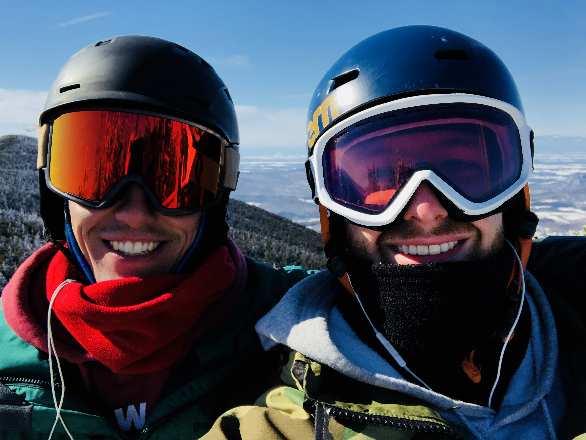

Hi,

A little late sending out this post. Slipped my mind on Sunday and I did not make time for it on Monday, so when you read this let's just pretend it's Sunday.

Last weekend Andrew went to New York with his Aunt, then ended up deciding to stay there for the week. Our other roommate from Boston, Hochiang, came up to the mountain, so instead of spending the week with Andrew I had some bonding time with Hochiang! For some reason Hochiang doesn't come up to the house very often, which is a bit perplexing to me since he also works remotely. 

I always wonder if it's just a coincidence that three of the roommates from our Boston house have moved their careers towards geographic flexibility. This past weekend my best friend Christina confided in me that she is starting to work towards a nursing coordinator role that is entirely remote. Perhaps this is a coincidence too. Or maybe a movement. 

Andrew and I have played with the idea of writing a book on how to transition to a remote working role, as well as what to expect from the lifestyle (ups and downs). I have a feeling if I did write something like that, it would probably be too lengthy and have a lot of relatively boring sections.

On to the exciting stuff-- the highlight of this past week; Wednesday. Several bouts of snowfall descended on the mountains, and I had handed off my deliverables the day before. So, naturally I took a well day. For the first time this season, I got first chair up to one of the most fun parts of the mountain. Taking laps down the lower section of Mount Ellen, we waited for the North Ridge chairlift to open. At the stroke of 9am we hopped on and headed straight for the summit. We got of the lift, snapped down our bindings and dove right into Exterminator woods. 

The great thing about these woods is that they drop you onto a trail that cuts through the mountain, so no matter where which path you take through the woods, you'll end up on back on tracks. I managed to go far enough left that I actually found myself surrounded by untouched powder. Powder can give you a bit of a weightlessness feel going through it, a bit like a ghost pushing through heavy air. Sometimes you can barely feel the ground under your skis. It's a bit like skiing nirvana. That, and the feeling of quiet solitude as you glide through the woods is hard to beat for a Wednesday morning. 

The next day I drove down just in time to catch the Thursday volunteering session. Afterwards I went over to the only arcade in Boston -- kind of retro place in Cambridge where a bunch of MIT kids hang out, eat grilled cheeses and try their hand at skee-ball. There was a bar training session with Venture Cafe on Friday, so went to that as well and as a result may soon be volunteering as a bartender!

Andrew came back from New York on Friday, so we went out together that night to a old time-y looking bar called the Saloon, then crashed at our old roommate's (Andrew Takao) house in Davis Square then drove back up to the mountain Saturday afternoon. Sad to say that we missed the incredible ski day on Saturday, and since it rained that night, Sunday's skiing was a bit miserable. But I guess you can't win them all!

Today I took a morning run with Andrew today before starting work. Right before we took our last run down the mountain, we hiked up to the peak. It was a blue bird (bird = sky in ski talk) day and the scene was a bit awe inspiring. After taking it in for a minute, we sat down and meditated for a bit. Great spot for it!

Andrew being in New York, and me skiing a bit too much slowed down our side project work, but I think that's okay. The week was a win in my book. I've been quoting this probably too often recently, but nonetheless I think it's relevant here:

"I wish I knew I was in the good ol' days, before I actually left them"
-Andy, The Office

See you next week,
Josh