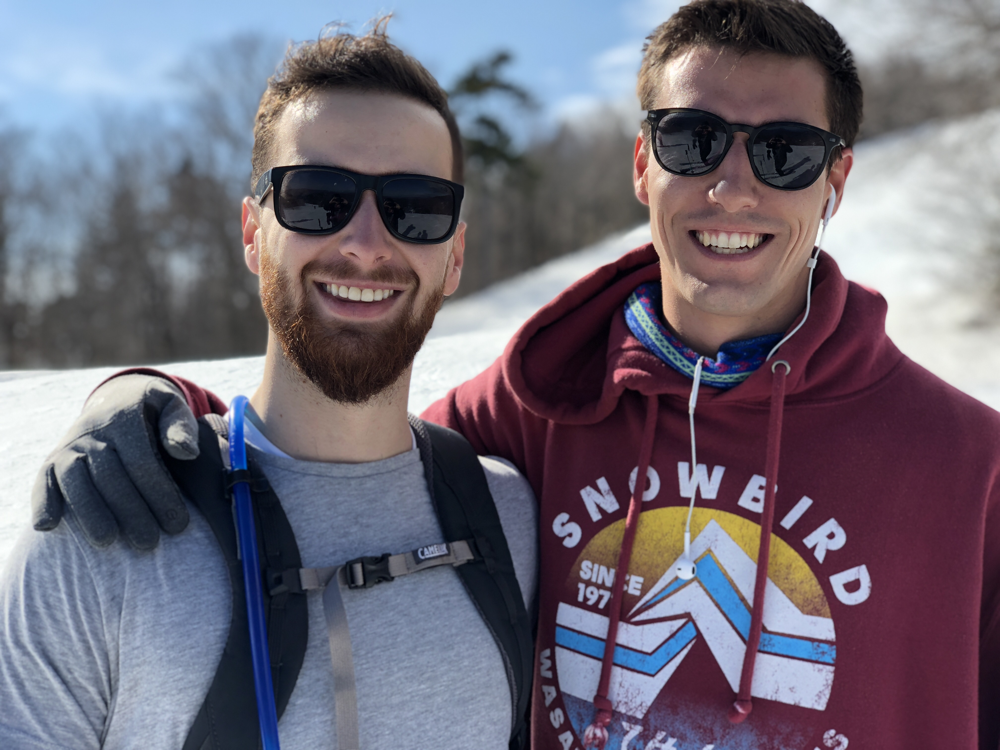

Hi,

As I write this, I'm sitting in the tiny (but cosy) apartment of an old friend of mine in the upper east side of Manhattan, NY. Been a pretty wild weekend so far, more on that later.

Okay back track to last Monday: 

Up in Vermont, the crew was coming out of an amazingly fun presidents weekend, and many people stuck around to ski one more day. It was awesome to hang out with all my close friends for a bit longer, though not so awesome to end the day and realize I really short changed myself on actual work done. One thing I've learned about myself is that it's really hard for me to enjoy the pleasures in life if I feel like I didn't put in the work to earn it. Even the memory of the day is a bit tainted by this guilt of gluttony.
I've also learned that skiing before working is an absolutely terrible idea. I've learned that it's hard to say no to one more run down the mountain, and it's super easy to run out of time in the day. So, note to self: it's probably prudent to do the most important stuff first.

Our friend Clara visited Andrew and I during the week. She's a researcher at MIT and a really brilliant girl. I first met her years ago, sitting on the downstairs porch of my apartment, having herself some crackers and grapes. In short order we were talking about black holes and string theory (which, being an experimental physicist, she adamantly denounces). She was an AirBnB guest of ours visiting from London for a position at MIT, which she took and we've been friends ever since. She's also an avid feminist. One night we all went to see the move Black Panther at the local theater. It was actually a really great movie, and after watching it I decided I want to go to Africa. 

Afterwards, we hung out at the theater's bar and talked about the ubiquitous societal pressures on women to conform to certain roles. Tyson (a construction management friend of ours) said that there is no girls in construction management because no girls want to work in construction; if there were candidates to hire, they would be happy to. She brought up several compelling examples of how there needs to be no overt pressuring involved; there are studies that show the mere presence of boys [in grade school] can change girls preferences of what toys to play with and what subjects to excel in. In other words, should everyone act in accordance to their 'authentic selves', we would see a very different distribution of women in all industries (such as STEM related programs). My mind couldn't help but wander back to the earlier lectures on freedom of the self.

Wednesday was perhaps the warmest day I've ever skied in my life. I believe it was 68 degrees on the mountain. The snow was soft and slushy, which was a good thing because for the first time in probably ever both Andrew and I forgot to bring our helmets to the mountain (We had a flat tire earlier and cleared out the trunk to get to the wheel). 

We decided to film the last run. It was a pretty featureless trail so nothing too epic; we switched filming halfway down, but Andrew slipped out right as I started filming so we didn't keep that take.

While Andrew was setting up the camera this old lady skied down and asked if we wanted a picture together, so we got that too!

Since there was pretty much no snow after that day we decided to drive back to Boston. We got home pretty late Wednesday so I went straight to bed. The next morning, there was a package waiting for me at the post office -- a present from Elodie. One thing about Elodie is that I feel like she belongs in a MENSA club for emotionally intelligent people. I may have mentioned once or twice before that I was short on words to keep up with her in conversation. So in a subtle act of thoughtfulness, she got me a book called "Other Word-ly", where readers can discover many other words to "surprise, delight and enamor".  Spoiler alert-- the remainder of this email may be peppered with some choice words. Ironically, as I flip through the pages of the book, I can't seem to find a word to express my gratitude. I'm doomed.

Fast forward to Friday, I kicked off the weekend with a good old fashioned party at my friends house in Boston, then the next morning threw my things in the car and drove down to New York City. I met up with my friends in Manhattan just in time to catch a concert in Madison Square Garden, which was awesome.The one thing I love about venues where the dance music is so loud and the bass is so deep that you abandon all modesty and balter! The concert ended around 11am and I felt like I was just getting started, so I left my friends in Manhattan and headed to Brooklyn to meet up with my buddy Matt. We explored some of the techno bars/clubs around the Brooklyn area, finally wandering home around 5 am. 

I woke up the next morning and grabbed a quick coffee with Matt before saying our goodbyes and heading into Manhattan to meet up with mom. She told me to meet her at Macy's for my birthday present. Definitely a great execution of gift giving, since I have been thinking about what it would be like to own a trendy raincoat ever since we visited Harrod's in London. The raincoat I saw in London was way over priced so I didn't go for it,  but she helped subsidize another cool one I found in Macy's, and now I can brave the monsoon season of Asia in style. Some articles of clothing have been absolutely integral to my travel gear, and I know this will come in handy many times over. Thanks mom for equipping me with the things I need to wander this world.

Anyways, that wraps it up for this week, see ya.

Josh
