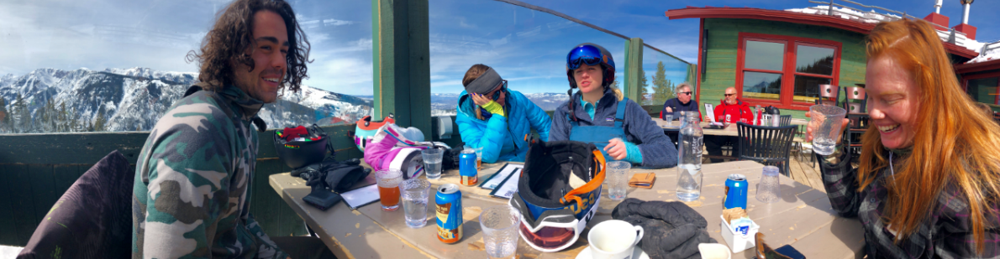
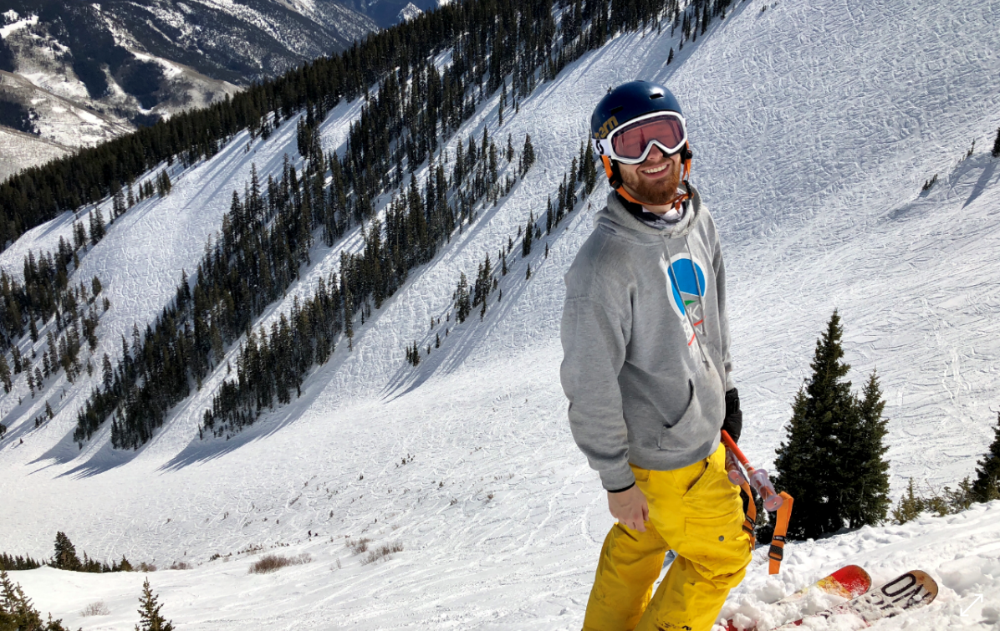
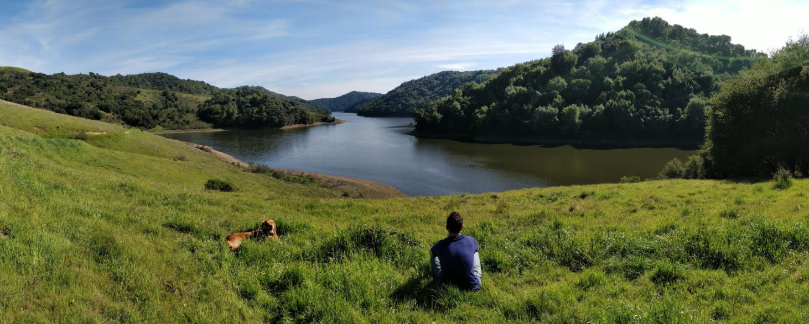
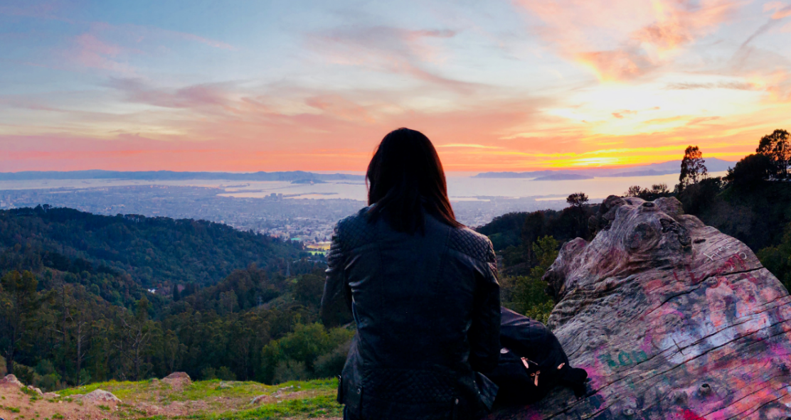

Hi all,

This week will be all about vacationing, skiing and traveling. 

On my birthday last week, I flew out of Boston over to Denver Colorado to start my ski trip out west. I packed up my things with Andrew, we grabbed our best friend Lauren and convinced our roommate Hochiang to drive us to the airport. 

As we walked out of our gate, we connected with the fourth traveler in our crew -- Lara Blasko. She's been a long time friend who now lives in San Francisco. Lauren's Dad was waiting at the terminal, so after grabbing all our ski gear, we loaded everything into the car and were off to Lauren's house.

Lauren's dad is a retired engineer turned ski instructor at Loveland resort, so he hooked us up with a couple free lift tickets. Loveland is a super fun Denver local's mountain, and Lauren's dad is a solid skier so he showed us a good time on the mountain. In Colorado the mountains are above tree lines, so it's a lot of wide open terrain instead of the thick wood's that I've grown accustomed to in New England.

After a few days of skiing in Denver, I picked up our rental car, then picked up everyone from Loveland and we headed up to Aspen. Our friend Skye (who is part of the Vermont snow house) has a lodge in aspen that she invited us all to. Aspen is essentially luxury skiing. Lift tickets are about $180 (which, with our VT season passes we get 50% on), and the ski town clearly caters to the uber wealthy. We stopped at a slope side bar / restaurant while going down the mountain that had wine by the glass starting at $30!

(left to right: Zach (boyfriend to Helen), Skye, Lara, Helen (Skye's cousin))

The mountains in Colorado were super fun. We had a 12 person ski crew and we managed to more or less stick together the whole time, while absolutely ripping down the mountain. We usually don't stop until the bottom, but some of these trails were so long and we were really putting all we got into the runs that no one seemed to mind taking a pause every once and a while. There was one section that we could only reach by taking a snow cat -- this large snow mobile that carries people in the back, kind of like a super large pick up truck. The picture below is me right before dropping into this enormous snow bowl.

One highlight of the trip was a clear night after a long day of skiing, we decided to go to these natural hot springs in the Colorado river. We drove for maybe 40 minutes looking for the spot on the side of the highway where you can clamber down some sketchy rocks into these semi man made pools of water heated by geothermal vents. 

The night air was freezing, the pools were shallow and hot but the most sensational experience of those moments was looking upwards in the dark night sky, witnessing an uncountable number of and star-like things. Something about celestial observations and the magnitude of nature seems to make all other things a little trivial. 

On Friday I stayed home to work while everyone went cross-country skiing. Not really my thing I think, and I was hoping to hit at least 10 hours of work that week (which I did!). It was actually a super productive day, albeit a bit long but it was great to get a solid amount of work done. 

On Saturday we left aspen to drive back to Denver. I had a flight out that night to go over to San Francisco and hang out with Elodie, and Lauren, Andrew and Lara had planned to go back to Lauren's house in Denver anyways. Before getting to Denver, we stopped in Vail to check out the U.S open snowboarding competition. Turned out to be a huge competition with all these tents and vendors and winter sport retailers and Olympic champions competing! Honestly none of us expected it to be as awesome as it was, and we ended up getting spots right on this enormous half pipe as we watched professional athletes throw quadruple spins over our heads. 

After the competition at Vail, we drove straight to the airport and I had to say goodbye to my friends. I flew out at 9, got into San Francisco at 10:30 to find Elodie waiting for me at the gate. She had gotten there an hour early! Surprised me at the exit point even. We had more time than we could have asked for waiting for my ski bags to come through baggage claim, but all was well at least on my end. 

Elodie lives in Moraga Hills, and it was a beautiful day today so we took a stroll with her lovable golden retriever Moose. The Moraga hills reminded me a bit of the billy goat trail by D.C; incredible scenic, relaxing and full of beautiful nature. We spent most of our Sunday there just hanging by the lake and playing with Moose and the panoramic feature on our phones.

In the evening we drove up to Elodie's favorite spot, grizzly peak to watch the sun set over San Francisco. She considers it a much better view than Twin Peak, and I have to say she might be right. 

I have a full week of California a head of me, I'll get you more updates next week!

See you then,
Josh

