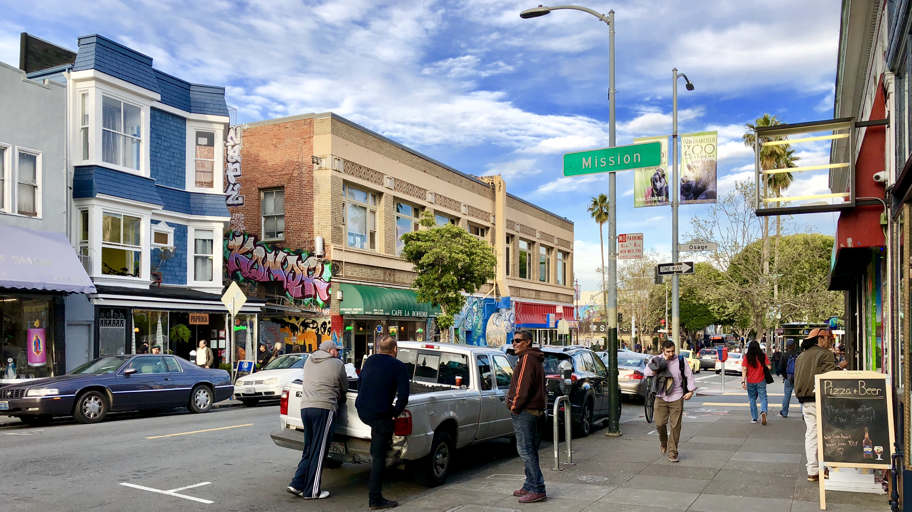

Hi all,

As I right this, I'm sitting at the coffee bar of a hip café chain in downtown San Francisco, somewhere in the vicinity of Tenderloin and South Market. It was the first one I picked for my morning work session and as it turns out, not only does it have all the coffee offerings to make this guy a happy camper; it has fast, password protected WiFi. There has been a new security requirement at my company, requiring me to be on secured internet and not in a handful of countries (such as Yemen, China, Vietnam, Cuba, etc etc...). The added security has made finding a work spot a little bit more difficult, but SF seems to be start up / coffee shop worker paradise. 

I was in East Bay with Elodie for the first half of the week, and it was cool hanging out there for a bit but her house is a bit of a commute from the city. She just moved back over to the SF area, started a new job and is in the process of making roots and forging new relationships in the city. After a few days of hanging out in East bay and playing with her dog, I moved into the city and crashed with my friend Emily. 

On Wednesday I was directed to an 'open work space' in the LinkedIn headquarters -- a vast wood paneled space with tons of work tables, outlets, young professionals and of course a coffee bar. A 20 foot piece of urban artwork hung on the inside wall of the room, while the street side wall was entirely made of glass. Depending on your vantage point, you could either enjoy the view of great artwork or people, walking to and from their daily appointments on the sunny downtown streets. 

Emily lives in the Mission district -- a super hip, urban neighborhood with a Spanish flair; filled with both San Francisco natives and young professionals. Cool hippie coffee shops, local bakeries and small bars and restaurants line the streets, decorated by bold murals painted in colorful tones. The sun was setting as I skateboarded down Mission St, on my way to meet up with Emily for dinner, and the vibe of the neighborhood felt so right to me. 

It was Friday when Emily invited me to have dinner with her, her partner Sini, and his friend who was in town visiting. Her partner and his friend are both from Austria, and after failing to get a table at this small Austrian restaurant (which was a bummer because I was looking forward to bratwursts), we decided on Moroccan. We were only able to snag a table at the bar, and I ended up sitting at the end next to Sini. This turned out to be a great arrangement (for me), because Sini and I talked none stop for the next two hours about almost everything under our overlapping suns. He's a tall Austrian fellow with a friendly and warm demeanor, who has no qualms with engaging a new friend in thought provoking and personally relevant topics. He is a Program Manager at Apple, recreational Tennis Player, technology enthusiast and a big fan of music festivals; him and I got a long great.

After dinner I found myself in a little Friday night writing-session party with Emily's close friends. This felt like classic San-Fran lovers / hippie / hang-out-and-talk-about-our-feelings get together, with an extremely chilled out vibe and a lot of eclectic, progressive individuals. It was cool to sit on a bean bag chair for a little while and listen to the random exchange of thoughts, but since I made plans with my other friend Lara to ski Tahoe that weekend, I had to jet out and get over to her house before everyone went to sleep.

At 3:30am Saturday, alarm went off, I woke up on the floor of Lara's apartment and we all drowsily shuffled into a friends car waiting outside. As we were throwing our gear onto the car, this girl Amy stepped out, who I actually spent a weekend with four years ago at Sugarloaf Mountain on this big 30 person ski trip Andrew, Tina and I hosted. My current roommate Nate was invited to the event and he had brought Amy with him several years ago. The connections endure!

Leaving at 4am to Lake Tahoe seemed to be the sweet spot. It took us 4 hours to get there, and while the access road to the ski mountains have been closed all night due to massive snowfall, it had opened right as we got to it! We decided to ski a full day at Alpine Meadows, and I have never skied in so much snow before. It was everywhere, and the mountain was filled with skiers trying to dig themselves out of the snow whenever they fell through. It was an insane workout trying to plow through so much snow. Falling was soft and easy, getting back up was quite an exercise. It was a bit challenging the first day because it was still snowing, and with the flat light hitting the snow it was impossible to see the variable features until you plowed into a snow pile. I always made it through the mounds of snow, but my skies didn't always come with me. I definitely need to up the DIN settings. 

By Sunday the skies cleared up, and it was a perfectly blue day shining on an incredibly fun mountain filled with snow. The adventure of new terrain, comfortable weather, great friends and not a care in the world -- I wish I could have stretched that day into infinity.

We skied straight through lunch, stopped an hour before the lift closed, hung out at the base lodge patio for some Apres Ski then headed to a local Mexican restaurant that was the San Francisco ski crew's go to. It seems like all the Mexican restaurants around California seem more authentic. Double guac, extra spicy salsa and a healthy portion of tri tips later, we were cruising in the car back to the city unbelievably content.

We finally made it back to Lara's apartment around 9pm on Sunday. I made plans with Sini and Emily for a Sunday night dinner, and while we were trying very hard to make it work the timing didn't quite work out, so I instead hung out with Lara's roommates, Angela and Tiffany. Both very cool girls with a fun sense of humor, I just hung on the couch with them and decompressed until sleep found it's way to me.

I'm now at this awesome coworking space called WeWork with Emily; I have a few hours of work ahead of me before catching my flight back to Boston. I already know I'm going to miss this place. I think I'll have to spend more time here in the coming year.

See you next week.

Josh