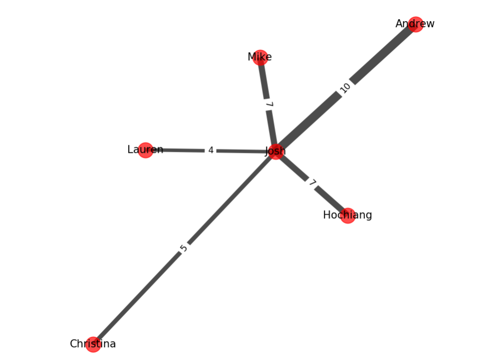

Hi all,

So this week was a slow pilgrimage from the snow lodge down to Maryland for Passover and Easter weekend. Slow in the sense that I got a little bit of time in my three current homes, making the week pretty well rounded as far as a normal work week goes.

First one, the snow house in Vermont. Monday was a big work day, as Mondays seem to be. I was in the final stretch with the financial reports I've been hammering away at for the past three months, and I tied up all the loose ends and prepped them for my Tuesday meeting. I spent the rest of my work time brainstorming with Andrew on a business idea worth pitching to WeWork. WeWork is a company that turns downtown office spaces into cool hipster coworking spaces that entrepreneurs and startups can rent out to work amongst other cool hipsters. They're offering 100k-360k as a creator award to whoever has a convincing enough story about what they're creating. (https://creatorawards.wework.com/) First round comes down to a 90 second pitch, so I've been trying to iron out exactly what I will say during those 90 seconds that will get me to the next round.

I also started taking an online course on creating and analyzing social networks. Social networks essentially are an application of a graph data structures. Graph data structures are where you have pieces of information packaged in nodes, and these nodes are connected together with edges that might hold more information too. Good for describing things and their relationship to each other. It's turning out to be a very interesting course actually. I'm really excited to complete it, and hoping I can start making my own social network / online communication tool soon. Here's a super basic graph I just through together:

Maybe I should try to start describing things with data visualization. That way these posts may be slightly more interesting and I get better at using data visualization libraries while I program. 

I also finished my machine learning housing prediction model -- now I realize I need to figure out how to package it in a user friendly web application so other people can try using it. to take a model that I can kind of run on my own personal computer and deploy it to a website so users can click on it and have it work for them online is a whole other challenge I've yet to dive into. I have a big work block ahead of me on that and I haven't found the time to carve out to sit down yet to do it. This is probably because I've been siphoning off most of my free time towards this network course. But it's all useful skills I think. Hopefully by my next post I'll have a demonstration of a machine learning model instead of a social network graph.

Anyways, back to Vermont and skiing...

Since we didn't ski Monday, we got a good session in Tuesday afternoon. We decided to just hit the park at the ski resort. There is a slow lift that goes over this pretty big ski park, full of rails and jumps and an assortment of features. You can watch the locals who probably grew up in that park hit some pretty big features without a second hesitation. There's always a big crew of them, who seem to all know each other. Would love to put in the hours at the park, hanging out and trying things each run down, but I think those hours for that are behind me.

We came back the next day and did the same thing, but with the warmer temperatures, the snow had gotten incredibly wet and soft. Wet and soft snow meant really slow progress down the mountain, and instead of stylishly skiing off the park features I was just slowly running into them. More falls that day for sure, which we made up for with a longer hot tub session at the gym.

Wednesday night I packed my car, left Andrew at the ski house and drove down to Boston. Drive was easy and enjoyable as always, got in around 9pm, read a bit then went to bed. I woke the next day, hopped on the train towards Cambridge and met up with Melissa at CIC for a work session before Venture Café. Turns out two of the bartenders didn't show up, so the Venture Café manager Shaun asked for some help behind the bar and I kicked off my bartending gig. Nice thing about pouring drinks is you get a little bit of face time with everyone. I think I like that job even more than the photographer role.

On Friday I woke up with an eight hour drive in front of me. In fact, probably longer being the holiday and I definitely didn't beat rush hour. I kind of dilly dallied around the house, mentally preparing myself to throw away a work day for sitting in my car, wishing I had just bought plane tickets. The idea of getting a solid morning work session, taking a 30 minute ride to the airport, working a bit on the plane with the free snacks before arriving in Maryland an hour and a half later was so incredibly appealing. Fortunately I had some flight points left over, so I booked a ticket that morning for a flight five hours later and I think that's the best decision I made all week. 

This weekend has been traditional holiday celebrations; when it seems like every year and every month changes so rapidly from the previous, it is definitely nice to have at least one thing consistent. 

That's it for now, see you next week.

Josh