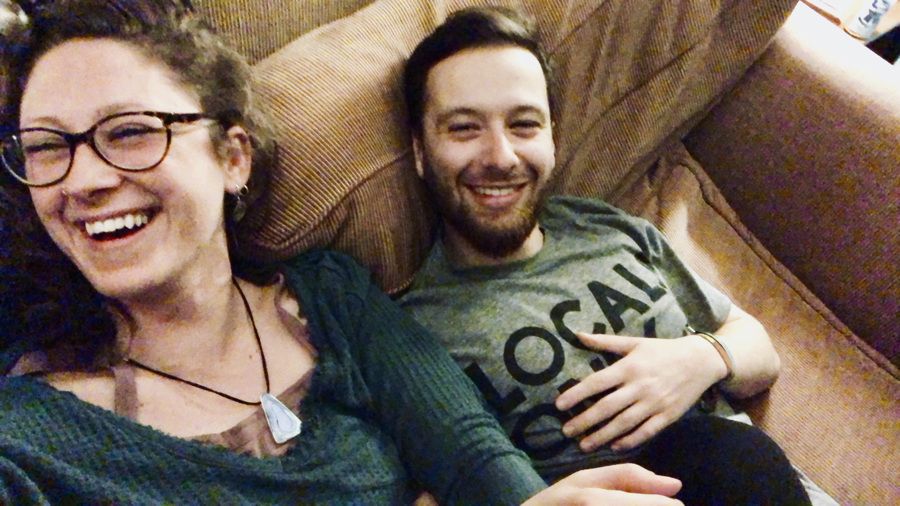

Hi all,

I'm going to try a new structure for my weekly write up. Before I tried to go through my week in chronological order, recounting memories from earlier in the week and working my way through. 

Though I've been reading this book called 'Made To Stick', which talks about how to share ideas in a compelling way, such that the information you sent through the airwaves can actual create significant change in others instead of being lost in transmission or simply forgotten. The book talked about how in journalism, it's effective to write up a story so that the content is stacked as a 'reverse pyramid'. The most exciting and attention grabbing information is at the top, and the more nuanced/intricate/less interesting sections are towards the bottom. That way readers can read as long as their attention spans last and not miss on the most important information. 

The book also talked about taking the big ideas you want to share and distilling it into just it's essence -- similar to a proverb. Short sentence that draws on a long experience. Then take the idea and follow up with Simple, Unexpected, Concrete and Credible, Emotional Stories. A.K.A SUCCESs. 

Anyways, so I'm just going to write more free form -- picking out memories from most important / recallable to least and order stuff that way. Might be more confusing to follow, but I maybe I'll get really good at it like the author in 100 days of solitude when he combines past, present and future tense all in one line; "Years from now, as the boy-turned-man lays by the tree, he thinks back to a memory from his childhood when he...". etc etc... Truth be told I haven't read the book yet but watched a very interesting video on it

**Saturday Night**

I was standing outside of the ski house, it was close to midnight. My friend Christina wandered outside too -- we setup a dance room and everyone was really grooving but it was also super hot and the cold air was really refreshing. She ran away from the house to get away from the light pollution, called me over. The house was filled with friends (we had 24 people up this weekend), and you could see in each window of the house different fun activities and crazy colored lights in every room (Matt Turis brought up remote controlled colored hue light bulbs). I don't think there was much of a moon that night, because above the house there was such an incredibly dense collection of stars that filled the dark sky. After a minute of silent star gazing, Tina brought up the idea of tiny-ness when witnessing something as immense as the cosmos. I watched a really fascinating Ted Talk earlier that week about connectedness, and what seemed relevant in that moment was the idea that our heart beats are connected to the galaxies and stars we see above us. Because as our hearts beat, it sends blood throughout the body, carrying oxygen that attaches to hemoglobin that provides us life. In the heart of the hemoglobin chemical structure is a single iron atom. The interesting part is how iron is created. Turns out it's a by-product of star formation. When gases in the universe begin to get drawn together, as they participate in a 100,000 galaxy gravitational dance called the Laniakae (which in Hawaiian means 'Immeasurable Heaven'), eventually a super massive galactic collision occurs, creating the stars we were looking at. The dance of the cosmos, driving inter-galactic gases together that collide and form fiery burning stars shoots out iron atoms which somehow found their way into the center of the hemoglobin molecule that travels through the veins of our bodies. It's as if the stars aTbove us that night were our second cousins or something. 

That whole Saturday was just all around fun. It was Maya's birthday, and three years ago we celebrated her birthday the same way by going up to Sugarbush for the annual Pond Skimming Weekend. That's where Sugarbush resort fills a man made pool with water and contestants try to ski across without falling in. That was the weekend where Andrew almost slit his earlobe off as we were biking back from the bars in downtown boston (he tried hopping onto a curve and bounced into a temporary fence on the side walk). That year I had tried to make it across the pond, only to completely face plant the water trying to do a trick halfway through. Maya is now in Med school in New Jersey, but she's always been part of the ski crew so she made the drive up for the weekend. 

Matt Turis and I decided to host a dance party at the ski house after all the day time festivities. Matt is from Brooklyn, so he curated a cool dance playlist while I handled all the part supplies. I still had a bunch of lights and stuff left over from college that I pulled out of the basement and brought up. I also grabbed Andrew's high definition speakers from our S Whitney apartment basement. After cleaning out the shoe room of pretty much everything, installing the lights, blowing up balloons and plugging in the speakers, we had an actually really cool setup. I honestly can't think of anything more enjoyable than dancing to awesome music with all your closest friends in a ski house. It made me remember nights in Berlin, and I think that became evident to everyone, because what really seemed to catch on was everyone agreeing that they are witnessing 'Euro Josh' for the first time.

**Saturday**

We all formed teams based off of countries so we can compete in fun day games. I formed team Japan with Andrew Takao, Sanae and Bernie (All three are roommates and very close friends to us-- Andrew Takao is an old S Whitney roommate). The most fun game we played was inspired by the movie Out Cold -- called King of the Mountain. At the top of the mountain, everyone fills up a cup of beer and then we race down to bottom, trying to spill as little beer as possible. The first five people to the bottom compare cups and whoever has the most beer in their cup wins. I got down third, but since I split my beer with our friend Amanda who didn't bring a beer, I definitely didn't win. Andrew got down second but he was filming the whole time and not watching out for his beer. Watching his footage clearly shows all the beer flying into his phone.

**Sunday**

Today I got an application into WeWork Creator award. I think I need more of a prototype to really move forward with the competition, but since I put the effort in making a 90 second video clip I figured I'd at least submit an application and see where it goes. I'll attach the pitch here. Looking back on it, I think I could have been a little more concrete on what we are looking to build. Essentially we'd like to build a video chat platform that doesn't have call buttons, but instead allows you to initiate conversations with your friends / coworkers as if you were in the same room together. 
​
Okay, could have more to talk about but I'm cutting this write up short. I'll attach a video montage of my weekend [here.](https://drive.google.com/file/d/1_gUHSTK4EwX5kWjdxvcO_ZK5oyS9iEaL/view?usp=drive_web)

See you next week,
Josh