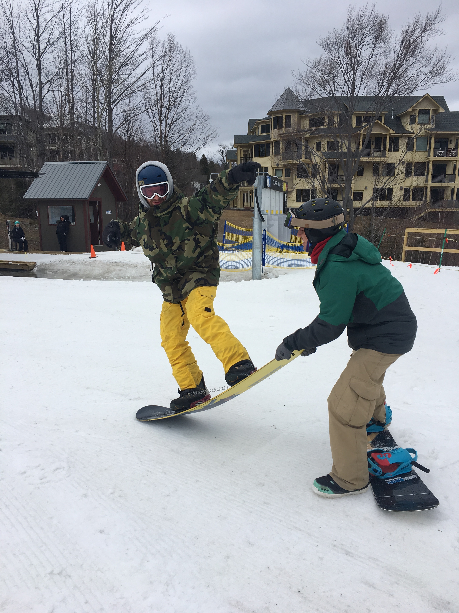

Hi,

Little late on this post, instead of writing on Sunday night I fell asleep on the couch while watching 'Darkest Hour' with Hochiang and Andrew. 

Anyways this past week marked significant progress with my side projects, Andrew started building out a portfolio website for me, and we had a record low of four people up at the ski house this weekend.  We also solidified our plans to live in San Francisco for 2019. A couple of our friends out there are getting a ski house by Lake Tahoe, so there may be a chance that we'll get to be west coast ski bums! Woot Woot!

As you may recall, I have been working on a housing prediction model to put on our 'Project 12' site. I finished the model a few weeks ago, but the missing piece was to put it up online so visitors to the website can interact with it. 

Andrew is not quite at the point where he can put the model / write up on the website, so I put the 'model deploying process' on hold to focus on a course about social networks and graph analysis. 

I figured it would be a relatively short course, seems like it needed only about 20 hours to complete. The material actually has been pretty interesting, so I've been pretty thorough in absorbing the information and algorithms used for building and analyzing networks. As a result, I've been putting a bit more time into it than I originally imagined. Fortunately I just finished all the course work, and all I have left is the last assignment. 

During this time, Andrew also pivoted a bit and started working on a portfolio website for me. On one hand it's not the Project 12 site we've been striving to work on, but on the other hand I can't quite complain since the site he's working on now will be enormously helpful to me. He plans on making two of them, one for me and one for him, so we both have portfolio sites where we can easily drop content as we create stuff. I can even drop my model on the portfolio site he's making, so if he completes any one of these sites then it's a win in my book. One other cool thing about this week is that we worked remotely with our friend / old roommate Zach and friend / old roommate Andrew Takao this week at CIC. A full crew of remote workers and friends working together! It's definitely awesome to work alongside your closest friends. 

Andrew and I drove up to the Ski house at the end of the week, and Andrew's girlfriend Claire drove down from Ottowa with her friend Tonya. Turns out nobody else decided to come up to the ski house that weekend (I think most people wanted to ski Tuckerman's Ravine that weekend), so we just paled around a bit. Tonya never snowboarded before, so all of us decided to snowboard for the day (Claire skis, she borrowed Lauren's gear) while Andrew taught Tonya how to snowboard. Fun day for sure, I'm definitely getting a bit better at snowboarding. Conditions were pretty terrible though -- most of everything was iced over. I was super scared to fall; on a snowboard catching an edge is not pretty. 

After getting out skiiing out of our system for the day, we stopped for pizza and beers afterwards, then headed home. All the dance party equipment was setup from the week prior, so the four of us had like a leftover-dance party. Still surprisingly fun for how little people there were.

That Sunday morning we noticed a couple new items in the fridge that weren't there before. Turns out Hochiang left boston around midnight on Saturday and got to the Ski house around 4am sunday. He joined us for breakfast in the morning, then we said our goodbyes to Claire and Tonya as they headed back to Ottawa and we headed to the mountain. My boot buckles broke on my ski boots, rendering them entirely useless, so I've been borrowing Tyson's gear until I can get myself a new pair of boots. It's a bit of a pain because ski boots cost about $400. Since the style of my old boots are no longer made, Dalbello doesn't carry replacement buckles, and neither do any of the local ski shops. Oh well, wouldn't mind a new pair of boots anyways. Andrew, Hochiang and I played around a bit for the day on the mountain, before picking up a redbox movie and heading home to relax for the weekend.

That's it for this weekend, until next week.

Josh