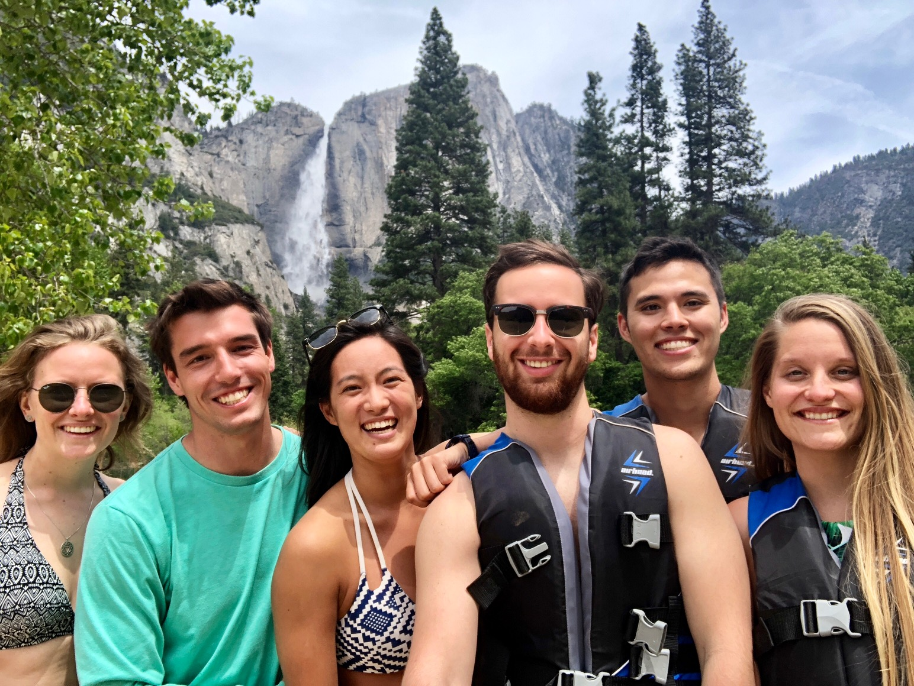

Hi,

It was raining in Boston the day before we left. Andrew Takao and I drove through stop and go traffic as we made our winding way up through Cambridge towards Takao's place. It began to rain in the afternoon, and only seemed to get more rainy and more sad as the day progressed into the evening. We picked up Andrew at the T station nearby, then drove over to Trader Joe's to pick up ingredients for dinner. We decided to go with a seafood ragu and gnocci, garlic bread and a Caesar salad. 

One by one the long time friends began to show up. Sanae came home from work and we started to cook. Hochiang showed up with some wine.  Right as dinner was finishing up, Lauren and Christina arrived. We pushed two coffee tables together, grabbed a bunch of pillows and made a table large enough to fit us all. Grabbing our cups and prepared food from the table, we all sat down, served ourselves and had one more friends dinner in Boston.

Andrew and I flew out to San Francisco the following morning. We had set aside a week in San Francisco to do some exploring of the city, reconnecting with friends out here and do have a little weekend getaway to Yosemite National Park.

The city always brings me into such good spirits. Maybe it's the sunny temperate weather. Maybe it's the feeling of grand possibilities in A.I. Or maybe the new frontier of friendships, but being back in San Francisco feels invigorating. 

Our flight landed around noon and we hopped out into the sunny terminal landing and snagged an uber into town. The friendly driver took us straight to the LinkedIn headquarters, where there is a large, beautiful shared open workspace. A crepe truck sat across the street, so stood on the street corner, watching people whizz by in these cool electric scooters while we munched on savory crepes.

Later that afternoon we made our way to SOMA to meet up with our friend Lara Blasko -- an old friend from Northeastern and fellow New England ski crew member. She strolls out of this clean urban office building where Fitbit is headquartered, rocking the tech-fitness-hipster wear and the stylish company knapsack; "Fitbit" embroidered in large letters on the flap. It kind of made me want one of those backpacks.

She told us to download this app called "LimeBike" and snag a scooter. Looking around, these green electric scooters we saw earlier were parked everywhere. As it turns out in this high-tech city, you can take out your phone and scan a code on the bike. Greeted with a little jingle, the bike comes to life, ready to take you anywhere in the city. Lara grabbed her city bike, Andrew grabbed himself a scooter, I strapped on my travel bags and off we went. Zipping through the city with Andrew, tailing Lara on her bike with all our travel bags was perhaps one of the most comical but fun things we've done in a while. We dropped our things off at Lara's, met up with Elodie and walked around the Mission for a while, eventually landing in Mission Dolores Park.

Later that evening I broke off from the group and headed over to Sini's house to hang out and grill some dinner. I had met Sini during my last visit to San Francisco, when I had joined Emily for dinner. Emily wasn't in town, and while it would have been nice to do dinner with both of them. There are very few encounters I've had with new people where the connection felt so new and familiar at the same time, and Sini was definitely one of them. So I had no qualms about just hanging at his place.  He lives around Bernal Heights, a very hilly neighborhood next to Twin Peaks with a very cool character to it. He has this super nice bachelor pad apartment that used to be a high end Airbnb rental property. Hot tub in the back, 16 seater wooden long table connecting the kitchen to the living room. We watched sports, checked out his half built camper van, grilled some chicken and corn, drank some beers and caught up on work and life. Our views on life and things we find interesting are so similar that it's kind of cool to hear more about how things are going for him today, because I feel like I can project out how things might look for me in a couple years. Things look pretty good.

The following day I met with Andrew, Claire and Lara for breakfast down in the mission before heading back to LinkedIn for a work session. Claire flew in from Canada the night before, and being in vacation mode she wanted to check out a bit of the San Francisco neighborhoods. I closed my laptop in the early afternoon and met them at Magnolia on Haight and Ashbury. They had rented bikes, so after having a beer and talking about all the different neighborhoods we went down Haight into Golden Gate Park, Andrew and Claire pulling me on my skateboard. We stopped by a pond there and had a bit of a picnic before heading to Mission for a mexican dinner with Lara then Elodie's to crash for the night. 

The following morning we packed our things in Elodie's van and drove up to Yosemite National Park. I cannot quite put it into words the immense beauty of this park. Enormous rock formations jut out of the earth and tower in the background landscape. Waterfalls ever flowing as you drive through the natural scenery. The hikes up the mountain, Vernal Falls especially, lead you straight to them. We had rented an airbnb cabin for the weekend, and Tim Takao (one of the first S Whitney St roommates) and his wife Cristina (one of the first S Whitney St roommates girlfriends) drove up from L.A to join us for the weekend. We hiked, made family dinners, hiked some more, grilled and rafted down a lazy river. We saw rainbows along the waterfall. We pitched hammocks at the summit, taking naps on rock ledge. Two days of hiking and one day of rafting made for a really packed in weekend.

That's it for now; tomorrow I will be flying to Hawaii, for a week with our buddy Kyron. Stay tuned for next week!

Josh

