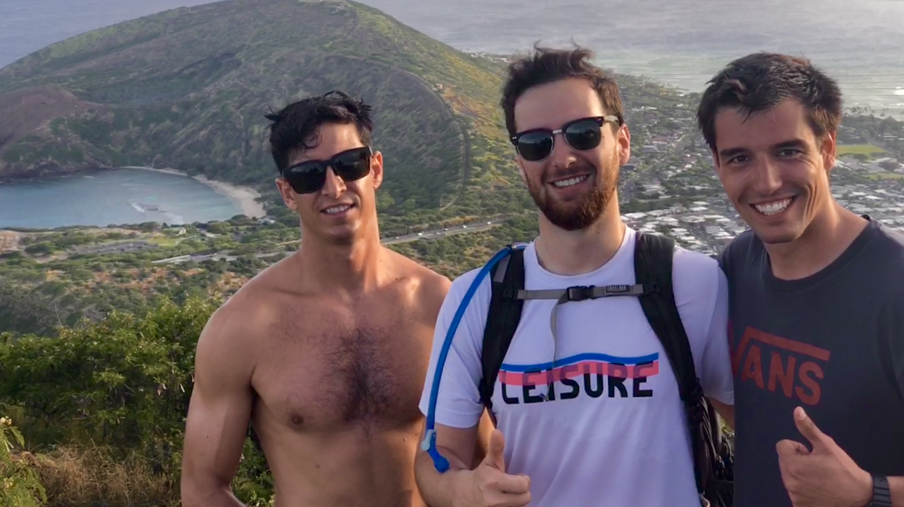
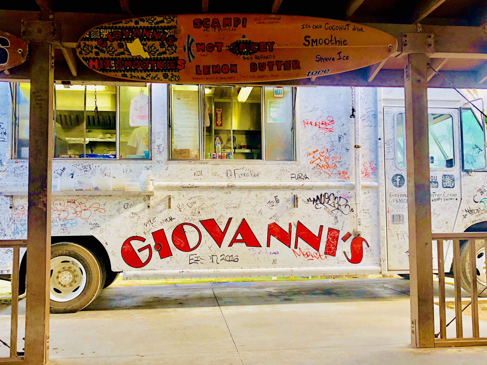

Hi,

This week started by saying good-bye to San Francisco, and saying hi to a jam packed week of adventure and action in Hawaii. I had come back from Yosemite last Monday, squeezing in two work days before flying out to Hawaii. I grabbed lunch with an old college friend, Freya at Uno Dos Tacos in downtown SF. She's doing marketing at Sephora and had just moved from Mission to Oakland, two spots I'm interested in living if I move over to San Francisco. Both have cool, young characteristics to them and are pretty central to where most people hang out. Oaklands significantly cheaper, but the mission is extremely close to where a lot of start-ups and companies are based (and is more expensive for that reason). 

I met up with Claire later that day in a hip coffee shop while Andrew had a meeting with a data scientist at AirBnB. Sounds like AirBnB gets hundreds of applicants for a single role, so it's a bit of a numbers game and a degree of luck to get considered. We had a nice chat and catch up -- all of us were flying out of San Francisco that day. Andrew eventually made his way to the coffee shop, we grabbed our bags, called an uber and made our way to the airport.

Flying west, that evening, we got in in time to grab some dinner in Honolulu. When we first stepped out of the small Hawaiian airport, we were welcomed with palm trees and warm, heavy island air. Kyron, our Coast Guard buddy from college days, pulled up in his pick up and we drove back to his place by downtown Honolulu. We stopped by Star Market and picked up some affordable and delicious poke -- a hawaiian staple in my opinion. Kyron lives with a coast guard buddy named Terry -- also really friendly and awesome guy. They have two rooms and the aparment has two couches that Wilson and I snagged.

We all had work the next day, so Andrew and I worked from Kyron's apartment while he headed into the base. We took a lunch break to skate around the beach, checking out some shops and the resort areas. It looked a lot like Miami in this area -- boutique stores lined a beach drive with gleaming hotel sky-rises alongside a manicured beach line. One resort had a man made lagoon between the beach and the resort. Andrew and I skated along everything, taking in the touristy-vacation vibe.

We went back to the house to catch up on more work, and when Kyron got back, we grabbed our gear and went for a hike up this relatively short but steep mountain that overlooks a lot of Honolulu. The trail is this old, decrepit railroad that literally goes straight up the mountain. The rail is intact the whole way up, but every few steps or so are missing tracks to walk on, so you need to balance along the rail or clamber up the mountain trail on either side. In one section, the ground itself falls away and next thing you know you're hiking 20 feet above ground along these rails. About 2/3rds up the mountain curves up, and the rail road tracks get very steep. I always had a 'just one more step' mentality the whole way up, but there were definitely moments where that 'one more step' was a challenge in and of itself.

Afterwards we hopped in Kyron's truck and drove over to this local spot in a very nice neighborhood. We parked on the street of this manicured suburban neighborhood and walked seemingly into the bushes and down a short steep dirt trail into a rocky cliff overlooking the ocean. A bunch of locals were hanging out there waiting for the sun to set. We dropped our towels and shirts, picked up some fins, walked over to the edge of the rocky overlook and one by one jumped into the water below. Super cool thing to do on a weekday evening!

We snagged dinner that night at Kona Brewery. Bartender was super cool and gave us a ton of samples. The cool thing about the Kona brewery (and a lot of the breweries) is the indoor-outdoor vibe of the place. 

​
Between work hours, we did a decent amount of outdoor stuff. We went to two more cliff jumping spots. One I didn't do, but Andrew jumped in. The rocks were a bit sharp climbing back up so Andrew asked for me to throw down his flip flops. The wind took both of them, one ended up falling in a crack, never to be seen again. Fortunately there are super great and cheap flip flops here, but Andrew ended up picking up some water shoes.
​

We went Kayaking one of the days. Picked up a rental from a local shop and drove to this super tiny beach / dock area. We kayaked all the way over to this island which had some more cliff jumping spots. The beach where we docked had a lone seal sleeping along the shoreline. We pulled up our kayaks, had a bit of lunch then climbed into the island. The coastline of the rest of the island was all this volcanic rock-like formations where the blue wave white wash would crash up against. We climbed up and into this cove that was sheltered a bit from the big crashing waves and took turns jumping off to the lagoon below. 

Later we went over to a food truck area and grabbed shrimp from this famous truck called Giovanni's. They coat these super tender shrimp in a lemon butter sauce served with rice and a ton of fried garlic. From there we walked along some famous beach / surf spots before heading home.

Today we spent the morning checking out Pearl Harbor. It was cool catching up on history and seeing the military base. It's interesting hearing about the history of Pearl Harbor and the Japanese invasion from our eyes, especially right before heading to Japan. I might try to pay a visit to Hiroshima and get a fuller picture of World War II. The most historic monument at Pearl Harbor is the sunken USS Arizona, where a ship piercing missile penetrated the ammunition area causing the entire battleship to spontaneously explode, instantly killing over 1000 crew members aboard. The sunken ship is still there, and unfortunately the memorial was closed due to technical issues with the ramp but we got some drive by photos.

Seems like this letter was more like photo-journalism. Anyways, tomorrow I'm going to try to get a full day of work in before jetting off to Japan! Next week will be all about Osaka, Japans Kitchen.

Talk to you later,
Josh
