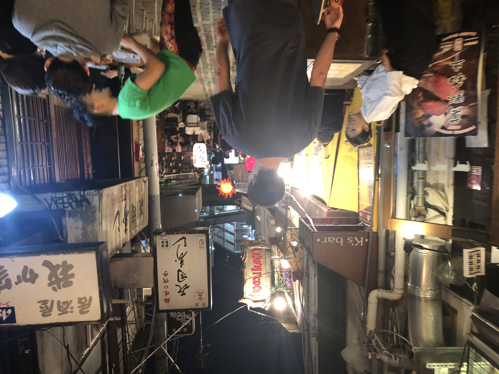
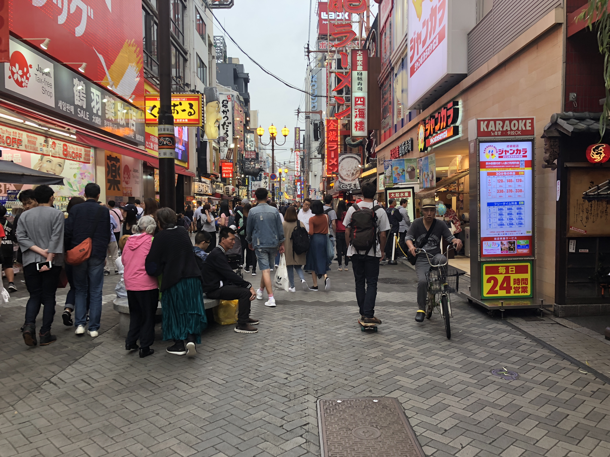
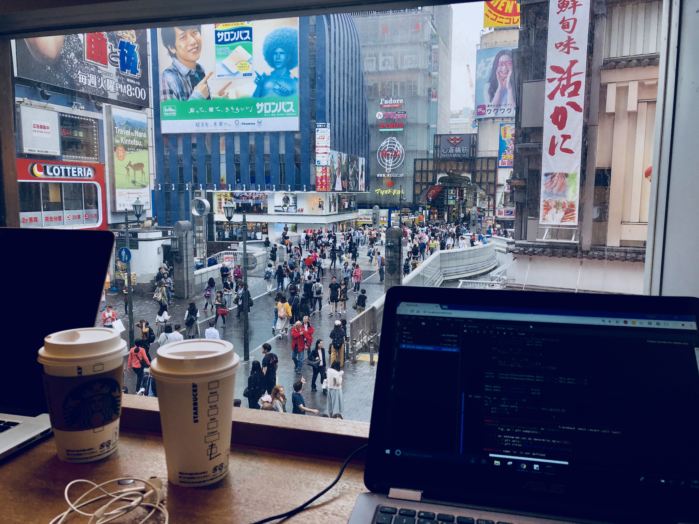
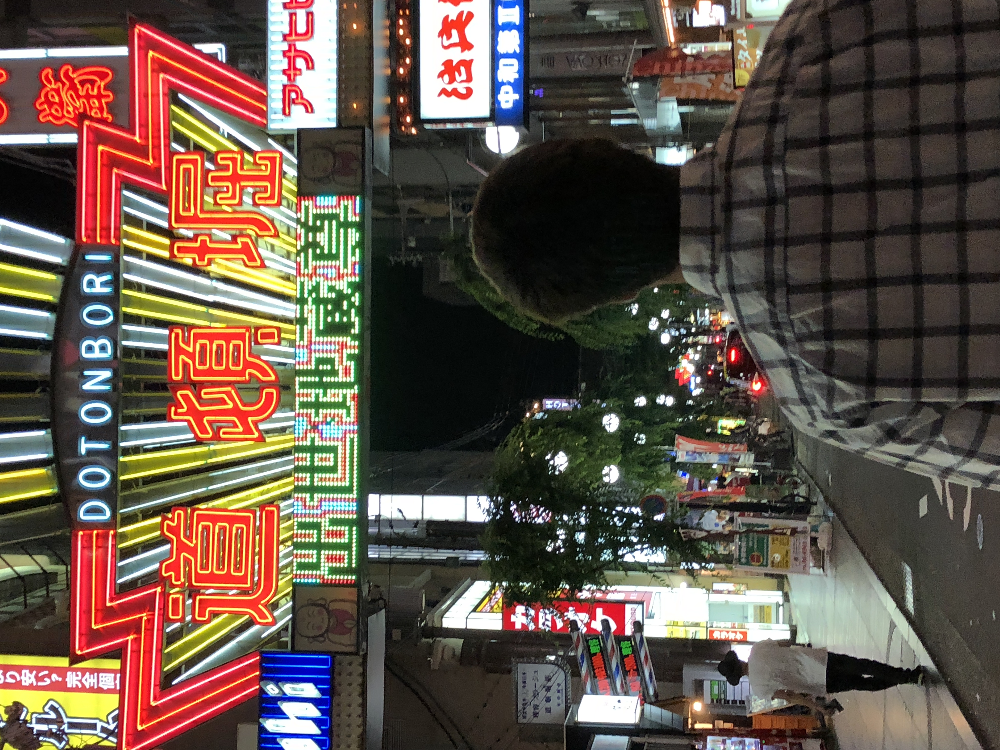
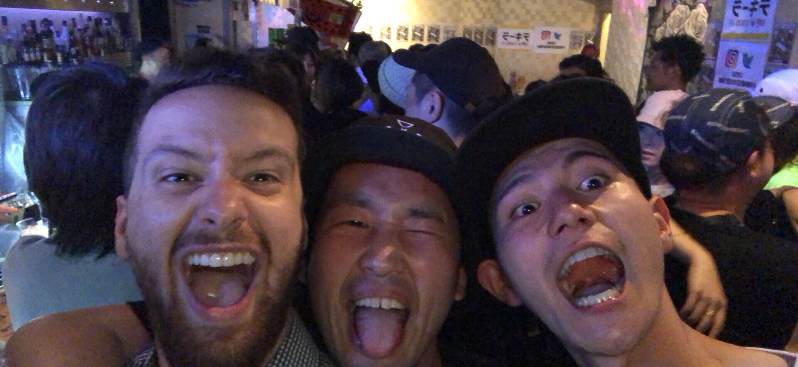
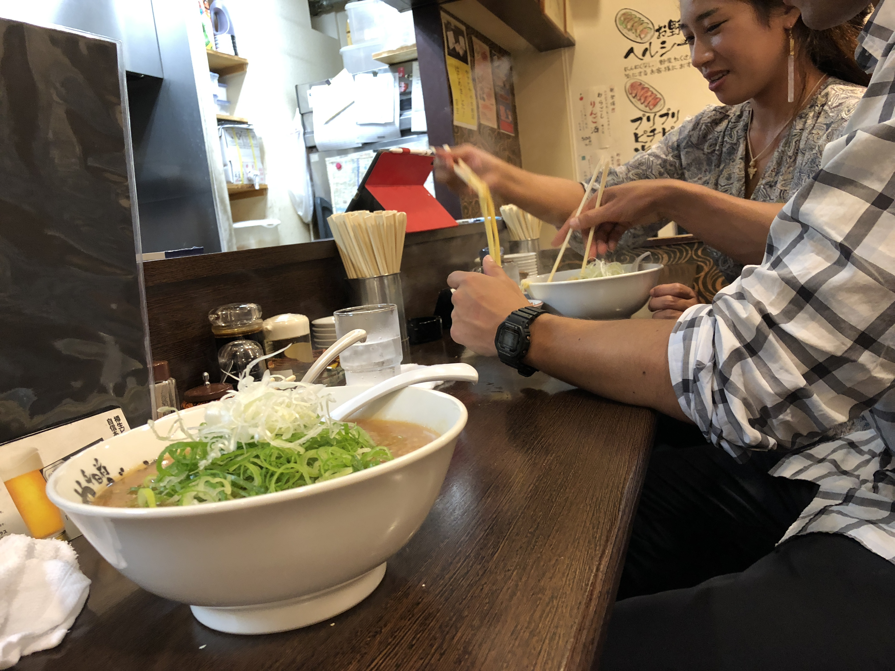

Hi,

Andrew and I stood at the flight ticket counter in the Hawaiian Airport. The ticket lady looked down at our two bags and backpacks, shaking her head. She regretfully informed us that AirAsia only allows 7kg on their international flight, and it would cost $100 to check a bag. Andrews bag weighed in at 16kg and mine was at 10kg. This wasn't even including our backpacks. While Andrew was busy cursing AirAsia for all their worth, the flight attendant suggested that we could join our bags together if we can get them under 20kg. So we borrowed a roll of "FRAGILE" labelling tape, and after some expert shuffling and re-organizing, managed to merge our two carry ons into one at exactly 20kg. 

It was a 9 hour flight from Hawaii to Japan, set to land 19 hours later. Unsurprisingly AirAsia doesn't offer food or water, but on the bright side there was an empty seat next to Andrew so we got some chips and drinks and hung out. Overall we had a decent flight . We landed at 8pm. The Osakan Airport felt like it was still in it's original packaging -- sterile, clean, orderly and very well lit. Pink bold signs with excited Japanese messages popped out against the clean whites and blacks of the interiour airport design. 

 

We found our way to the train station and hopped on the express towards downtown Osaka. Osaka is considered Japan's Kitchen -- a merchant city right on the water that served as an inlet for a lot of goods shipped in from other parts of the world. Unlike the professional, orderly and regimented Tokyo natives, the people of Osaka are a bit warmer, friendlier and boisterous. A bartender we made friends with days later described Osaka more similar to L.A and Tokyo more similar to New York. Restaurants here compete on flavor, and the locals love to go out and have a drink and be merry. There seems to be no end to the number of food spots here. 
​
 
​

The city is flat and a bit smaller than Tokyo -- the tight streets gridline through the city and are accessed mostly by the traveling feet of the Osakan locals. It is incredibly fun to go on a ride here with our skateboards and weave through the crowds and these narrow alleyways. 

​
 
​
Andrew and I got a place right by Namba Station, one of the most popular districts in the city. We arrived pretty late on Tuesday, dropped our bags and skated around looking for something to eat. Most restaurants were beginning to close down, only a small handful of very tiny bars on very tiny side streets seemed to be open, serving just small groups of friends. We ended up finding a 24-hour ramen shop. Sliding open the Japanese style wooden doors, we walked in to a narrow ramen bar. Here we ordered our first meal -- tskumen. It's a dish similar to ramen; served with cooked and cooled fat udon like noodles and a side bowl of an extra thick, extra salty ramen like gravy. You grab a couple noodles and dip them into the sauce, then wash it down with some Asahi beer. There was something peculiar about that moment, quietly eating some tskumen on a Tuesday evening. As if it was the most ordinary thing in the world, but considerably extraordinary at the same time. 

We spent the next few days absorbed in our work. I have been working on an algorithm for object detection (computer vision open problem) while Andrew has been doing a lot of job out reach. Our apartment has great WiFi so we spent a good portion of time working from our place and venturing out when we get hungry. We did work one day at the Starbucks in downtown Namba, which was cool to watch the flow of tourists throughout the day.

We've been sampling everything here. Udon noodles, ramen, sushi shops, okonomoyaki, yakitori, donburi, yakisoba and a ton of onigiris. The local convenience store sells these triangular rolls of rice wrapped in seaweed and stuffed with all sorts of things. They're a dollar each so we get those all the time. We were thinking it would be a good idea to write a book called "What is this?! A Culinary Adventure Through Different Cultures". Many times we are very confused about what we're about to eat.

Some highlights on our eating adventures included a restaurant called GRAMM, which is a somewhat boutique cafe / dessert restaurant that serves the famous ultra-fluffy Japanese pancakes. Each pancake is like an inch or two thick, stacked into a leaning tower of fluffy goodness.
​
 
​
Yesterday we went to a really well known Okonomoyaki shop called Mizuno, which serves these cabbage-egg-noddle pancakes on a hibachi grill in front of you. You sit along the bar and they beat some eggs, a variety of meats, cabbage and seasonings into a bowl. They pour it out onto the grill then top with some noodles, flip then season the whole thing with a couple different sauces, exotic spices, wasabi mustard and some Japanese Mayo. You have your own little spatula to use in order to cut up the big pancake and transfer bits to your little personal plate. 
​​​
 
​
We had an old friend named Ami who we met in Hokkaido last year. She's an avid snowboarder and was on vacation herself with some friends when we were doing our big group ski trip in early 2017. She's from Osaka, so we took the train over to visit her at her family's candy store. The candy store actually served some very traditional Japanese treats, and we got a super authentic culture trip from her mom who was running the store. We tried some very interesting treats, including this jelly-fish like thing dusted in a nutty soybean flour. We had these little bamboo skewers to try to pick up and eat these things, and it was almost exactly like trying to pick up a jellyfish with a tiny stick and eat it. It tasted pretty good though -- not overly sweet but the texture was unlike any food thing I've had before. 

She also served us these mochi balls designed as ornate flowers. Really incredible stuff. The last thing was this very fancy (and I imagine expensive) matcha green tea, whisked and served in a shallow wooden bowl. She taught us how to drink it properly -- placing one hand facing forward underneath the bowl and the other wrapped around the side, you turn the bowl counter clockwise three time. Then, you take three drinks of the tea, finishing on the third sip. Then you rotate the bowl again three times, bow and say "arigato go-zima"; which means "thank you very much". It was probably the most cultural thing I've done on my two years of travel, and it was definitely awesome. 

Later that night we met up with Ami again and we all went to a rock-and-roll bar down by Dotonburi, which is the popular downtown area of Osaka by Namba Station.
​
 
​
The bar was called Dash. When we arrived, Ami was waiting outside for us with some of her local friends. Seems like Ami knew everyone at the bar. I think she is a friends with a lot of people from this skateboard shop called Volcom, and the bar was full of really cool, skateboard / rock and roll people. She introduced us to all her friends, and her best friend was this really fun and really generous guy who kept offering to buy us drinks. He's pictured in the middle below.  

The whole place had a really cool vibe, with a lot of the music being US rock bands of the 90's and 2000's -- Red Hot Chili Peppers, Papa Roach, Sum 41 and the like. I think there is still a very strong rock scene in Japan, which I think has all but faded out in the US by now. So in that regard it was cool to go to a bar where that kind of music was playing. 

Afterwards we tried going to a famous Udon restaurant Ami recommended, but it was closed. Instead we found a late night ramen shop and got some giyozas (japanese fried dumplings) and ramen. 
​

​
This week we're back at work. We'll be in Osaka until the 11th, then we're thinking of doing a four day trip around a lot of Japan.
​

​
Talk to you next week.

Josh