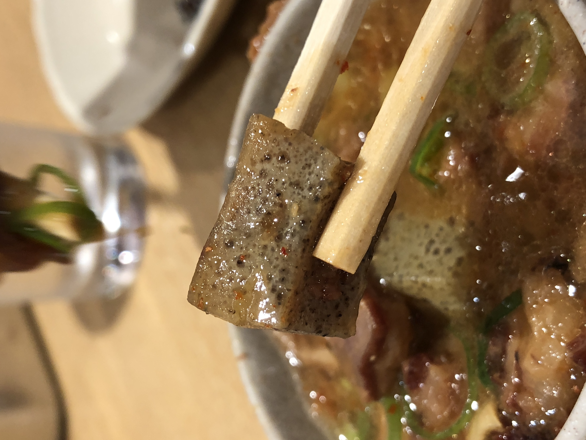
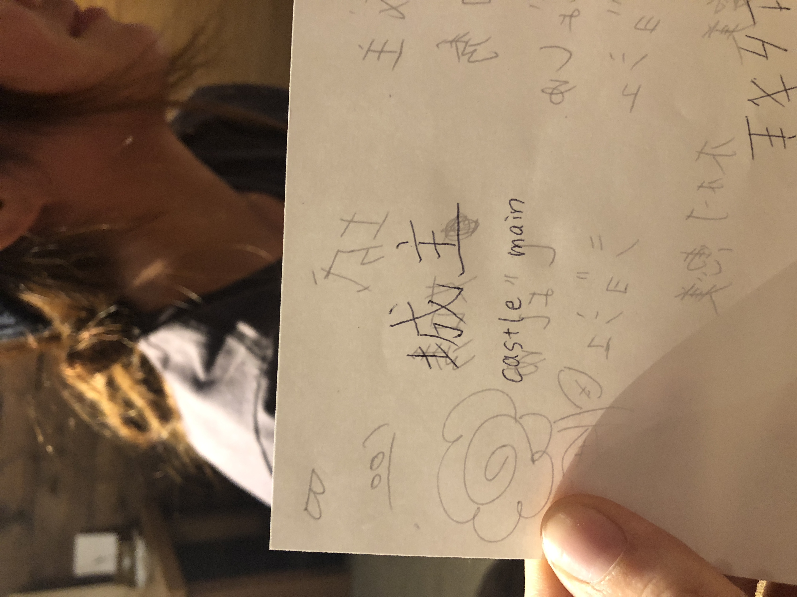
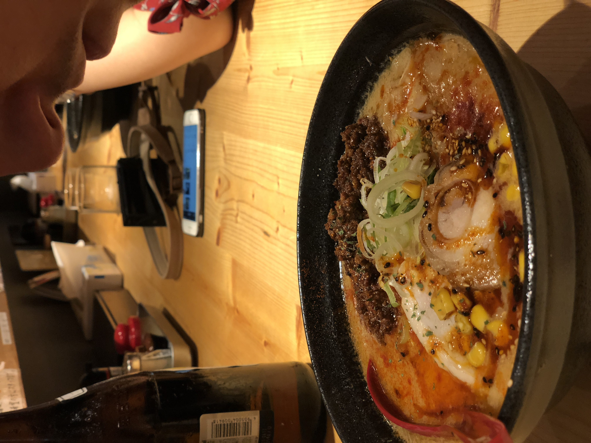
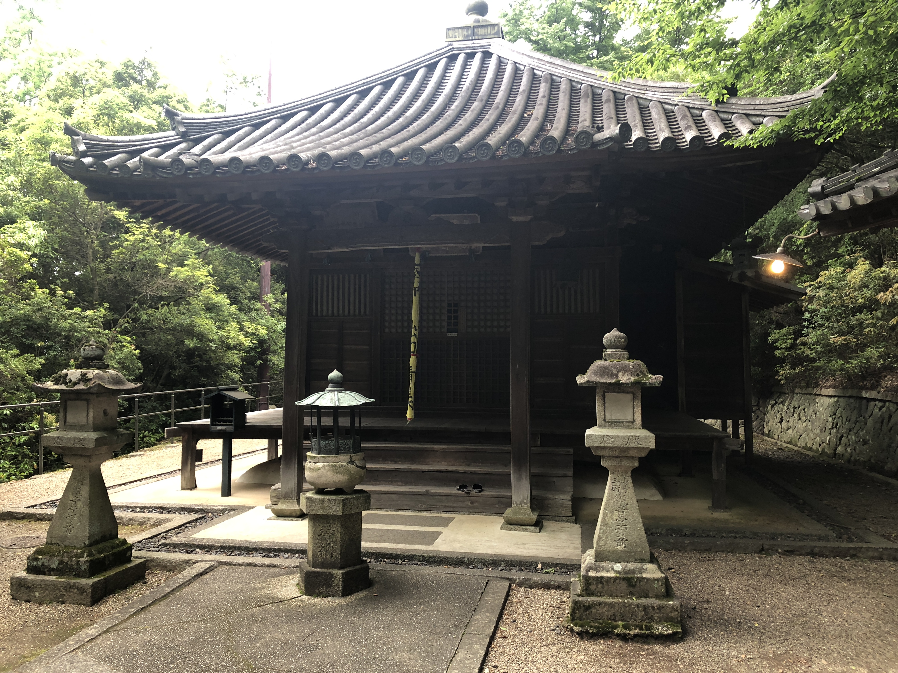
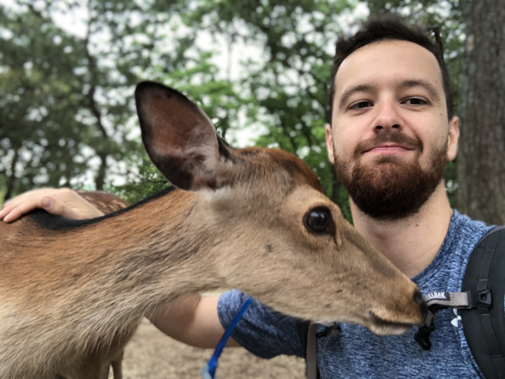
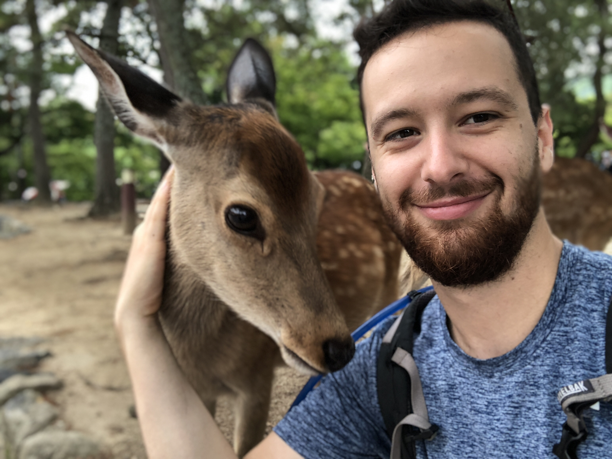

Hi,

So I was on a bullet train this morning, traveling from Higemi to Naoshima while I wrote my weekly letter. I did not have internet at the moment so I was crafting the email in wordpad, and forgot to save as the train pulled up into the station. My computer likes to turn itself off completely when I don't use it for a while, so unfortunately we lost the elaborate email of the past week. Instead, we get the distilled version!

This past Thursday I was sitting on the second floor of the Starbucks. Out the window you can see the hustle and bustle of Dotonburi street , tourists walking around taking pictures and shuffling across the large pedestrian bridge in Namba, downtown Osaka. There's a big waterway that runs right through this area, and a multitude of restaurants lined up on either side.

I was a few hours into the work session when Andrew walked over. He sat down with his laptop and showed me what he had been working on -- a one week jam-packed adventure that would take us all over Japan. Set to leave in three days. So I am now sitting in a traditional style Japanese room in somewhat quaint inn on the island of Naoshima, propped up by our unfolded mat-beds while I write this letter on those Japanese style tables with the really stubby legs.

The past week had been a big push for work. We spent most of our time either working or indulging in an assortment of local delicacies. There were still many times where we had no idea what we were eating. 

There were definitely a lot of highlight meals though. On Monday we met up with Ami and Megumi, two friends we made at a Hostel we stayed at last year while skiing in Hokkaido. They took us to a tiny tucked away Japanese restaurant in a nondescript alleyway somewhere downtown. We ordered rounds and rounds of yakitori, which are pretty much Japanese styled kebabs. They are delicious, and possibly up there on some of the best kind of kebabs you can eat. We sat on little seat cushions with our shoes off and legs crossed over a little Japanese table and drank beer and had a really good time. Megumi speaks almost no English, but fortunately Google Translate helped out a lot. She taught me how to write my name in Japanese. Apparently Josh means "Lord of the Castle" or something like that. 

Afterwards we went to an Izakaya restaurant, which are bars where you get to order more Yakitori! We had a round of beers and some more kebabs. I personally didn't, because I actually had an interview with Amazon that night. I scheduled it for 2am (10am West Coast), and learned that's not the most prudent thing to do for a technical interview. I was definitely super tired by the time 2am rolled around, but it's okay because my heart really wasn't in for the position they were interviewing me for and it's based out of Seattle, which conflicts with my "going-to-San-Francisco" plans. 

We finally got a chance to go to my absolute favorite Ramen spot in literally the entire world. I chanced upon it one random night in Osaka a year ago, and had been yearning to go back since then. It was just as good as I remembered. Thick, rich miso broth coats the springy and slightly firm ramen noodles. They top it with a semi spicy chili oil, slow cooked minced meat and unbelievably tender chashu pork. It's the kind of meal that you wish your hunger would never be satiated, so you can go on eating it indefinitely. 

On Saturday we did a little site-seeing. Finally got around to seeing the Osaka Castle. It's this huge castle that sits atop a big hill overlooking all of Osaka. It's surrounded by several moats that you have to cross to get there. I think you can even stay in the Castle if you want. Japan doesn't put too much focus on the comforts of accommodations, so these would floor mats in a largely unadorned room. Sometimes simple is better. We made it to the castle a few minutes before they closed and climbed the eight stories in order to get a full view of Osaka from the top. 

On Sunday we took the train over to Nara to see some Japanese Shrines. The shrines were very big and impressive, with an enormous, three story Buddha Statue in one of them. It was quite zen walking through the shrines, especially when we got off the tourist route a bit. We meditated in one of the shrines to scents of incense and damp moss from the light rain outside. 

While the Shrines were cool, the fact that the whole place was filled with friendly deer was over the top awesome. There were deer everywhere, just walking amongst people, hanging out, playing frisbee, looking for cookies. There were a few vendors offering packs of cookies to feed the deer, so Andrew and I grabbed two packs and became one with the deer people. Some were friendly, most were pretty indifferent and all of them let you pet them at least once. I guess petting a deer is exactly as you would imaging petting a deer would be if it didn't run away. 

Afterwards we took a long cruise on our skateboards back into town. We found a long stretch of road with just the right amount of downhill to it and had one of the longest coasting rides of probably my life. Moments like that are definitely the finest moments of skateboarding. Like ducking into the barrel of a wave while surfing, or floating across fresh powder on skis. Or maybe knitting with silk yarn for non-action sport people out there. 

We caught the train back to Osaka and met up with our friend Ema for a night in. We actually met her a few days prior out on the town and she ended up living a few minutes away from us. She came over and we ordered some pizza and put on a movie called "Split", which is about three girls who get kidnapped by a person with Dissociative Identity Disorder. Wasn't too scary of a movie, but some of the concepts around the mental disorder as depicted in the movie were pretty fascinating, and I wonder if there is any truth to them. Things like certain "identities" of an individual can express completely different physiology. In this movie, one of the guys 23 identities had diabetes. Of course some of his more "unstable" identities were conniving to create the ultimate identity, called "The Beast" which supposedly transcended human capabilities.  The "mental illness" part of it was that the three identities considered three girls as sacrifice an essential part to this transformation. 

Well, looks like I'm just as capable at writing an extremely lengthy letter two times in a row. I'll wrap this one up for now, Andrew and I need to grab some dinner. We're going to this Izakaya restaurant right next to the inn. Tomorrow, we head to Hiroshima!

Talk to you next week,
Josh

