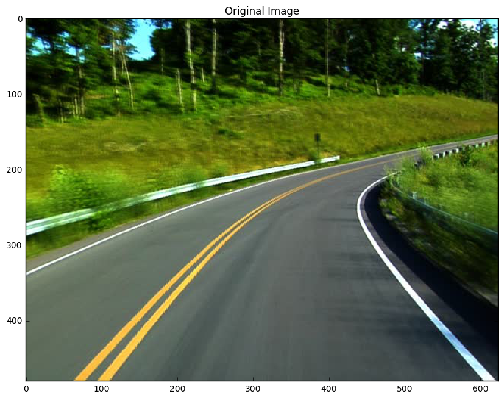
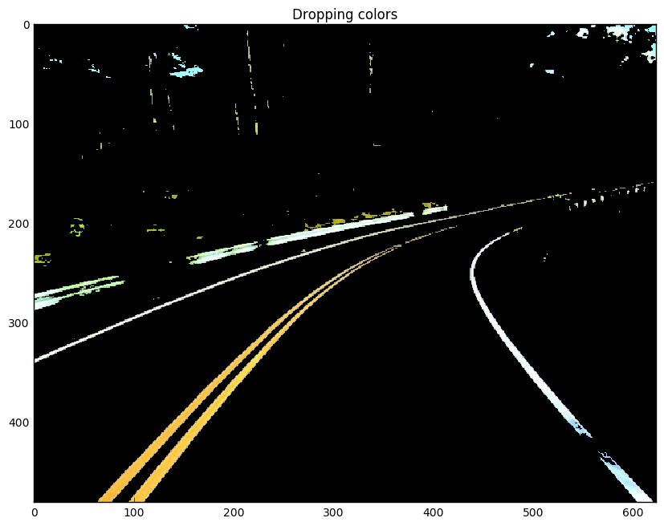
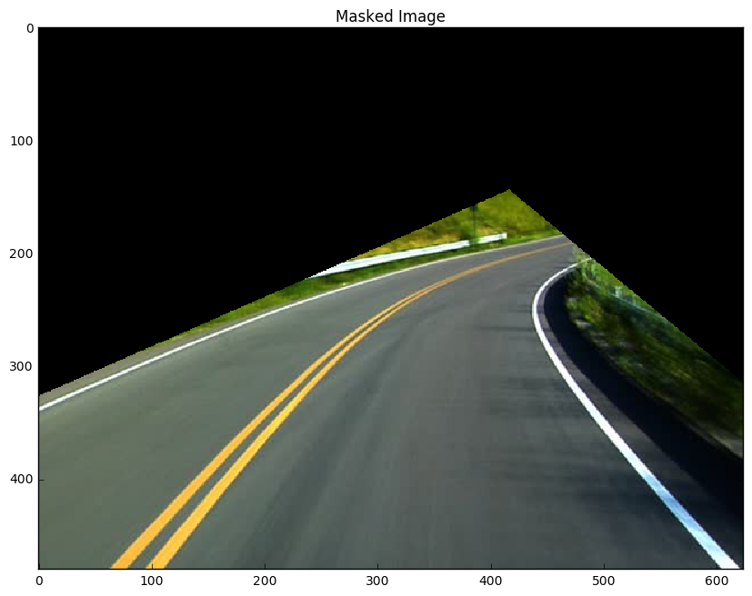
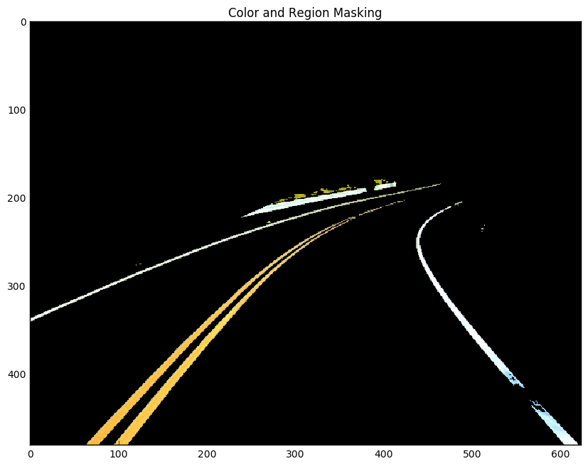
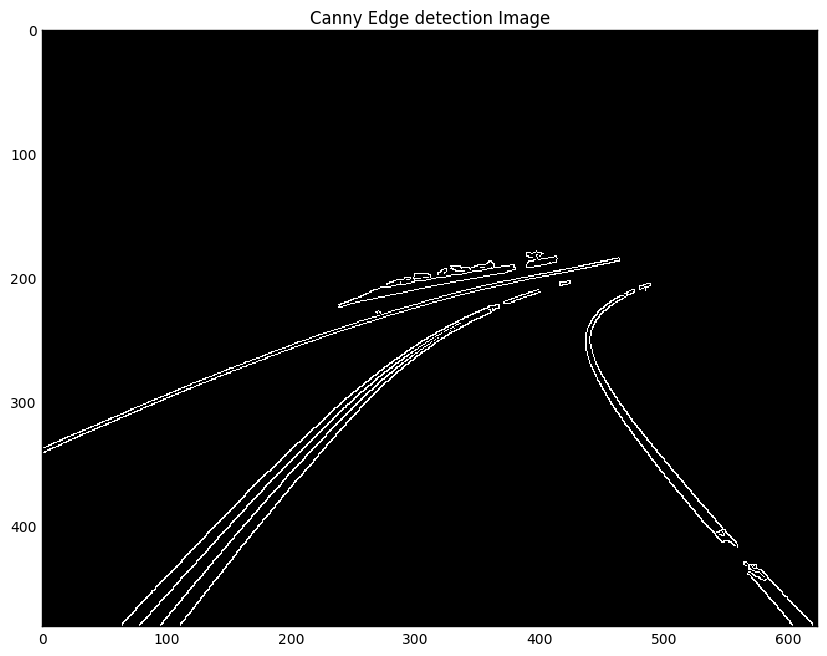

# Image Processing for Lane Detection

The purpose of this journal is to explore image processing techniques for roadway images.


```python
import matplotlib.pyplot as plt
import matplotlib.image as mpimg
import numpy as np
import cv2

%matplotlib inline
plt.rcParams['figure.figsize'] = (10.0, 8.0) # set default size of plots
plt.rcParams['image.interpolation'] = 'nearest'
plt.rcParams['image.cmap'] = 'gray'

# Read in the image
image = mpimg.imread('test2.jpg')

# Grab size of image
y_size, x_size = image.shape[0:2]

# Create Copies
image_color_filter = np.copy(image)
image_region_mask = np.copy(image)

# Original Image
plt.title('Original Image')
plt.imshow(image)
```


    <matplotlib.image.AxesImage at 0x231d45a9518>





### Threshold Image by Color
Taking a full color image, mask all pixels (drop color values to zero) where the pixel intensities are not sufficient for the color white.


```python
def color_mask(img, red=150, green=150, blue=0):
    '''
    Thresholds an image based on RGB color. Drops all pixels that does not meet this color threshold
    input:
    {image}: an image variable assigned by matplotlib.image.imread
    output:
    {region_selection}: an image with masking applied

    '''
    filtered_image = np.copy(img)
    # Color Threshold
    rgb_threshold = [red, green, blue]

    # Reduce values below threshold
    meets_threshold = (img[:, :, 0] < rgb_threshold[0]) \
                    | (img[:, :, 1] < rgb_threshold[1]) \
                    | (img[:, :, 2] < rgb_threshold[2])

    filtered_image[meets_threshold] = [0, 0, 0]

    return filtered_image
plt.title('Dropping colors')
plt.imshow(color_mask(img=image_color_filter))
```


    <matplotlib.image.AxesImage at 0x231db8e3278>





### Segment Image by Region
Looking at the image above, turns out there are areas in the picture that contained colors matching the color filter, so they did not get masked by color thresholding. Here, the picture will be masked by a triangular region where the road should be.


```python
def region_mask(image):
    '''
    Masks all portions of the image that does not include a road.

    input:
    {image}: an image variable assigned by matplotlib.image.imread
    output:
    {region_selection}: the same image with masking applieds

    '''

    # Pull out the x and y sizes and make a copy of the image
    y_size = image.shape[0]
    x_size = image.shape[1]
    region_selection = np.copy(image)

    # Triangular mask points
    point_A = [-350, y_size]
    point_B = [x_size * 2/3, y_size * 3/10]
    point_C = [x_size + 200, y_size]

    # Create lines of triangular mask
    line_AB = np.polyfit((point_A[0], point_B[0]), (point_A[1], point_B[1]), 1)
    line_BC = np.polyfit((point_C[0], point_B[0]), (point_C[1], point_B[1]), 1)
    line_AC = np.polyfit((point_A[0], point_C[0]), (point_A[1], point_C[1]), 1)

    XX, YY = np.meshgrid(np.arange(0, x_size), np.arange(0, y_size))

    # Thresholding the grid values within the region
    threshold = (YY > (XX * line_AB[0] + line_AB[1])) & \
                (YY > (XX * line_BC[0] + line_BC[1])) & \
                (YY < (XX * line_AC[0] + line_AC[1]))
    threshold = threshold != 1

    # Color pixels red within this region
    region_selection[threshold] = [0, 0, 0]

    return region_selection
plt.title('Masked Image')
plt.imshow(region_mask(image_region_mask))
```


    <matplotlib.image.AxesImage at 0x231da7ccc18>





```python
# Process the image for both color and region
processed_image = np.copy(image)
processed_image = color_mask(processed_image)
processed_image = region_mask(processed_image)
plt.title('Color and Region Masking')
plt.imshow(processed_image)
```


    <matplotlib.image.AxesImage at 0x231dc7e6550>





### Canny Edge Detection


```python
# Canny Filter parameters
low_threshold, high_threshold, kernel = 100, 400, 3

grayscale = cv2.cvtColor(np.copy(processed_image), cv2.COLOR_RGB2GRAY)
blur_gray = cv2.GaussianBlur(grayscale, (kernel, kernel), 0)
edge_only = cv2.Canny(blur_gray, low_threshold, high_threshold)

plt.title('Canny Edge detection Image')
plt.imshow(edge_only)

```


    <matplotlib.image.AxesImage at 0x231e6d182e8>





### Hough Transform


```python
# Define the Hough transform parameters
# Make a blank the same size as our image to draw on
rho = 1
theta = np.pi/180
threshold = 1
min_line_length = 10
max_line_gap = 1
line_image = np.copy(edge_only)*0 #creating a blank to draw lines on

# Run Hough on edge detected image
lines = cv2.HoughLinesP(edge_only, rho, theta, threshold, np.array([]),
                            min_line_length, max_line_gap)

# Iterate over the output "lines" and draw lines on the blank
for line in lines:
    for x1,y1,x2,y2 in line:
        cv2.line(line_image,(x1,y1),(x2,y2),(255,0,0),10)

# Create a "color" binary image to combine with line image
color_edges = np.dstack((edge_only, edge_only, edge_only))

# Draw the lines on the edge image
combo = cv2.addWeighted(color_edges, 0.8, line_image, 1, 0)
plt.imshow(combo)
```


    ---------------------------------------------------------------------------

    error                                     Traceback (most recent call last)

    <ipython-input-48-abc7c0f3188c> in <module>()
         21
         22 # Draw the lines on the edge image
    ---> 23 combo = cv2.addWeighted(color_edges, 0.8, line_image, 1, 0)
         24 plt.imshow(combo)


    error: ..\..\..\modules\core\src\arithm.cpp:639: error: (-209) The operation is neither 'array op array' (where arrays have the same size and the same number of channels), nor 'array op scalar', nor 'scalar op array' in function cv::arithm_op


```python

```
