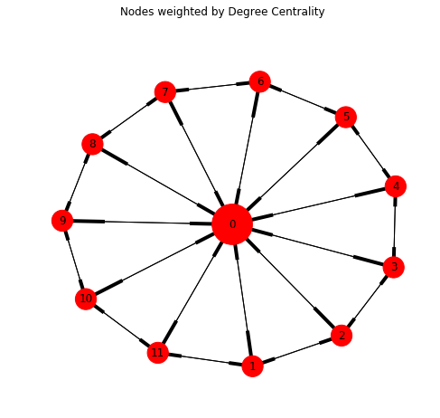
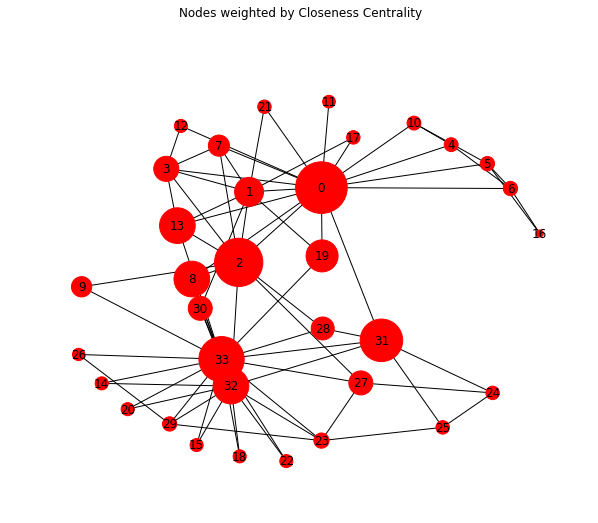
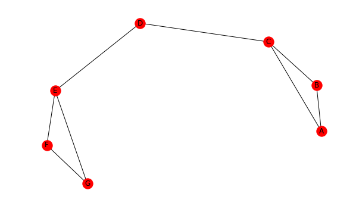

# Centrality Measurements
Do you know any friends who are connectors? They seem to know everybody? Nodes that are connected to many groups find their way to the center of a social network graph. Below are techniques on how to measure the centrality of each node on a network.


```python
import networkx as nx
from matplotlib import pyplot as plt
from IPython.display import display, HTML
from ipywidgets import *

# Put the two tables next to each other
CSS = """
.output {
    flex-direction: row;
    width: 1080px;
    flex: 0 0 100%;
    display: flex;
    max-width: 1000px;
}
"""

pd.set_option('precision', 2)
HTML('<style>{}</style>'.format(CSS))
```


    HTML(value='<style>\n.output {\n    flex-direction: row;\n    width: 1080px;\n    flex: 0 0 100%;\n    display…


## In Degree Centrality
One measure of importance of a given node is the number of connections it has. Perhaps nodes that are referenced by many other nodes are considered important. This makes sense for celebrities in real life. In Degree Centrality is defined by the ratio between the number of in-degree connections (for DiGraph) a node has as compared to the total number of other nodes in a graph.


```python
import numpy as np
import pandas as pd

G = nx.davis_southern_women_graph().to_directed() # nx.karate_club_graph()
G = nx.wheel_graph(12).to_directed()

def degreeCentrality(G):
    num_nodes = len(G.nodes())
    centrality = {n: 0 for n in G.nodes()}

    for n in G.nodes():
        centrality[n] = np.round(G.in_degree(n) / (num_nodes - 1), 2)

    return centrality

centrality = DegreeCentrality(G)
node_size = [centrality[n] * 2000 for n in G.nodes()]

fig = plt.figure(figsize=(8,7))
fig.suptitle('Nodes weighted by Degree Centrality')
pos = nx.spring_layout(G)
nx.draw_networkx(G, pos, node_size=node_size)
plt.axis('off')
plt.show()

display(pd.Series(centrality, name='Degree Centrality').sort_values(ascending=False).reset_index().head(10))

```





<div>
<style scoped>
    .dataframe tbody tr th:only-of-type {
        vertical-align: middle;
    }

    .dataframe tbody tr th {
        vertical-align: top;
    }

    .dataframe thead th {
        text-align: right;
    }
</style>
<table border="1" class="dataframe">
  <thead>
    <tr style="text-align: right;">
      <th></th>
      <th>index</th>
      <th>Degree Centrality</th>
    </tr>
  </thead>
  <tbody>
    <tr>
      <th>0</th>
      <td>0</td>
      <td>1.00</td>
    </tr>
    <tr>
      <th>1</th>
      <td>11</td>
      <td>0.27</td>
    </tr>
    <tr>
      <th>2</th>
      <td>10</td>
      <td>0.27</td>
    </tr>
    <tr>
      <th>3</th>
      <td>9</td>
      <td>0.27</td>
    </tr>
    <tr>
      <th>4</th>
      <td>8</td>
      <td>0.27</td>
    </tr>
    <tr>
      <th>5</th>
      <td>7</td>
      <td>0.27</td>
    </tr>
    <tr>
      <th>6</th>
      <td>6</td>
      <td>0.27</td>
    </tr>
    <tr>
      <th>7</th>
      <td>5</td>
      <td>0.27</td>
    </tr>
    <tr>
      <th>8</th>
      <td>4</td>
      <td>0.27</td>
    </tr>
    <tr>
      <th>9</th>
      <td>3</td>
      <td>0.27</td>
    </tr>
  </tbody>
</table>
</div>


## Closeness Centrality
Another measurement of node importance in a network is the measure of how close a node is between other nodes. The assumption is that an important node is closest to the most other nodes. For social networks, how many connections involve a node?


```python
def closenessCentrality(G, node):
    """
    Closeness defined by the number of [other] nodes in the network
    divided by the sum of all the nodes divided by the nodes distance from them
    """

    paths = all_shortest_paths(G, node)
    n1_to = {n: len(p) - 1 for n, p in paths.items()}

    closeness = (G.number_of_nodes() - 1) / sum([n1_to[n2] for n2 in G.nodes()])

    return closeness


def all_shortest_paths(G, source):
    assert source in G, 'Source node not in Graph'

    this_level = [source]
    paths_to = {source: [source]}

    return _all_shortest_paths_from(this_level, G.adj, paths_to)

def _all_shortest_paths_from(first_level, adj_to, paths_to):
    next_level = first_level

    while next_level:
        curr_level = next_level
        next_level = []

        for curr_node in curr_level:
            for next_node in adj_to[curr_node]:
                if next_node not in paths_to:
                    paths_to[next_node] = paths_to[curr_node] + [next_node]
                    next_level += [next_node]

    return paths_to

```


```python
K = nx.karate_club_graph()

node_size = [4 ** (closenessCentrality(K,n) * 10) for n in K.nodes()]

fig = plt.figure(figsize=(10,8))
fig.suptitle('Nodes weighted by Closeness Centrality')
plt.axis('off')
nx.draw_networkx(K, node_size=node_size)
plt.show()

```





## Betweenness Centrality
One consideration for the importance of a node on a network is the number of connections that run through the node of interest. If a node is often found in the shortest path between all other pairs of nodes, it is considered a more important node. The informal algorithm goes like this:

1. Start with a node of interest
2. count the number of shortest paths between a pair of nodes in the network
3. count the number of these paths that contain the node of interest
4. calculate the ratio between the paths containing this node and the total number of paths
5. sum up ths ratio for all pairs of nodes on the network.

    ***Note that for directed graphs, nodes that are disconnected (there is no path between the pair) should not be included in the calculation, as a 0 for the total number of paths between the two nodes (step 2) would yield an undefined answer.
### Finding the node with the largest Betweenness Centrality, and determining the value


```python
import networkx as nx
import matplotlib.pyplot as plt
import itertools as it

G = nx.Graph()
G.add_edge('A', 'B')
G.add_edge('A', 'C')
G.add_edge('B', 'C')
G.add_edge('C', 'D')
G.add_edge('D', 'E')
G.add_edge('E', 'F')
G.add_edge('E', 'G')
G.add_edge('F', 'G')

plt.figure(figsize=(10,6))
nx.draw_networkx(G)
plt.axis('off')
plt.show()

nodes = G.nodes()
betweenness = {n: 0 for n in nodes}
paths_containing_n = 0
u_v = [i for i in it.combinations(nodes, 2)]

for n in nodes:
    for path in u_v:
        v1, v2 = path
        if v1 == n or v2 == n: continue
        paths_containing_n = 0
        total_number_paths = 0
        for p in nx.all_shortest_paths(G, *path):
            total_number_paths += 1
            if n in p:
                paths_containing_n +=1
        if n == 'D':
            print('shortest paths between {} and {}:\n{} path(s) with D / {} path(s) = {}\n'.format(*path,
                                                                                     paths_containing_n,
                                                                                     total_number_paths,
                                                                                     paths_containing_n/total_number_paths))
        betweenness[n] += (paths_containing_n /
                           total_number_paths)

node = max(betweenness, key=betweenness.get)
print('Node with highest betweenness centrality:', node, '\nScore:',betweenness[node])
```





    shortest paths between G and C:
    1 path(s) with D / 1 path(s) = 1.0

    shortest paths between G and E:
    0 path(s) with D / 1 path(s) = 0.0

    shortest paths between G and B:
    1 path(s) with D / 1 path(s) = 1.0

    shortest paths between G and F:
    0 path(s) with D / 1 path(s) = 0.0

    shortest paths between G and A:
    1 path(s) with D / 1 path(s) = 1.0

    shortest paths between C and E:
    1 path(s) with D / 1 path(s) = 1.0

    shortest paths between C and B:
    0 path(s) with D / 1 path(s) = 0.0

    shortest paths between C and F:
    1 path(s) with D / 1 path(s) = 1.0

    shortest paths between C and A:
    0 path(s) with D / 1 path(s) = 0.0

    shortest paths between E and B:
    1 path(s) with D / 1 path(s) = 1.0

    shortest paths between E and F:
    0 path(s) with D / 1 path(s) = 0.0

    shortest paths between E and A:
    1 path(s) with D / 1 path(s) = 1.0

    shortest paths between B and F:
    1 path(s) with D / 1 path(s) = 1.0

    shortest paths between B and A:
    0 path(s) with D / 1 path(s) = 0.0

    shortest paths between F and A:
    1 path(s) with D / 1 path(s) = 1.0

    Node with highest betweenness centrality: D
    Score: 9.0


## Normalized Betweenness Centrality
dividing the centrality by the number of pairs in the network


```python

def betweennessCentrality(G):

    nodes = G.nodes()
    betweenness = {n: 0 for n in nodes}
    paths_containing_n = 0
    u_v = [i for i in it.combinations(nodes, 2)]

    for n in nodes:
        for path in u_v:
            v1, v2 = path
            if v1 == n or v2 == n: continue
            paths_containing_n = 0
            total_number_paths = 0
            for p in nx.all_shortest_paths(G, *path):
                total_number_paths += 1
                if n in p:
                    paths_containing_n +=1

            betweenness[n] += (paths_containing_n /
                               total_number_paths)

    # Normalize ################################################
    N = len(nodes)
    betweenness = {n: betweenness[n] / (0.5 * (N-1) * (N-2)) for n in nodes}#
    ############################################################

    return betweenness

betweenness = betweennessCentrality(G)

node = max(betweenness, key=betweenness.get)
print('Node with highest betweenness Centrality:{}'.format(node))
print('Normalized Score:',betweenness[node])
```

    Node with highest betweenness Centrality:0
    Normalized Score: 0.7


```python
assert betweennessCentrality(G)[0] == nx.betweenness_centrality(G)[0]
assert closenessCentrality(G, 0) == nx.closeness_centrality(G)[0]
assert degreeCentrality(G)[0] == nx.degree_centrality(G)[0]
```


    ---------------------------------------------------------------------------

    AssertionError                            Traceback (most recent call last)

    <ipython-input-205-b06414e5183f> in <module>()
          1 assert betweennessCentrality(G)[0] == nx.betweenness_centrality(G)[0]
          2 assert closenessCentrality(G, 0) == nx.closeness_centrality(G)[0]
    ----> 3 assert degreeCentrality(G)[0] == nx.degree_centrality(G)[0]


    AssertionError:


```python
nx.degree_centrality(G)[0]
```


    2.0
