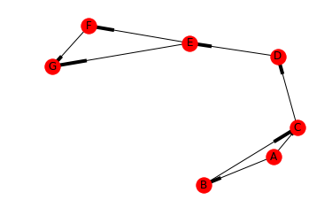

# Graph Search
Algorithms for finding paths, searching for nodes in unweighted and weighted graphs


```python
from IPython.display import display, HTML

CSS = """
.output {
    margin: left;
    flex-direction: row;
    border-style: dotted;
}
"""
HTML('<style>{}</style>'.format(CSS))
```


<style>
.output {
    margin: left;
    flex-wrap: nowrap;
    width: 150%;
    flex-direction: row;
    border-style: dotted;
}
</style>


## Shortest Path Algorithm
Find shortest path to all other nodes from given node


```python
def all_shortest_paths(G, source):
    assert source in G, 'Source node not in Graph'

    this_level = [source]
    paths_to = {source: [source]}

    return _all_shortest_paths_from(this_level, G.adj, paths_to)

def _all_shortest_paths_from(first_level, adj_to, paths_to):
    next_level = first_level

    while next_level:
        curr_level = next_level
        next_level = []

        for curr_node in curr_level:
            for next_node in adj_to[curr_node]:
                if next_node not in paths_to:
                    paths_to[next_node] = paths_to[curr_node] + [next_node]
                    next_level += [next_node]

    return paths_to
```


```python
import networkx as nx
import matplotlib.pyplot as plt

G = nx.DiGraph()
G.add_edge('A', 'B')
G.add_edge('A', 'C')
G.add_edge('B', 'C')
G.add_edge('C', 'D')
G.add_edge('D', 'E')
G.add_edge('E', 'F')
G.add_edge('E', 'G')
G.add_edge('F', 'G')


plt.figure(figsize=(6,4))
plt.axis('off')
for target, path in all_shortest_paths(G, 'C').items():
    print('From C to {}: \n\t{}'.format(target, '->'.join(path)))

nx.draw_networkx(G)
plt.show()
```

    From C to F:
    	C->D->E->F
    From C to E:
    	C->D->E
    From C to C:
    	C
    From C to D:
    	C->D
    From C to G:
    	C->D->E->G



