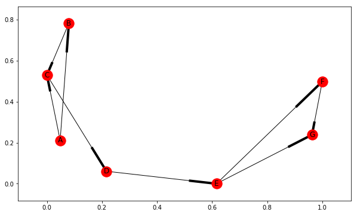

---
title: "HITS Algorithm: Hubs and Authority"
date: "2018-04-18"
path: "/hits-algorithm/"
category: "Notes"
section: "Network Analysis"

---

Algorithm runs k iterations, updating the hub value and authority value of all nodes.

**Steps:**
1. set all nodes to a hub and authority value of 1
2. for each node, calculate the authority score by summing up the neighboring nodes hub values for all incoming connections
3. for each node, calculate the hub score by summing up the neighboring nodes authority values for all outgoing connections
4. Normalize each score: divide by sum of authority / hub score of all nodes
5. assign new score to each node


```python
def HITS(G, k=10):
    hubs = {n: 1 for n in G.nodes()}
    auth = {n: 1 for n in G.nodes()}
    
    for _ in range(k):

        curr_hubs = hubs
        curr_auth = auth

        for n in G.nodes():
            for i in G.(n):
                auth[n] += curr_hubs[i]
            for i in G.successors(n):
                hubs[n] += curr_auth[i]

        total_auth = sum([i for i in curr_auth.values()])
        total_hubs = sum([i for i in curr_hubs.values()])

        for n in G.nodes():  # regularize
            auth[n] /= total_auth
            hubs[n] /= total_hubs
            
    return hubs, auth
```


```python
import networkx as nx
import matplotlib.pyplot as plt

G = nx.DiGraph()
G.add_edge('A', 'B')
G.add_edge('A', 'C')
G.add_edge('B', 'C')
G.add_edge('C', 'D')
G.add_edge('D', 'E')
G.add_edge('E', 'F')
G.add_edge('E', 'G')
G.add_edge('F', 'G')


fig = plt.figure(figsize=(10,6))

nx.draw_networkx(G)
plt.show()
```





```python
import pandas as pd
import numpy as np
from IPython.display import display, HTML

# Put the two tables next to each other
CSS = """
.output {
    flex-direction: row;
}
"""

pd.set_option('precision', 2)
HTML('<style>{}</style>'.format(CSS))
```


<style>
.output {
    flex-direction: row;
}
</style>


```python
%%html
<style>
.output {
    flex-direction: row;
}
</style>
```


<style>
.output {
    flex-direction: row;
}
</style>


```python
hubs, auth = HITS(G, 100)
df_hubs = pd.Series(hubs, name='Hub Value').reset_index()
df_auth = pd.Series(auth, name='Authority Value').reset_index()

display(np.round(df_hubs,4))
display(np.round(df_auth,4))
```


<div>
<style scoped>
    .dataframe tbody tr th:only-of-type {
        vertical-align: middle;
    }

    .dataframe tbody tr th {
        vertical-align: top;
    }

    .dataframe thead th {
        text-align: right;
    }
</style>
<table border="1" class="dataframe">
  <thead>
    <tr style="text-align: right;">
      <th></th>
      <th>index</th>
      <th>Hub Value</th>
    </tr>
  </thead>
  <tbody>
    <tr>
      <th>0</th>
      <td>A</td>
      <td>0.24</td>
    </tr>
    <tr>
      <th>1</th>
      <td>B</td>
      <td>0.14</td>
    </tr>
    <tr>
      <th>2</th>
      <td>C</td>
      <td>0.00</td>
    </tr>
    <tr>
      <th>3</th>
      <td>D</td>
      <td>0.00</td>
    </tr>
    <tr>
      <th>4</th>
      <td>E</td>
      <td>0.16</td>
    </tr>
    <tr>
      <th>5</th>
      <td>F</td>
      <td>0.46</td>
    </tr>
    <tr>
      <th>6</th>
      <td>G</td>
      <td>0.00</td>
    </tr>
  </tbody>
</table>
</div>


<div>
<style scoped>
    .dataframe tbody tr th:only-of-type {
        vertical-align: middle;
    }

    .dataframe tbody tr th {
        vertical-align: top;
    }

    .dataframe thead th {
        text-align: right;
    }
</style>
<table border="1" class="dataframe">
  <thead>
    <tr style="text-align: right;">
      <th></th>
      <th>index</th>
      <th>Authority Value</th>
    </tr>
  </thead>
  <tbody>
    <tr>
      <th>0</th>
      <td>A</td>
      <td>0.00</td>
    </tr>
    <tr>
      <th>1</th>
      <td>B</td>
      <td>0.07</td>
    </tr>
    <tr>
      <th>2</th>
      <td>C</td>
      <td>0.44</td>
    </tr>
    <tr>
      <th>3</th>
      <td>D</td>
      <td>0.00</td>
    </tr>
    <tr>
      <th>4</th>
      <td>E</td>
      <td>0.00</td>
    </tr>
    <tr>
      <th>5</th>
      <td>F</td>
      <td>0.18</td>
    </tr>
    <tr>
      <th>6</th>
      <td>G</td>
      <td>0.31</td>
    </tr>
  </tbody>
</table>
</div>

