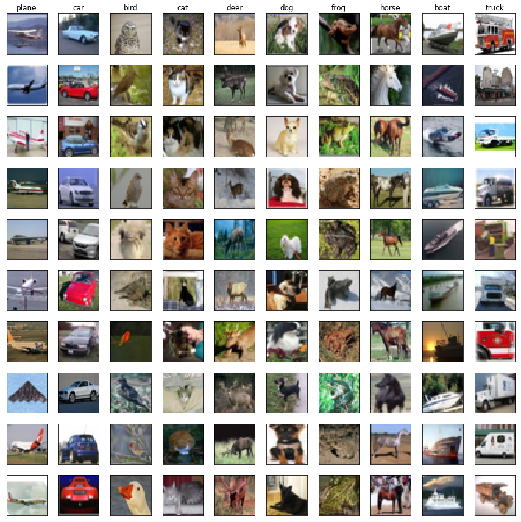

In this write up I will be developing a Convolutional Neural Network to do image recognition. I will be working with the CIFAR-10 dataset. This is a very popular image dataset for developing and testing Machine Learning algorithms due to image size and data quality; training a model with variations in optimization parameters or architectures can happen much more quickly, while still being applicable to image related challenges. This dataset size and structure also be transferable to real world datasets of images where the image sizes are not very large. An example could be segmented photos of lung modules or small features of larger images that were curated into a dataset for classification tasks.

In this secenary, the hypothetical client has given me a repository of images and they ask if I can build a model that will correctly recognize a series of classes from a bunch of images. My assumption here is that this request can be predicted, and that there is sufficient data to make this prediction:

_Hypothesis 1:_
 - There is a statistical probability relating the outputs to the inputs (I can beat random).
 
_Hypothesis 2:_
 - There is sufficient data to learn the relationships between the inputs and the outputs.
 
To test this, I will take a quick look at the data, build a base line model, and see if I can apply training tricks, statistical techniques and architectures in the hopes that I will have a powerful prediction engine.


```python
from keras.datasets import cifar10
import numpy as np
import pandas as pd
import matplotlib.pyplot as plt
from matplotlib import gridspec
from sklearn.metrics import confusion_matrix
from keras import optimizers
import keras.backend as K
import pickle
import itertools
```

    /home/paperspace/anaconda3/envs/fastai/lib/python3.6/site-packages/h5py/__init__.py:36: FutureWarning: Conversion of the second argument of issubdtype from `float` to `np.floating` is deprecated. In future, it will be treated as `np.float64 == np.dtype(float).type`.
      from ._conv import register_converters as _register_converters
    Using TensorFlow backend.
    


```python
%reload_ext autoreload
%autoreload 2
%matplotlib inline
```

### Load dataset


```python
(x_train, y_train), (x_test, y_test) = cifar10.load_data()
```

### Peek at some samples


```python
label = {0: 'plane', 1: 'car', 2:'bird', 3:'cat', 4:'deer', 
         5:'dog', 6:'frog', 7:'horse', 8:'boat', 9: 'truck'}

rows, cols = 10, 10
def plot_samples(x_train, y_train, rows, cols):
    
    fig = plt.figure(figsize=(12,12))
    g_s = gridspec.GridSpec(rows, cols)
    # g_s.update(left=0.1,right=0.9,wspace=0.05, top=0.9, bottom=0.1)
    ax = {}
    
    for i in range(cols):
        sample_pics = x_train[(y_train == i).reshape(-1)]
        for j in range(rows):
            num_samples = sample_pics.shape[0]
            random_idx = np.random.choice(num_samples, replace=False) 
            sample_pic = x_train[(y_train == i).reshape(-1)][random_idx]

            ax[(i, j)] = fig.add_subplot(g_s[j, i])
            ax[(i, j)].set_xticks([])
            ax[(i, j)].set_yticks([])
            ax[(i, j)].imshow(sample_pic)
        ax[(i, 0)].set_title(label[i])
    fig.tight_layout()
plot_samples(x_train, y_train, rows, cols);
```





### Observations
- Some images are not completely centered (padding and sub-sampling might help)
- Background color is diverse within subgroups (model may not train on color scheme of photos?)
- The entire object is contained in each image (easier time for recognition)
- the images are all the same size (no cropping, padding or subsampling necessary)
- there is a perfect distribution of classes (oversampling not necessary)

### Creating Data Splits: Validation Sets
First let's create a validation set from the training set. It's good practice to train your model on one set of data, then improve the accuracy and tune hyper-parameters by measuring against a validation set. After all the fine-tuning is done, the final predictive capabilities of the model should be on a set of data that it has never seen before. There is a possibility that in the process of tuning the hyper-parameters, the model has over-fitted to the validation data, so a good judge of generalization is to measure against the test dataset.


```python
print('Current Data Shape:'
      '\n\tX(train): {}'
      '\n\tY(train): {}'
      '\n\tX(test): {}'
      '\n\tY(test): {}'.format(x_train.shape[0],
                               y_train.shape[0],
                               x_test.shape[0],
                               y_test.shape[0]))

def shuffle_split(x, y, split=0.8):
    samples = x.shape[0]
    shuffle = np.random.choice(samples, samples)
    x = x[shuffle]
    y = y[shuffle]
    split_idx = int(samples * split)
    x_train = x[:split_idx]
    y_train = y[:split_idx]
    x_valid = x[split_idx:]
    y_valid = y[split_idx:]
    
    return x_train, y_train, x_valid, y_valid

x_train, y_train, x_valid, y_valid = shuffle_split(x_train, y_train)

print('Split Data Shape:'
      '\n\tX(train): {}'
      '\n\tY(train): {}'
      '\n\tX(valid): {}'
      '\n\tY(valid): {}'.format(x_train.shape[0],
                               y_train.shape[0],
                               x_valid.shape[0],
                               y_valid.shape[0]))

```

    Current Data Shape:
    	X(train): 50000
    	Y(train): 50000
    	X(test): 10000
    	Y(test): 10000
    Split Data Shape:
    	X(train): 40000
    	Y(train): 40000
    	X(valid): 10000
    	Y(valid): 10000
    

### Pre-Processing the Data
Generally Machine Learning models like normalized data. That way no single feature over powers other features because of the magnitude of scale. Image data is technically of the same scale (all values exist between 0-255), but it's best to have the values centered about zero and with a standard deviation of 1. This helps control the weight values and generally allows the model to train properly.

Another technique employed is random horizontal flipping. This data augmentation technique randomly flips the images, creating unique perspectives of the same object. This can lead to better predictive capabilities.


```python
from keras.preprocessing.image import ImageDataGenerator
from keras.utils.np_utils import to_categorical

# Data metadata
num_classes = 10
in_dim = x_train.shape[1:]

# Normalize data; create preprocessing function
data = ImageDataGenerator(samplewise_center=True, 
                          samplewise_std_normalization=True,
                          horizontal_flip=True)
data.fit(x_train)

# Convert y_train to one hot encoding of classes(num_examples x num_classes)
y_train = to_categorical(y_train, num_classes)
y_valid = to_categorical(y_valid, num_classes)
y_test = to_categorical(y_test, num_classes)

# TODO:
# Add Data Augmentation
# Add padding: Add pixels around image and pick 32x32 not centered crops
```

### Simple Deep Convolutional Neural Network


```python
from keras.models import Sequential
from keras.layers import Dense, Activation, Flatten, Conv2D, MaxPooling2D, Dropout

# hyper parameters:
p = 0.25  # Dropout probability 
k = 3     # kernel size for convolution
f1 = 32   # number of filters, convolution 1
f2 = 64   # number of filters, convolution 2

model = Sequential(
        [Conv2D(f1, (k, k), padding='same', name='First-Convolution', input_shape=in_dim),
         Activation('relu', name='First-Relu'),
         Conv2D(f1, (k, k), padding='same', name='Second-Convolution'),
         Activation('relu', name='Second-Relu'),
         MaxPooling2D((2, 2), name='First-Max-Pool'),
         Dropout(p, name='First-Dropout'),
         Conv2D(f2, (k, k), padding='same', name='Third-Convolution'),
         Activation('relu', name='Third-Relu'),
         Conv2D(f2, (k, k), padding='same', name='Fourth-Convolution'),
         Activation('relu', name='Fourth-Relu'),
         MaxPooling2D((2, 2), name='Second-Max-Pool'),
         Dropout(p, name='Second-Dropout'),
         Flatten(name='Flatten'),
         Dense(512, name='First-Affine'),
         Activation('relu', name='Fifth-Relu'),
         Dropout(2*p, name='Third-Dropout'),
         Dense(10, name='Final-Connected-Layer'),
         Activation('softmax', name='Softmax')
        ])

print(model.summary())
```

    _________________________________________________________________
    Layer (type)                 Output Shape              Param #   
    =================================================================
    First-Convolution (Conv2D)   (None, 32, 32, 32)        896       
    _________________________________________________________________
    First-Relu (Activation)      (None, 32, 32, 32)        0         
    _________________________________________________________________
    Second-Convolution (Conv2D)  (None, 32, 32, 32)        9248      
    _________________________________________________________________
    Second-Relu (Activation)     (None, 32, 32, 32)        0         
    _________________________________________________________________
    First-Max-Pool (MaxPooling2D (None, 16, 16, 32)        0         
    _________________________________________________________________
    First-Dropout (Dropout)      (None, 16, 16, 32)        0         
    _________________________________________________________________
    Third-Convolution (Conv2D)   (None, 16, 16, 64)        18496     
    _________________________________________________________________
    Third-Relu (Activation)      (None, 16, 16, 64)        0         
    _________________________________________________________________
    Fourth-Convolution (Conv2D)  (None, 16, 16, 64)        36928     
    _________________________________________________________________
    Fourth-Relu (Activation)     (None, 16, 16, 64)        0         
    _________________________________________________________________
    Second-Max-Pool (MaxPooling2 (None, 8, 8, 64)          0         
    _________________________________________________________________
    Second-Dropout (Dropout)     (None, 8, 8, 64)          0         
    _________________________________________________________________
    Flatten (Flatten)            (None, 4096)              0         
    _________________________________________________________________
    First-Affine (Dense)         (None, 512)               2097664   
    _________________________________________________________________
    Fifth-Relu (Activation)      (None, 512)               0         
    _________________________________________________________________
    Third-Dropout (Dropout)      (None, 512)               0         
    _________________________________________________________________
    Final-Connected-Layer (Dense (None, 10)                5130      
    _________________________________________________________________
    Softmax (Activation)         (None, 10)                0         
    =================================================================
    Total params: 2,168,362
    Trainable params: 2,168,362
    Non-trainable params: 0
    _________________________________________________________________
    None
    

### Model Architecture


```python
from IPython.display import SVG
from keras.utils.vis_utils import model_to_dot

SVG(model_to_dot(model).create(prog='dot', format='svg'))
```


### Compile and Train a Base Model


```python
base_model = model

# Iterations
num_train = x_train.shape[0]
num_epochs = 300
batch_size = 500
iters_per_epoch = num_train // batch_size

base_model.compile(loss='categorical_crossentropy', 
                   optimizer=optimizers.SGD(lr=0.001), 
                   metrics=['categorical_accuracy'])

# Flow training data through pre-processing pipeline
train_datagen = data.flow(x_train, y_train, batch_size=batch_size)
valid_datagen = data.flow(x_valid, y_valid, batch_size=batch_size)
test_datagen = data.flow(x_test, batch_size=batch_size)

# Fit the model
hist = base_model.fit_generator(train_datagen,
                                epochs=num_epochs,
                                validation_data=valid_datagen,
                                shuffle=True)

y_pred = base_model.predict_generator(test_datagen)
```

    Epoch 1/300
    80/80 [==============================] - 9s 108ms/step - loss: 2.3291 - categorical_accuracy: 0.1034 - val_loss: 2.2949 - val_categorical_accuracy: 0.1276
    Epoch 2/300
    80/80 [==============================] - 8s 102ms/step - loss: 2.3160 - categorical_accuracy: 0.1079 - val_loss: 2.2882 - val_categorical_accuracy: 0.1490
    Epoch 3/300
    80/80 [==============================] - 8s 103ms/step - loss: 2.3052 - categorical_accuracy: 0.1160 - val_loss: 2.2815 - val_categorical_accuracy: 0.1717
    Epoch 4/300
    80/80 [==============================] - 8s 102ms/step - loss: 2.2968 - categorical_accuracy: 0.1230 - val_loss: 2.2756 - val_categorical_accuracy: 0.1844
    Epoch 5/300
    80/80 [==============================] - 8s 103ms/step - loss: 2.2898 - categorical_accuracy: 0.1266 - val_loss: 2.2687 - val_categorical_accuracy: 0.1992
    Epoch 6/300
    80/80 [==============================] - 8s 103ms/step - loss: 2.2841 - categorical_accuracy: 0.1340 - val_loss: 2.2615 - val_categorical_accuracy: 0.2174
    Epoch 7/300
    80/80 [==============================] - 8s 101ms/step - loss: 2.2769 - categorical_accuracy: 0.1426 - val_loss: 2.2542 - val_categorical_accuracy: 0.2284
    Epoch 8/300
    80/80 [==============================] - 8s 103ms/step - loss: 2.2685 - categorical_accuracy: 0.1506 - val_loss: 2.2456 - val_categorical_accuracy: 0.2358
    Epoch 9/300
    80/80 [==============================] - 8s 102ms/step - loss: 2.2583 - categorical_accuracy: 0.1582 - val_loss: 2.2356 - val_categorical_accuracy: 0.2461
    Epoch 10/300
    80/80 [==============================] - 8s 102ms/step - loss: 2.2500 - categorical_accuracy: 0.1655 - val_loss: 2.2237 - val_categorical_accuracy: 0.2554
    Epoch 11/300
    80/80 [==============================] - 8s 103ms/step - loss: 2.2377 - categorical_accuracy: 0.1732 - val_loss: 2.2103 - val_categorical_accuracy: 0.2596
    Epoch 12/300
    80/80 [==============================] - 8s 104ms/step - loss: 2.2229 - categorical_accuracy: 0.1838 - val_loss: 2.1940 - val_categorical_accuracy: 0.2604
    Epoch 13/300
    80/80 [==============================] - 8s 102ms/step - loss: 2.2079 - categorical_accuracy: 0.1933 - val_loss: 2.1747 - val_categorical_accuracy: 0.2641
    Epoch 14/300
    80/80 [==============================] - 8s 103ms/step - loss: 2.1913 - categorical_accuracy: 0.1964 - val_loss: 2.1526 - val_categorical_accuracy: 0.2674
    Epoch 15/300
    80/80 [==============================] - 8s 103ms/step - loss: 2.1738 - categorical_accuracy: 0.2019 - val_loss: 2.1295 - val_categorical_accuracy: 0.2695
    Epoch 16/300
    80/80 [==============================] - 8s 101ms/step - loss: 2.1514 - categorical_accuracy: 0.2114 - val_loss: 2.1057 - val_categorical_accuracy: 0.2725
    Epoch 17/300
    80/80 [==============================] - 8s 103ms/step - loss: 2.1323 - categorical_accuracy: 0.2163 - val_loss: 2.0806 - val_categorical_accuracy: 0.2784
    Epoch 18/300
    80/80 [==============================] - 8s 103ms/step - loss: 2.1140 - categorical_accuracy: 0.2217 - val_loss: 2.0573 - val_categorical_accuracy: 0.2838
    Epoch 19/300
    80/80 [==============================] - 8s 103ms/step - loss: 2.0927 - categorical_accuracy: 0.2305 - val_loss: 2.0355 - val_categorical_accuracy: 0.2915
    Epoch 20/300
    80/80 [==============================] - 8s 103ms/step - loss: 2.0805 - categorical_accuracy: 0.2313 - val_loss: 2.0152 - val_categorical_accuracy: 0.3014
    Epoch 21/300
    80/80 [==============================] - 8s 103ms/step - loss: 2.0665 - categorical_accuracy: 0.2353 - val_loss: 1.9988 - val_categorical_accuracy: 0.3062
    Epoch 22/300
    80/80 [==============================] - 8s 103ms/step - loss: 2.0501 - categorical_accuracy: 0.2433 - val_loss: 1.9837 - val_categorical_accuracy: 0.3154
    Epoch 23/300
    80/80 [==============================] - 8s 100ms/step - loss: 2.0402 - categorical_accuracy: 0.2479 - val_loss: 1.9707 - val_categorical_accuracy: 0.3195
    Epoch 24/300
    80/80 [==============================] - 8s 103ms/step - loss: 2.0291 - categorical_accuracy: 0.2531 - val_loss: 1.9578 - val_categorical_accuracy: 0.3241
    Epoch 25/300
    80/80 [==============================] - 8s 102ms/step - loss: 2.0212 - categorical_accuracy: 0.2554 - val_loss: 1.9461 - val_categorical_accuracy: 0.3246
    Epoch 26/300
    80/80 [==============================] - 8s 102ms/step - loss: 2.0116 - categorical_accuracy: 0.2587 - val_loss: 1.9361 - val_categorical_accuracy: 0.3312
    Epoch 27/300
    80/80 [==============================] - 8s 104ms/step - loss: 2.0028 - categorical_accuracy: 0.2643 - val_loss: 1.9261 - val_categorical_accuracy: 0.3318
    Epoch 28/300
    80/80 [==============================] - 8s 102ms/step - loss: 1.9930 - categorical_accuracy: 0.2697 - val_loss: 1.9162 - val_categorical_accuracy: 0.3366
    Epoch 29/300
    80/80 [==============================] - 8s 100ms/step - loss: 1.9840 - categorical_accuracy: 0.2718 - val_loss: 1.9079 - val_categorical_accuracy: 0.3382
    Epoch 30/300
    80/80 [==============================] - 8s 103ms/step - loss: 1.9740 - categorical_accuracy: 0.2781 - val_loss: 1.8999 - val_categorical_accuracy: 0.3419
    Epoch 31/300
    80/80 [==============================] - 8s 103ms/step - loss: 1.9692 - categorical_accuracy: 0.2825 - val_loss: 1.8897 - val_categorical_accuracy: 0.3470
    Epoch 32/300
    80/80 [==============================] - 8s 102ms/step - loss: 1.9648 - categorical_accuracy: 0.2833 - val_loss: 1.8829 - val_categorical_accuracy: 0.3492
    Epoch 33/300
    80/80 [==============================] - 8s 102ms/step - loss: 1.9593 - categorical_accuracy: 0.2853 - val_loss: 1.8765 - val_categorical_accuracy: 0.3503
    Epoch 34/300
    80/80 [==============================] - 8s 104ms/step - loss: 1.9478 - categorical_accuracy: 0.2908 - val_loss: 1.8696 - val_categorical_accuracy: 0.3535
    Epoch 35/300
    80/80 [==============================] - 8s 102ms/step - loss: 1.9432 - categorical_accuracy: 0.2949 - val_loss: 1.8613 - val_categorical_accuracy: 0.3543
    Epoch 36/300
    80/80 [==============================] - 8s 101ms/step - loss: 1.9329 - categorical_accuracy: 0.3031 - val_loss: 1.8557 - val_categorical_accuracy: 0.3587
    Epoch 37/300
    80/80 [==============================] - 8s 103ms/step - loss: 1.9302 - categorical_accuracy: 0.2988 - val_loss: 1.8487 - val_categorical_accuracy: 0.3589
    Epoch 38/300
    80/80 [==============================] - 8s 101ms/step - loss: 1.9228 - categorical_accuracy: 0.3038 - val_loss: 1.8418 - val_categorical_accuracy: 0.3626
    Epoch 39/300
    80/80 [==============================] - 8s 103ms/step - loss: 1.9150 - categorical_accuracy: 0.3056 - val_loss: 1.8348 - val_categorical_accuracy: 0.3653
    Epoch 40/300
    80/80 [==============================] - 8s 101ms/step - loss: 1.9128 - categorical_accuracy: 0.3033 - val_loss: 1.8285 - val_categorical_accuracy: 0.3676
    Epoch 41/300
    80/80 [==============================] - 8s 103ms/step - loss: 1.9077 - categorical_accuracy: 0.3091 - val_loss: 1.8222 - val_categorical_accuracy: 0.3691
    Epoch 42/300
    80/80 [==============================] - 8s 102ms/step - loss: 1.8994 - categorical_accuracy: 0.3094 - val_loss: 1.8162 - val_categorical_accuracy: 0.3721
    Epoch 43/300
    80/80 [==============================] - 8s 103ms/step - loss: 1.8926 - categorical_accuracy: 0.3154 - val_loss: 1.8100 - val_categorical_accuracy: 0.3734
    Epoch 44/300
    80/80 [==============================] - 8s 101ms/step - loss: 1.8878 - categorical_accuracy: 0.3189 - val_loss: 1.8030 - val_categorical_accuracy: 0.3745
    Epoch 45/300
    80/80 [==============================] - 8s 102ms/step - loss: 1.8799 - categorical_accuracy: 0.3222 - val_loss: 1.7964 - val_categorical_accuracy: 0.3786
    Epoch 46/300
    80/80 [==============================] - 8s 102ms/step - loss: 1.8780 - categorical_accuracy: 0.3214 - val_loss: 1.7897 - val_categorical_accuracy: 0.3801
    Epoch 47/300
    80/80 [==============================] - 8s 103ms/step - loss: 1.8730 - categorical_accuracy: 0.3246 - val_loss: 1.7859 - val_categorical_accuracy: 0.3833
    Epoch 48/300
    80/80 [==============================] - 8s 101ms/step - loss: 1.8633 - categorical_accuracy: 0.3277 - val_loss: 1.7792 - val_categorical_accuracy: 0.3867
    Epoch 49/300
    80/80 [==============================] - 8s 102ms/step - loss: 1.8580 - categorical_accuracy: 0.3315 - val_loss: 1.7723 - val_categorical_accuracy: 0.3860
    Epoch 50/300
    80/80 [==============================] - 8s 102ms/step - loss: 1.8555 - categorical_accuracy: 0.3294 - val_loss: 1.7668 - val_categorical_accuracy: 0.3883
    Epoch 51/300
    80/80 [==============================] - 8s 102ms/step - loss: 1.8535 - categorical_accuracy: 0.3285 - val_loss: 1.7606 - val_categorical_accuracy: 0.3891
    Epoch 52/300
    80/80 [==============================] - 8s 102ms/step - loss: 1.8414 - categorical_accuracy: 0.3383 - val_loss: 1.7545 - val_categorical_accuracy: 0.3901
    Epoch 53/300
    80/80 [==============================] - 8s 102ms/step - loss: 1.8398 - categorical_accuracy: 0.3356 - val_loss: 1.7511 - val_categorical_accuracy: 0.3930
    Epoch 54/300
    80/80 [==============================] - 8s 102ms/step - loss: 1.8345 - categorical_accuracy: 0.3373 - val_loss: 1.7445 - val_categorical_accuracy: 0.3935
    Epoch 55/300
    80/80 [==============================] - 8s 103ms/step - loss: 1.8278 - categorical_accuracy: 0.3424 - val_loss: 1.7384 - val_categorical_accuracy: 0.3938
    Epoch 56/300
    80/80 [==============================] - 8s 101ms/step - loss: 1.8191 - categorical_accuracy: 0.3455 - val_loss: 1.7319 - val_categorical_accuracy: 0.3947
    Epoch 57/300
    80/80 [==============================] - 8s 102ms/step - loss: 1.8179 - categorical_accuracy: 0.3415 - val_loss: 1.7273 - val_categorical_accuracy: 0.3931
    Epoch 58/300
    80/80 [==============================] - 8s 102ms/step - loss: 1.8118 - categorical_accuracy: 0.3464 - val_loss: 1.7209 - val_categorical_accuracy: 0.3966
    Epoch 59/300
    80/80 [==============================] - 8s 102ms/step - loss: 1.8080 - categorical_accuracy: 0.3485 - val_loss: 1.7163 - val_categorical_accuracy: 0.3992
    Epoch 60/300
    80/80 [==============================] - 8s 102ms/step - loss: 1.8028 - categorical_accuracy: 0.3529 - val_loss: 1.7100 - val_categorical_accuracy: 0.4035
    Epoch 61/300
    80/80 [==============================] - 8s 102ms/step - loss: 1.8012 - categorical_accuracy: 0.3503 - val_loss: 1.7062 - val_categorical_accuracy: 0.4030
    Epoch 62/300
    80/80 [==============================] - 8s 102ms/step - loss: 1.7934 - categorical_accuracy: 0.3524 - val_loss: 1.6988 - val_categorical_accuracy: 0.4065
    Epoch 63/300
    80/80 [==============================] - 8s 103ms/step - loss: 1.7879 - categorical_accuracy: 0.3539 - val_loss: 1.6932 - val_categorical_accuracy: 0.4097
    Epoch 64/300
    80/80 [==============================] - 8s 102ms/step - loss: 1.7843 - categorical_accuracy: 0.3563 - val_loss: 1.6894 - val_categorical_accuracy: 0.4080
    Epoch 65/300
    80/80 [==============================] - 8s 102ms/step - loss: 1.7811 - categorical_accuracy: 0.3561 - val_loss: 1.6839 - val_categorical_accuracy: 0.4110
    Epoch 66/300
    80/80 [==============================] - 8s 102ms/step - loss: 1.7727 - categorical_accuracy: 0.3610 - val_loss: 1.6782 - val_categorical_accuracy: 0.4135
    Epoch 67/300
    80/80 [==============================] - 8s 103ms/step - loss: 1.7654 - categorical_accuracy: 0.3619 - val_loss: 1.6734 - val_categorical_accuracy: 0.4110
    Epoch 68/300
    80/80 [==============================] - 8s 101ms/step - loss: 1.7629 - categorical_accuracy: 0.3633 - val_loss: 1.6676 - val_categorical_accuracy: 0.4141
    Epoch 69/300
    80/80 [==============================] - 8s 102ms/step - loss: 1.7586 - categorical_accuracy: 0.3663 - val_loss: 1.6619 - val_categorical_accuracy: 0.4165
    Epoch 70/300
    80/80 [==============================] - 8s 102ms/step - loss: 1.7544 - categorical_accuracy: 0.3634 - val_loss: 1.6578 - val_categorical_accuracy: 0.4192
    Epoch 71/300
    80/80 [==============================] - 8s 102ms/step - loss: 1.7452 - categorical_accuracy: 0.3717 - val_loss: 1.6514 - val_categorical_accuracy: 0.4185
    Epoch 72/300
    80/80 [==============================] - 8s 102ms/step - loss: 1.7459 - categorical_accuracy: 0.3698 - val_loss: 1.6479 - val_categorical_accuracy: 0.4149
    Epoch 73/300
    80/80 [==============================] - 8s 103ms/step - loss: 1.7337 - categorical_accuracy: 0.3733 - val_loss: 1.6416 - val_categorical_accuracy: 0.4207
    Epoch 74/300
    80/80 [==============================] - 8s 102ms/step - loss: 1.7361 - categorical_accuracy: 0.3717 - val_loss: 1.6360 - val_categorical_accuracy: 0.4229
    Epoch 75/300
    80/80 [==============================] - 8s 103ms/step - loss: 1.7274 - categorical_accuracy: 0.3770 - val_loss: 1.6318 - val_categorical_accuracy: 0.4230
    Epoch 76/300
    80/80 [==============================] - 8s 102ms/step - loss: 1.7252 - categorical_accuracy: 0.3777 - val_loss: 1.6247 - val_categorical_accuracy: 0.4277
    Epoch 77/300
    80/80 [==============================] - 8s 102ms/step - loss: 1.7203 - categorical_accuracy: 0.3780 - val_loss: 1.6212 - val_categorical_accuracy: 0.4260
    Epoch 78/300
    80/80 [==============================] - 8s 103ms/step - loss: 1.7132 - categorical_accuracy: 0.3824 - val_loss: 1.6166 - val_categorical_accuracy: 0.4256
    Epoch 79/300
    80/80 [==============================] - 8s 101ms/step - loss: 1.7077 - categorical_accuracy: 0.3823 - val_loss: 1.6103 - val_categorical_accuracy: 0.4296
    Epoch 80/300
    80/80 [==============================] - 8s 103ms/step - loss: 1.7072 - categorical_accuracy: 0.3830 - val_loss: 1.6065 - val_categorical_accuracy: 0.4305
    Epoch 81/300
    80/80 [==============================] - 8s 102ms/step - loss: 1.6978 - categorical_accuracy: 0.3880 - val_loss: 1.6007 - val_categorical_accuracy: 0.4300
    Epoch 82/300
    80/80 [==============================] - 8s 103ms/step - loss: 1.6915 - categorical_accuracy: 0.3884 - val_loss: 1.5958 - val_categorical_accuracy: 0.4329
    Epoch 83/300
    80/80 [==============================] - 8s 102ms/step - loss: 1.6916 - categorical_accuracy: 0.3868 - val_loss: 1.5901 - val_categorical_accuracy: 0.4366
    Epoch 84/300
    80/80 [==============================] - 8s 102ms/step - loss: 1.6824 - categorical_accuracy: 0.3899 - val_loss: 1.5867 - val_categorical_accuracy: 0.4392
    Epoch 85/300
    80/80 [==============================] - 8s 103ms/step - loss: 1.6803 - categorical_accuracy: 0.3926 - val_loss: 1.5814 - val_categorical_accuracy: 0.4382
    Epoch 86/300
    80/80 [==============================] - 8s 103ms/step - loss: 1.6753 - categorical_accuracy: 0.3903 - val_loss: 1.5773 - val_categorical_accuracy: 0.4388
    Epoch 87/300
    80/80 [==============================] - 8s 103ms/step - loss: 1.6722 - categorical_accuracy: 0.3934 - val_loss: 1.5736 - val_categorical_accuracy: 0.4399
    Epoch 88/300
    80/80 [==============================] - 8s 101ms/step - loss: 1.6713 - categorical_accuracy: 0.3930 - val_loss: 1.5681 - val_categorical_accuracy: 0.4417
    Epoch 89/300
    80/80 [==============================] - 8s 102ms/step - loss: 1.6635 - categorical_accuracy: 0.3953 - val_loss: 1.5647 - val_categorical_accuracy: 0.4419
    Epoch 90/300
    80/80 [==============================] - 8s 102ms/step - loss: 1.6576 - categorical_accuracy: 0.3978 - val_loss: 1.5616 - val_categorical_accuracy: 0.4432
    Epoch 91/300
    80/80 [==============================] - 8s 102ms/step - loss: 1.6564 - categorical_accuracy: 0.3986 - val_loss: 1.5547 - val_categorical_accuracy: 0.4466
    Epoch 92/300
    80/80 [==============================] - 8s 102ms/step - loss: 1.6554 - categorical_accuracy: 0.3973 - val_loss: 1.5523 - val_categorical_accuracy: 0.4472
    Epoch 93/300
    80/80 [==============================] - 8s 102ms/step - loss: 1.6476 - categorical_accuracy: 0.4045 - val_loss: 1.5488 - val_categorical_accuracy: 0.4463
    Epoch 94/300
    80/80 [==============================] - 8s 102ms/step - loss: 1.6424 - categorical_accuracy: 0.4020 - val_loss: 1.5443 - val_categorical_accuracy: 0.4497
    Epoch 95/300
    80/80 [==============================] - 8s 102ms/step - loss: 1.6433 - categorical_accuracy: 0.4027 - val_loss: 1.5432 - val_categorical_accuracy: 0.4486
    Epoch 96/300
    80/80 [==============================] - 8s 102ms/step - loss: 1.6382 - categorical_accuracy: 0.4062 - val_loss: 1.5376 - val_categorical_accuracy: 0.4516
    Epoch 97/300
    80/80 [==============================] - 8s 103ms/step - loss: 1.6364 - categorical_accuracy: 0.4086 - val_loss: 1.5354 - val_categorical_accuracy: 0.4506
    Epoch 98/300
    80/80 [==============================] - 8s 103ms/step - loss: 1.6349 - categorical_accuracy: 0.4065 - val_loss: 1.5331 - val_categorical_accuracy: 0.4516
    Epoch 99/300
    80/80 [==============================] - 8s 103ms/step - loss: 1.6300 - categorical_accuracy: 0.4076 - val_loss: 1.5284 - val_categorical_accuracy: 0.4559
    Epoch 100/300
    80/80 [==============================] - 8s 103ms/step - loss: 1.6258 - categorical_accuracy: 0.4105 - val_loss: 1.5251 - val_categorical_accuracy: 0.4570
    Epoch 101/300
    80/80 [==============================] - 8s 103ms/step - loss: 1.6188 - categorical_accuracy: 0.4109 - val_loss: 1.5203 - val_categorical_accuracy: 0.4579
    Epoch 102/300
    80/80 [==============================] - 8s 100ms/step - loss: 1.6200 - categorical_accuracy: 0.4124 - val_loss: 1.5196 - val_categorical_accuracy: 0.4582
    Epoch 103/300
    80/80 [==============================] - 8s 102ms/step - loss: 1.6162 - categorical_accuracy: 0.4129 - val_loss: 1.5147 - val_categorical_accuracy: 0.4616
    Epoch 104/300
    80/80 [==============================] - 8s 104ms/step - loss: 1.6091 - categorical_accuracy: 0.4150 - val_loss: 1.5139 - val_categorical_accuracy: 0.4612
    Epoch 105/300
    80/80 [==============================] - 8s 103ms/step - loss: 1.6124 - categorical_accuracy: 0.4132 - val_loss: 1.5108 - val_categorical_accuracy: 0.4589
    Epoch 106/300
    80/80 [==============================] - 8s 102ms/step - loss: 1.6100 - categorical_accuracy: 0.4153 - val_loss: 1.5089 - val_categorical_accuracy: 0.4626
    Epoch 107/300
    80/80 [==============================] - 8s 101ms/step - loss: 1.6035 - categorical_accuracy: 0.4172 - val_loss: 1.5072 - val_categorical_accuracy: 0.4622
    Epoch 108/300
    80/80 [==============================] - 8s 102ms/step - loss: 1.5999 - categorical_accuracy: 0.4193 - val_loss: 1.5011 - val_categorical_accuracy: 0.4662
    Epoch 109/300
    80/80 [==============================] - 8s 101ms/step - loss: 1.6002 - categorical_accuracy: 0.4173 - val_loss: 1.4994 - val_categorical_accuracy: 0.4629
    Epoch 110/300
    80/80 [==============================] - 8s 101ms/step - loss: 1.5992 - categorical_accuracy: 0.4189 - val_loss: 1.4979 - val_categorical_accuracy: 0.4671
    Epoch 111/300
    80/80 [==============================] - 8s 102ms/step - loss: 1.5925 - categorical_accuracy: 0.4209 - val_loss: 1.4957 - val_categorical_accuracy: 0.4636
    Epoch 112/300
    80/80 [==============================] - 8s 103ms/step - loss: 1.5899 - categorical_accuracy: 0.4244 - val_loss: 1.4926 - val_categorical_accuracy: 0.4680
    Epoch 113/300
    80/80 [==============================] - 8s 101ms/step - loss: 1.5915 - categorical_accuracy: 0.4203 - val_loss: 1.4890 - val_categorical_accuracy: 0.4688
    Epoch 114/300
    80/80 [==============================] - 8s 102ms/step - loss: 1.5841 - categorical_accuracy: 0.4243 - val_loss: 1.4885 - val_categorical_accuracy: 0.4701
    Epoch 115/300
    80/80 [==============================] - 8s 102ms/step - loss: 1.5851 - categorical_accuracy: 0.4227 - val_loss: 1.4843 - val_categorical_accuracy: 0.4716
    Epoch 116/300
    80/80 [==============================] - 8s 102ms/step - loss: 1.5827 - categorical_accuracy: 0.4240 - val_loss: 1.4833 - val_categorical_accuracy: 0.4711
    Epoch 117/300
    80/80 [==============================] - 8s 100ms/step - loss: 1.5838 - categorical_accuracy: 0.4261 - val_loss: 1.4800 - val_categorical_accuracy: 0.4725
    Epoch 118/300
    80/80 [==============================] - 8s 103ms/step - loss: 1.5769 - categorical_accuracy: 0.4261 - val_loss: 1.4789 - val_categorical_accuracy: 0.4744
    Epoch 119/300
    80/80 [==============================] - 8s 101ms/step - loss: 1.5725 - categorical_accuracy: 0.4275 - val_loss: 1.4750 - val_categorical_accuracy: 0.4735
    Epoch 120/300
    80/80 [==============================] - 8s 103ms/step - loss: 1.5695 - categorical_accuracy: 0.4297 - val_loss: 1.4743 - val_categorical_accuracy: 0.4715
    Epoch 121/300
    80/80 [==============================] - 8s 102ms/step - loss: 1.5691 - categorical_accuracy: 0.4287 - val_loss: 1.4737 - val_categorical_accuracy: 0.4731
    Epoch 122/300
    80/80 [==============================] - 8s 102ms/step - loss: 1.5665 - categorical_accuracy: 0.4330 - val_loss: 1.4694 - val_categorical_accuracy: 0.4749
    Epoch 123/300
    80/80 [==============================] - 8s 102ms/step - loss: 1.5722 - categorical_accuracy: 0.4289 - val_loss: 1.4680 - val_categorical_accuracy: 0.4781
    Epoch 124/300
    80/80 [==============================] - 8s 102ms/step - loss: 1.5610 - categorical_accuracy: 0.4312 - val_loss: 1.4645 - val_categorical_accuracy: 0.4759
    Epoch 125/300
    80/80 [==============================] - 8s 103ms/step - loss: 1.5637 - categorical_accuracy: 0.4319 - val_loss: 1.4644 - val_categorical_accuracy: 0.4740
    Epoch 126/300
    80/80 [==============================] - 8s 102ms/step - loss: 1.5601 - categorical_accuracy: 0.4327 - val_loss: 1.4622 - val_categorical_accuracy: 0.4793
    Epoch 127/300
    80/80 [==============================] - 8s 102ms/step - loss: 1.5603 - categorical_accuracy: 0.4333 - val_loss: 1.4598 - val_categorical_accuracy: 0.4804
    Epoch 128/300
    80/80 [==============================] - 8s 102ms/step - loss: 1.5523 - categorical_accuracy: 0.4365 - val_loss: 1.4576 - val_categorical_accuracy: 0.4819
    Epoch 129/300
    80/80 [==============================] - 8s 101ms/step - loss: 1.5569 - categorical_accuracy: 0.4354 - val_loss: 1.4569 - val_categorical_accuracy: 0.4816
    Epoch 130/300
    80/80 [==============================] - 8s 102ms/step - loss: 1.5507 - categorical_accuracy: 0.4342 - val_loss: 1.4542 - val_categorical_accuracy: 0.4814
    Epoch 131/300
    80/80 [==============================] - 8s 101ms/step - loss: 1.5518 - categorical_accuracy: 0.4344 - val_loss: 1.4538 - val_categorical_accuracy: 0.4836
    Epoch 132/300
    80/80 [==============================] - 8s 102ms/step - loss: 1.5445 - categorical_accuracy: 0.4402 - val_loss: 1.4499 - val_categorical_accuracy: 0.4814
    Epoch 133/300
    80/80 [==============================] - 8s 103ms/step - loss: 1.5454 - categorical_accuracy: 0.4403 - val_loss: 1.4462 - val_categorical_accuracy: 0.4856
    Epoch 134/300
    80/80 [==============================] - 8s 102ms/step - loss: 1.5442 - categorical_accuracy: 0.4373 - val_loss: 1.4473 - val_categorical_accuracy: 0.4844
    Epoch 135/300
    80/80 [==============================] - 8s 103ms/step - loss: 1.5363 - categorical_accuracy: 0.4444 - val_loss: 1.4440 - val_categorical_accuracy: 0.4853
    Epoch 136/300
    80/80 [==============================] - 8s 103ms/step - loss: 1.5371 - categorical_accuracy: 0.4453 - val_loss: 1.4420 - val_categorical_accuracy: 0.4837
    Epoch 137/300
    80/80 [==============================] - 8s 101ms/step - loss: 1.5351 - categorical_accuracy: 0.4428 - val_loss: 1.4434 - val_categorical_accuracy: 0.4860
    Epoch 138/300
    80/80 [==============================] - 8s 102ms/step - loss: 1.5349 - categorical_accuracy: 0.4430 - val_loss: 1.4392 - val_categorical_accuracy: 0.4853
    Epoch 139/300
    80/80 [==============================] - 8s 101ms/step - loss: 1.5335 - categorical_accuracy: 0.4405 - val_loss: 1.4371 - val_categorical_accuracy: 0.4879
    Epoch 140/300
    80/80 [==============================] - 8s 102ms/step - loss: 1.5339 - categorical_accuracy: 0.4444 - val_loss: 1.4371 - val_categorical_accuracy: 0.4891
    Epoch 141/300
    80/80 [==============================] - 8s 103ms/step - loss: 1.5322 - categorical_accuracy: 0.4416 - val_loss: 1.4330 - val_categorical_accuracy: 0.4893
    Epoch 142/300
    80/80 [==============================] - 8s 103ms/step - loss: 1.5297 - categorical_accuracy: 0.4427 - val_loss: 1.4333 - val_categorical_accuracy: 0.4874
    Epoch 143/300
    80/80 [==============================] - 8s 102ms/step - loss: 1.5294 - categorical_accuracy: 0.4453 - val_loss: 1.4313 - val_categorical_accuracy: 0.4859
    Epoch 144/300
    80/80 [==============================] - 8s 101ms/step - loss: 1.5202 - categorical_accuracy: 0.4472 - val_loss: 1.4302 - val_categorical_accuracy: 0.4921
    Epoch 145/300
    80/80 [==============================] - 8s 99ms/step - loss: 1.5201 - categorical_accuracy: 0.4474 - val_loss: 1.4257 - val_categorical_accuracy: 0.4897
    Epoch 146/300
    80/80 [==============================] - 8s 99ms/step - loss: 1.5206 - categorical_accuracy: 0.4458 - val_loss: 1.4232 - val_categorical_accuracy: 0.4912
    Epoch 147/300
    80/80 [==============================] - 8s 100ms/step - loss: 1.5181 - categorical_accuracy: 0.4496 - val_loss: 1.4242 - val_categorical_accuracy: 0.4921
    Epoch 148/300
    80/80 [==============================] - 8s 97ms/step - loss: 1.5178 - categorical_accuracy: 0.4474 - val_loss: 1.4225 - val_categorical_accuracy: 0.4920
    Epoch 149/300
    80/80 [==============================] - 8s 100ms/step - loss: 1.5169 - categorical_accuracy: 0.4494 - val_loss: 1.4200 - val_categorical_accuracy: 0.4949
    Epoch 150/300
    80/80 [==============================] - 8s 99ms/step - loss: 1.5124 - categorical_accuracy: 0.4497 - val_loss: 1.4208 - val_categorical_accuracy: 0.4924
    Epoch 151/300
    80/80 [==============================] - 8s 99ms/step - loss: 1.5103 - categorical_accuracy: 0.4527 - val_loss: 1.4158 - val_categorical_accuracy: 0.4941
    Epoch 152/300
    80/80 [==============================] - 8s 102ms/step - loss: 1.5084 - categorical_accuracy: 0.4523 - val_loss: 1.4150 - val_categorical_accuracy: 0.4962
    Epoch 153/300
    80/80 [==============================] - 8s 104ms/step - loss: 1.5091 - categorical_accuracy: 0.4550 - val_loss: 1.4135 - val_categorical_accuracy: 0.4976
    Epoch 154/300
    80/80 [==============================] - 8s 102ms/step - loss: 1.5126 - categorical_accuracy: 0.4516 - val_loss: 1.4125 - val_categorical_accuracy: 0.4979
    Epoch 155/300
    80/80 [==============================] - 8s 101ms/step - loss: 1.5071 - categorical_accuracy: 0.4547 - val_loss: 1.4134 - val_categorical_accuracy: 0.4971
    Epoch 156/300
    80/80 [==============================] - 8s 103ms/step - loss: 1.5073 - categorical_accuracy: 0.4544 - val_loss: 1.4109 - val_categorical_accuracy: 0.4987
    Epoch 157/300
    80/80 [==============================] - 8s 103ms/step - loss: 1.5046 - categorical_accuracy: 0.4545 - val_loss: 1.4081 - val_categorical_accuracy: 0.4969
    Epoch 158/300
    80/80 [==============================] - 8s 102ms/step - loss: 1.5052 - categorical_accuracy: 0.4537 - val_loss: 1.4065 - val_categorical_accuracy: 0.5009
    Epoch 159/300
    80/80 [==============================] - 8s 103ms/step - loss: 1.5024 - categorical_accuracy: 0.4534 - val_loss: 1.4063 - val_categorical_accuracy: 0.4997
    Epoch 160/300
    80/80 [==============================] - 8s 105ms/step - loss: 1.4999 - categorical_accuracy: 0.4583 - val_loss: 1.4055 - val_categorical_accuracy: 0.4988
    Epoch 161/300
    80/80 [==============================] - 8s 103ms/step - loss: 1.5010 - categorical_accuracy: 0.4571 - val_loss: 1.4037 - val_categorical_accuracy: 0.5000
    Epoch 162/300
    80/80 [==============================] - 8s 102ms/step - loss: 1.4937 - categorical_accuracy: 0.4619 - val_loss: 1.4010 - val_categorical_accuracy: 0.5000
    Epoch 163/300
    80/80 [==============================] - 8s 103ms/step - loss: 1.4959 - categorical_accuracy: 0.4593 - val_loss: 1.4010 - val_categorical_accuracy: 0.4994
    Epoch 164/300
    80/80 [==============================] - 8s 102ms/step - loss: 1.4899 - categorical_accuracy: 0.4607 - val_loss: 1.3979 - val_categorical_accuracy: 0.5036
    Epoch 165/300
    80/80 [==============================] - 8s 102ms/step - loss: 1.4927 - categorical_accuracy: 0.4590 - val_loss: 1.3966 - val_categorical_accuracy: 0.5021
    Epoch 166/300
    80/80 [==============================] - 8s 102ms/step - loss: 1.4898 - categorical_accuracy: 0.4621 - val_loss: 1.3952 - val_categorical_accuracy: 0.5028
    Epoch 167/300
    80/80 [==============================] - 8s 102ms/step - loss: 1.4890 - categorical_accuracy: 0.4605 - val_loss: 1.3932 - val_categorical_accuracy: 0.5055
    Epoch 168/300
    80/80 [==============================] - 8s 102ms/step - loss: 1.4884 - categorical_accuracy: 0.4603 - val_loss: 1.3900 - val_categorical_accuracy: 0.5058
    Epoch 169/300
    80/80 [==============================] - 8s 102ms/step - loss: 1.4825 - categorical_accuracy: 0.4637 - val_loss: 1.3881 - val_categorical_accuracy: 0.5060
    Epoch 170/300
    80/80 [==============================] - 8s 102ms/step - loss: 1.4820 - categorical_accuracy: 0.4631 - val_loss: 1.3886 - val_categorical_accuracy: 0.5040
    Epoch 171/300
    80/80 [==============================] - 8s 103ms/step - loss: 1.4818 - categorical_accuracy: 0.4659 - val_loss: 1.3867 - val_categorical_accuracy: 0.5071
    Epoch 172/300
    80/80 [==============================] - 8s 104ms/step - loss: 1.4811 - categorical_accuracy: 0.4644 - val_loss: 1.3866 - val_categorical_accuracy: 0.5062
    Epoch 173/300
    80/80 [==============================] - 8s 102ms/step - loss: 1.4799 - categorical_accuracy: 0.4662 - val_loss: 1.3852 - val_categorical_accuracy: 0.5082
    Epoch 174/300
    80/80 [==============================] - 8s 102ms/step - loss: 1.4799 - categorical_accuracy: 0.4624 - val_loss: 1.3814 - val_categorical_accuracy: 0.5089
    Epoch 175/300
    80/80 [==============================] - 8s 102ms/step - loss: 1.4798 - categorical_accuracy: 0.4632 - val_loss: 1.3827 - val_categorical_accuracy: 0.5070
    Epoch 176/300
    80/80 [==============================] - 8s 103ms/step - loss: 1.4780 - categorical_accuracy: 0.4644 - val_loss: 1.3818 - val_categorical_accuracy: 0.5072
    Epoch 177/300
    80/80 [==============================] - 8s 102ms/step - loss: 1.4747 - categorical_accuracy: 0.4633 - val_loss: 1.3794 - val_categorical_accuracy: 0.5078
    Epoch 178/300
    80/80 [==============================] - 8s 103ms/step - loss: 1.4727 - categorical_accuracy: 0.4631 - val_loss: 1.3767 - val_categorical_accuracy: 0.5105
    Epoch 179/300
    80/80 [==============================] - 8s 102ms/step - loss: 1.4727 - categorical_accuracy: 0.4679 - val_loss: 1.3774 - val_categorical_accuracy: 0.5086
    Epoch 180/300
    80/80 [==============================] - 8s 103ms/step - loss: 1.4708 - categorical_accuracy: 0.4656 - val_loss: 1.3740 - val_categorical_accuracy: 0.5118
    Epoch 181/300
    80/80 [==============================] - 8s 103ms/step - loss: 1.4689 - categorical_accuracy: 0.4683 - val_loss: 1.3743 - val_categorical_accuracy: 0.5109
    Epoch 182/300
    80/80 [==============================] - 8s 102ms/step - loss: 1.4672 - categorical_accuracy: 0.4664 - val_loss: 1.3705 - val_categorical_accuracy: 0.5125
    Epoch 183/300
    80/80 [==============================] - 8s 103ms/step - loss: 1.4663 - categorical_accuracy: 0.4697 - val_loss: 1.3720 - val_categorical_accuracy: 0.5138
    Epoch 184/300
    80/80 [==============================] - 8s 102ms/step - loss: 1.4676 - categorical_accuracy: 0.4690 - val_loss: 1.3686 - val_categorical_accuracy: 0.5124
    Epoch 185/300
    80/80 [==============================] - 8s 101ms/step - loss: 1.4638 - categorical_accuracy: 0.4686 - val_loss: 1.3690 - val_categorical_accuracy: 0.5121
    Epoch 186/300
    80/80 [==============================] - 8s 103ms/step - loss: 1.4620 - categorical_accuracy: 0.4711 - val_loss: 1.3686 - val_categorical_accuracy: 0.5110
    Epoch 187/300
    80/80 [==============================] - 8s 102ms/step - loss: 1.4596 - categorical_accuracy: 0.4726 - val_loss: 1.3672 - val_categorical_accuracy: 0.5129
    Epoch 188/300
    80/80 [==============================] - 8s 102ms/step - loss: 1.4605 - categorical_accuracy: 0.4709 - val_loss: 1.3644 - val_categorical_accuracy: 0.5109
    Epoch 189/300
    80/80 [==============================] - 8s 103ms/step - loss: 1.4619 - categorical_accuracy: 0.4701 - val_loss: 1.3634 - val_categorical_accuracy: 0.5128
    Epoch 190/300
    80/80 [==============================] - 8s 103ms/step - loss: 1.4564 - categorical_accuracy: 0.4712 - val_loss: 1.3600 - val_categorical_accuracy: 0.5125
    Epoch 191/300
    80/80 [==============================] - 8s 103ms/step - loss: 1.4550 - categorical_accuracy: 0.4750 - val_loss: 1.3603 - val_categorical_accuracy: 0.5162
    Epoch 192/300
    80/80 [==============================] - 8s 103ms/step - loss: 1.4511 - categorical_accuracy: 0.4736 - val_loss: 1.3585 - val_categorical_accuracy: 0.5151
    Epoch 193/300
    80/80 [==============================] - 8s 102ms/step - loss: 1.4525 - categorical_accuracy: 0.4755 - val_loss: 1.3572 - val_categorical_accuracy: 0.5166
    Epoch 194/300
    80/80 [==============================] - 8s 103ms/step - loss: 1.4524 - categorical_accuracy: 0.4743 - val_loss: 1.3590 - val_categorical_accuracy: 0.5152
    Epoch 195/300
    80/80 [==============================] - 8s 101ms/step - loss: 1.4498 - categorical_accuracy: 0.4797 - val_loss: 1.3552 - val_categorical_accuracy: 0.5164
    Epoch 196/300
    80/80 [==============================] - 8s 101ms/step - loss: 1.4497 - categorical_accuracy: 0.4775 - val_loss: 1.3546 - val_categorical_accuracy: 0.5155
    Epoch 197/300
    80/80 [==============================] - 8s 103ms/step - loss: 1.4482 - categorical_accuracy: 0.4754 - val_loss: 1.3528 - val_categorical_accuracy: 0.5162
    Epoch 198/300
    80/80 [==============================] - 8s 103ms/step - loss: 1.4460 - categorical_accuracy: 0.4750 - val_loss: 1.3566 - val_categorical_accuracy: 0.5200
    Epoch 199/300
    80/80 [==============================] - 8s 102ms/step - loss: 1.4449 - categorical_accuracy: 0.4794 - val_loss: 1.3497 - val_categorical_accuracy: 0.5174
    Epoch 200/300
    80/80 [==============================] - 8s 101ms/step - loss: 1.4471 - categorical_accuracy: 0.4752 - val_loss: 1.3514 - val_categorical_accuracy: 0.5200
    Epoch 201/300
    80/80 [==============================] - 8s 102ms/step - loss: 1.4453 - categorical_accuracy: 0.4749 - val_loss: 1.3492 - val_categorical_accuracy: 0.5176
    Epoch 202/300
    80/80 [==============================] - 8s 102ms/step - loss: 1.4454 - categorical_accuracy: 0.4755 - val_loss: 1.3457 - val_categorical_accuracy: 0.5188
    Epoch 203/300
    80/80 [==============================] - 8s 103ms/step - loss: 1.4375 - categorical_accuracy: 0.4793 - val_loss: 1.3453 - val_categorical_accuracy: 0.5213
    Epoch 204/300
    80/80 [==============================] - 8s 103ms/step - loss: 1.4377 - categorical_accuracy: 0.4821 - val_loss: 1.3451 - val_categorical_accuracy: 0.5173
    Epoch 205/300
    80/80 [==============================] - 8s 101ms/step - loss: 1.4333 - categorical_accuracy: 0.4848 - val_loss: 1.3410 - val_categorical_accuracy: 0.5191
    Epoch 206/300
    80/80 [==============================] - 8s 102ms/step - loss: 1.4368 - categorical_accuracy: 0.4788 - val_loss: 1.3433 - val_categorical_accuracy: 0.5165
    Epoch 207/300
    80/80 [==============================] - 8s 101ms/step - loss: 1.4380 - categorical_accuracy: 0.4781 - val_loss: 1.3399 - val_categorical_accuracy: 0.5217
    Epoch 208/300
    80/80 [==============================] - 8s 102ms/step - loss: 1.4369 - categorical_accuracy: 0.4846 - val_loss: 1.3387 - val_categorical_accuracy: 0.5227
    Epoch 209/300
    80/80 [==============================] - 8s 103ms/step - loss: 1.4347 - categorical_accuracy: 0.4834 - val_loss: 1.3380 - val_categorical_accuracy: 0.5240
    Epoch 210/300
    80/80 [==============================] - 8s 102ms/step - loss: 1.4303 - categorical_accuracy: 0.4837 - val_loss: 1.3360 - val_categorical_accuracy: 0.5235
    Epoch 211/300
    80/80 [==============================] - 8s 102ms/step - loss: 1.4306 - categorical_accuracy: 0.4831 - val_loss: 1.3359 - val_categorical_accuracy: 0.5219
    Epoch 212/300
    80/80 [==============================] - 8s 101ms/step - loss: 1.4293 - categorical_accuracy: 0.4809 - val_loss: 1.3353 - val_categorical_accuracy: 0.5267
    Epoch 213/300
    80/80 [==============================] - 8s 102ms/step - loss: 1.4234 - categorical_accuracy: 0.4883 - val_loss: 1.3338 - val_categorical_accuracy: 0.5239
    Epoch 214/300
    80/80 [==============================] - 8s 102ms/step - loss: 1.4274 - categorical_accuracy: 0.4848 - val_loss: 1.3320 - val_categorical_accuracy: 0.5250
    Epoch 215/300
    80/80 [==============================] - 8s 101ms/step - loss: 1.4257 - categorical_accuracy: 0.4850 - val_loss: 1.3326 - val_categorical_accuracy: 0.5268
    Epoch 216/300
    80/80 [==============================] - 8s 102ms/step - loss: 1.4266 - categorical_accuracy: 0.4856 - val_loss: 1.3304 - val_categorical_accuracy: 0.5251
    Epoch 217/300
    80/80 [==============================] - 8s 102ms/step - loss: 1.4265 - categorical_accuracy: 0.4839 - val_loss: 1.3314 - val_categorical_accuracy: 0.5259
    Epoch 218/300
    80/80 [==============================] - 8s 103ms/step - loss: 1.4182 - categorical_accuracy: 0.4865 - val_loss: 1.3282 - val_categorical_accuracy: 0.5260
    Epoch 219/300
    80/80 [==============================] - 8s 102ms/step - loss: 1.4187 - categorical_accuracy: 0.4877 - val_loss: 1.3260 - val_categorical_accuracy: 0.5278
    Epoch 220/300
    80/80 [==============================] - 8s 102ms/step - loss: 1.4201 - categorical_accuracy: 0.4879 - val_loss: 1.3256 - val_categorical_accuracy: 0.5269
    Epoch 221/300
    80/80 [==============================] - 8s 102ms/step - loss: 1.4195 - categorical_accuracy: 0.4877 - val_loss: 1.3255 - val_categorical_accuracy: 0.5292
    Epoch 222/300
    80/80 [==============================] - 8s 101ms/step - loss: 1.4181 - categorical_accuracy: 0.4866 - val_loss: 1.3226 - val_categorical_accuracy: 0.5293
    Epoch 223/300
    80/80 [==============================] - 8s 103ms/step - loss: 1.4167 - categorical_accuracy: 0.4901 - val_loss: 1.3246 - val_categorical_accuracy: 0.5269
    Epoch 224/300
    80/80 [==============================] - 8s 102ms/step - loss: 1.4141 - categorical_accuracy: 0.4880 - val_loss: 1.3184 - val_categorical_accuracy: 0.5303
    Epoch 225/300
    80/80 [==============================] - 8s 102ms/step - loss: 1.4153 - categorical_accuracy: 0.4903 - val_loss: 1.3195 - val_categorical_accuracy: 0.5301
    Epoch 226/300
    80/80 [==============================] - 8s 102ms/step - loss: 1.4111 - categorical_accuracy: 0.4924 - val_loss: 1.3177 - val_categorical_accuracy: 0.5302
    Epoch 227/300
    80/80 [==============================] - 8s 101ms/step - loss: 1.4107 - categorical_accuracy: 0.4926 - val_loss: 1.3180 - val_categorical_accuracy: 0.5299
    Epoch 228/300
    80/80 [==============================] - 8s 104ms/step - loss: 1.4101 - categorical_accuracy: 0.4898 - val_loss: 1.3159 - val_categorical_accuracy: 0.5289
    Epoch 229/300
    80/80 [==============================] - 8s 102ms/step - loss: 1.4118 - categorical_accuracy: 0.4909 - val_loss: 1.3168 - val_categorical_accuracy: 0.5297
    Epoch 230/300
    80/80 [==============================] - 8s 102ms/step - loss: 1.4080 - categorical_accuracy: 0.4937 - val_loss: 1.3146 - val_categorical_accuracy: 0.5343
    Epoch 231/300
    80/80 [==============================] - 8s 102ms/step - loss: 1.4065 - categorical_accuracy: 0.4906 - val_loss: 1.3145 - val_categorical_accuracy: 0.5325
    Epoch 232/300
    80/80 [==============================] - 8s 102ms/step - loss: 1.4080 - categorical_accuracy: 0.4923 - val_loss: 1.3105 - val_categorical_accuracy: 0.5323
    Epoch 233/300
    80/80 [==============================] - 8s 103ms/step - loss: 1.4021 - categorical_accuracy: 0.4970 - val_loss: 1.3100 - val_categorical_accuracy: 0.5345
    Epoch 234/300
    80/80 [==============================] - 8s 104ms/step - loss: 1.4050 - categorical_accuracy: 0.4941 - val_loss: 1.3127 - val_categorical_accuracy: 0.5301
    Epoch 235/300
    80/80 [==============================] - 8s 103ms/step - loss: 1.4041 - categorical_accuracy: 0.4944 - val_loss: 1.3072 - val_categorical_accuracy: 0.5328
    Epoch 236/300
    80/80 [==============================] - 8s 101ms/step - loss: 1.4027 - categorical_accuracy: 0.4986 - val_loss: 1.3058 - val_categorical_accuracy: 0.5322
    Epoch 237/300
    80/80 [==============================] - 8s 103ms/step - loss: 1.3996 - categorical_accuracy: 0.4953 - val_loss: 1.3053 - val_categorical_accuracy: 0.5346
    Epoch 238/300
    80/80 [==============================] - 8s 102ms/step - loss: 1.3993 - categorical_accuracy: 0.4953 - val_loss: 1.3039 - val_categorical_accuracy: 0.5330
    Epoch 239/300
    80/80 [==============================] - 8s 103ms/step - loss: 1.3967 - categorical_accuracy: 0.4985 - val_loss: 1.3007 - val_categorical_accuracy: 0.5356
    Epoch 240/300
    80/80 [==============================] - 8s 102ms/step - loss: 1.3934 - categorical_accuracy: 0.4971 - val_loss: 1.3025 - val_categorical_accuracy: 0.5369
    Epoch 241/300
    80/80 [==============================] - 8s 103ms/step - loss: 1.3988 - categorical_accuracy: 0.4969 - val_loss: 1.3004 - val_categorical_accuracy: 0.5372
    Epoch 242/300
    80/80 [==============================] - 8s 103ms/step - loss: 1.3974 - categorical_accuracy: 0.5006 - val_loss: 1.3024 - val_categorical_accuracy: 0.5367
    Epoch 243/300
    80/80 [==============================] - 8s 101ms/step - loss: 1.3948 - categorical_accuracy: 0.4959 - val_loss: 1.3007 - val_categorical_accuracy: 0.5382
    Epoch 244/300
    80/80 [==============================] - 8s 103ms/step - loss: 1.3972 - categorical_accuracy: 0.4962 - val_loss: 1.2986 - val_categorical_accuracy: 0.5363
    Epoch 245/300
    80/80 [==============================] - 8s 102ms/step - loss: 1.3885 - categorical_accuracy: 0.5005 - val_loss: 1.2975 - val_categorical_accuracy: 0.5395
    Epoch 246/300
    80/80 [==============================] - 8s 103ms/step - loss: 1.3918 - categorical_accuracy: 0.4998 - val_loss: 1.2971 - val_categorical_accuracy: 0.5408
    Epoch 247/300
    80/80 [==============================] - 8s 101ms/step - loss: 1.3885 - categorical_accuracy: 0.4995 - val_loss: 1.2959 - val_categorical_accuracy: 0.5398
    Epoch 248/300
    80/80 [==============================] - 8s 103ms/step - loss: 1.3887 - categorical_accuracy: 0.4981 - val_loss: 1.2955 - val_categorical_accuracy: 0.5382
    Epoch 249/300
    80/80 [==============================] - 8s 101ms/step - loss: 1.3863 - categorical_accuracy: 0.4986 - val_loss: 1.2925 - val_categorical_accuracy: 0.5399
    Epoch 250/300
    80/80 [==============================] - 8s 104ms/step - loss: 1.3855 - categorical_accuracy: 0.5003 - val_loss: 1.2909 - val_categorical_accuracy: 0.5403
    Epoch 251/300
    80/80 [==============================] - 8s 102ms/step - loss: 1.3859 - categorical_accuracy: 0.5014 - val_loss: 1.2878 - val_categorical_accuracy: 0.5418
    Epoch 252/300
    80/80 [==============================] - 8s 102ms/step - loss: 1.3842 - categorical_accuracy: 0.5022 - val_loss: 1.2896 - val_categorical_accuracy: 0.5419
    Epoch 253/300
    80/80 [==============================] - 8s 100ms/step - loss: 1.3819 - categorical_accuracy: 0.5024 - val_loss: 1.2872 - val_categorical_accuracy: 0.5400
    Epoch 254/300
    80/80 [==============================] - 8s 102ms/step - loss: 1.3836 - categorical_accuracy: 0.5056 - val_loss: 1.2894 - val_categorical_accuracy: 0.5416
    Epoch 255/300
    80/80 [==============================] - 8s 100ms/step - loss: 1.3791 - categorical_accuracy: 0.5069 - val_loss: 1.2867 - val_categorical_accuracy: 0.5414
    Epoch 256/300
    80/80 [==============================] - 8s 101ms/step - loss: 1.3825 - categorical_accuracy: 0.5001 - val_loss: 1.2850 - val_categorical_accuracy: 0.5414
    Epoch 257/300
    80/80 [==============================] - 8s 99ms/step - loss: 1.3764 - categorical_accuracy: 0.5068 - val_loss: 1.2839 - val_categorical_accuracy: 0.5429
    Epoch 258/300
    80/80 [==============================] - 8s 99ms/step - loss: 1.3734 - categorical_accuracy: 0.5065 - val_loss: 1.2821 - val_categorical_accuracy: 0.5420
    Epoch 259/300
    80/80 [==============================] - 8s 98ms/step - loss: 1.3779 - categorical_accuracy: 0.5064 - val_loss: 1.2820 - val_categorical_accuracy: 0.5453
    Epoch 260/300
    80/80 [==============================] - 8s 97ms/step - loss: 1.3763 - categorical_accuracy: 0.5072 - val_loss: 1.2798 - val_categorical_accuracy: 0.5467
    Epoch 261/300
    80/80 [==============================] - 8s 99ms/step - loss: 1.3759 - categorical_accuracy: 0.5050 - val_loss: 1.2805 - val_categorical_accuracy: 0.5438
    Epoch 262/300
    80/80 [==============================] - 8s 99ms/step - loss: 1.3731 - categorical_accuracy: 0.5087 - val_loss: 1.2794 - val_categorical_accuracy: 0.5432
    Epoch 263/300
    80/80 [==============================] - 8s 98ms/step - loss: 1.3745 - categorical_accuracy: 0.5049 - val_loss: 1.2796 - val_categorical_accuracy: 0.5452
    Epoch 264/300
    80/80 [==============================] - 8s 100ms/step - loss: 1.3729 - categorical_accuracy: 0.5044 - val_loss: 1.2773 - val_categorical_accuracy: 0.5451
    Epoch 265/300
    80/80 [==============================] - 8s 99ms/step - loss: 1.3666 - categorical_accuracy: 0.5081 - val_loss: 1.2782 - val_categorical_accuracy: 0.5449
    Epoch 266/300
    80/80 [==============================] - 8s 100ms/step - loss: 1.3739 - categorical_accuracy: 0.5053 - val_loss: 1.2746 - val_categorical_accuracy: 0.5453
    Epoch 267/300
    80/80 [==============================] - 8s 99ms/step - loss: 1.3729 - categorical_accuracy: 0.5069 - val_loss: 1.2758 - val_categorical_accuracy: 0.5477
    Epoch 268/300
    80/80 [==============================] - 8s 102ms/step - loss: 1.3685 - categorical_accuracy: 0.5092 - val_loss: 1.2741 - val_categorical_accuracy: 0.5493
    Epoch 269/300
    80/80 [==============================] - 8s 102ms/step - loss: 1.3683 - categorical_accuracy: 0.5068 - val_loss: 1.2720 - val_categorical_accuracy: 0.5467
    Epoch 270/300
    80/80 [==============================] - 8s 102ms/step - loss: 1.3638 - categorical_accuracy: 0.5094 - val_loss: 1.2739 - val_categorical_accuracy: 0.5461
    Epoch 271/300
    80/80 [==============================] - 8s 101ms/step - loss: 1.3633 - categorical_accuracy: 0.5099 - val_loss: 1.2704 - val_categorical_accuracy: 0.5490
    Epoch 272/300
    80/80 [==============================] - 8s 103ms/step - loss: 1.3631 - categorical_accuracy: 0.5126 - val_loss: 1.2696 - val_categorical_accuracy: 0.5469
    Epoch 273/300
    80/80 [==============================] - 8s 101ms/step - loss: 1.3588 - categorical_accuracy: 0.5128 - val_loss: 1.2674 - val_categorical_accuracy: 0.5485
    Epoch 274/300
    80/80 [==============================] - 8s 102ms/step - loss: 1.3625 - categorical_accuracy: 0.5087 - val_loss: 1.2695 - val_categorical_accuracy: 0.5473
    Epoch 275/300
    80/80 [==============================] - 8s 103ms/step - loss: 1.3614 - categorical_accuracy: 0.5110 - val_loss: 1.2663 - val_categorical_accuracy: 0.5518
    Epoch 276/300
    80/80 [==============================] - 8s 102ms/step - loss: 1.3613 - categorical_accuracy: 0.5110 - val_loss: 1.2655 - val_categorical_accuracy: 0.5464
    Epoch 277/300
    80/80 [==============================] - 8s 102ms/step - loss: 1.3598 - categorical_accuracy: 0.5121 - val_loss: 1.2658 - val_categorical_accuracy: 0.5499
    Epoch 278/300
    80/80 [==============================] - 8s 102ms/step - loss: 1.3615 - categorical_accuracy: 0.5114 - val_loss: 1.2639 - val_categorical_accuracy: 0.5497
    Epoch 279/300
    80/80 [==============================] - 8s 102ms/step - loss: 1.3583 - categorical_accuracy: 0.5106 - val_loss: 1.2611 - val_categorical_accuracy: 0.5517
    Epoch 280/300
    80/80 [==============================] - 8s 101ms/step - loss: 1.3487 - categorical_accuracy: 0.5182 - val_loss: 1.2609 - val_categorical_accuracy: 0.5482
    Epoch 281/300
    80/80 [==============================] - 8s 101ms/step - loss: 1.3537 - categorical_accuracy: 0.5129 - val_loss: 1.2598 - val_categorical_accuracy: 0.5491
    Epoch 282/300
    80/80 [==============================] - 8s 101ms/step - loss: 1.3516 - categorical_accuracy: 0.5138 - val_loss: 1.2569 - val_categorical_accuracy: 0.5546
    Epoch 283/300
    80/80 [==============================] - 8s 101ms/step - loss: 1.3518 - categorical_accuracy: 0.5149 - val_loss: 1.2565 - val_categorical_accuracy: 0.5526
    Epoch 284/300
    80/80 [==============================] - 8s 103ms/step - loss: 1.3523 - categorical_accuracy: 0.5142 - val_loss: 1.2575 - val_categorical_accuracy: 0.5547
    Epoch 285/300
    80/80 [==============================] - 8s 102ms/step - loss: 1.3515 - categorical_accuracy: 0.5161 - val_loss: 1.2578 - val_categorical_accuracy: 0.5540
    Epoch 286/300
    80/80 [==============================] - 8s 102ms/step - loss: 1.3482 - categorical_accuracy: 0.5171 - val_loss: 1.2570 - val_categorical_accuracy: 0.5521
    Epoch 287/300
    80/80 [==============================] - 8s 101ms/step - loss: 1.3477 - categorical_accuracy: 0.5167 - val_loss: 1.2539 - val_categorical_accuracy: 0.5539
    Epoch 288/300
    80/80 [==============================] - 8s 101ms/step - loss: 1.3456 - categorical_accuracy: 0.5171 - val_loss: 1.2535 - val_categorical_accuracy: 0.5536
    Epoch 289/300
    80/80 [==============================] - 8s 102ms/step - loss: 1.3443 - categorical_accuracy: 0.5174 - val_loss: 1.2511 - val_categorical_accuracy: 0.5573
    Epoch 290/300
    80/80 [==============================] - 8s 104ms/step - loss: 1.3461 - categorical_accuracy: 0.5176 - val_loss: 1.2527 - val_categorical_accuracy: 0.5566
    Epoch 291/300
    80/80 [==============================] - 8s 102ms/step - loss: 1.3438 - categorical_accuracy: 0.5179 - val_loss: 1.2504 - val_categorical_accuracy: 0.5575
    Epoch 292/300
    80/80 [==============================] - 8s 102ms/step - loss: 1.3422 - categorical_accuracy: 0.5173 - val_loss: 1.2481 - val_categorical_accuracy: 0.5572
    Epoch 293/300
    80/80 [==============================] - 8s 102ms/step - loss: 1.3456 - categorical_accuracy: 0.5179 - val_loss: 1.2485 - val_categorical_accuracy: 0.5579
    Epoch 294/300
    80/80 [==============================] - 8s 101ms/step - loss: 1.3412 - categorical_accuracy: 0.5216 - val_loss: 1.2461 - val_categorical_accuracy: 0.5601
    Epoch 295/300
    80/80 [==============================] - 8s 104ms/step - loss: 1.3400 - categorical_accuracy: 0.5160 - val_loss: 1.2439 - val_categorical_accuracy: 0.5599
    Epoch 296/300
    80/80 [==============================] - 8s 101ms/step - loss: 1.3396 - categorical_accuracy: 0.5212 - val_loss: 1.2445 - val_categorical_accuracy: 0.5587
    Epoch 297/300
    80/80 [==============================] - 8s 102ms/step - loss: 1.3425 - categorical_accuracy: 0.5165 - val_loss: 1.2446 - val_categorical_accuracy: 0.5576
    Epoch 298/300
    80/80 [==============================] - 8s 104ms/step - loss: 1.3337 - categorical_accuracy: 0.5199 - val_loss: 1.2452 - val_categorical_accuracy: 0.5546
    Epoch 299/300
    80/80 [==============================] - 8s 101ms/step - loss: 1.3325 - categorical_accuracy: 0.5211 - val_loss: 1.2401 - val_categorical_accuracy: 0.5606
    Epoch 300/300
    80/80 [==============================] - 8s 101ms/step - loss: 1.3365 - categorical_accuracy: 0.5203 - val_loss: 1.2409 - val_categorical_accuracy: 0.5586
    

### Save Model
I'm going to save the model so when I revisit the algorithm development, I don't need to retrain a base model for comparison.


```python
import pickle

# serialize model to JSON
model_json = model.to_json()
with open("base_model.json", "w") as json_file:
    json_file.write(model_json)
    
# serialize weights to HDF5
model.save_weights("base_model.h5")
print("Saved model to disk")

model.save('base_model_all.h5')

# pickle the history
with open('base_model_history.pickle', 'wb') as handle:
    pickle.dump(hist.history, handle, protocol=pickle.HIGHEST_PROTOCOL)
```

    Saved model to disk
    

As you can see in the plot to the right, it is not too clear on where the valley is with the learning rate and loss value. Well, that's machine learning for you. In an update to this post I will do some troubleshooting and look over this further, but the best I can ascertain from the visualization as it stands is a good initial learning rate would be in the $10^{-3}$ range, as it looks like theres a dip right at the $10^{-2}$.

### Load Model, Assess Training


```python
import pickle
from keras.models import model_from_json

base_model = model

# load weights into new model
base_model.load_weights("base_model.h5")
print("Loaded model from disk")

# Load history
with open('base_model_history.pickle', 'rb') as handle:
    history = pickle.load(handle)
```

    Loaded model from disk
    


```python
import matplotlib.pyplot as plt
from keras.utils import to_categorical
labels = {0: 'plane', 1: 'car', 2:'bird', 3:'cat', 4:'deer', 
         5:'dog', 6:'frog', 7:'horse', 8:'boat', 9: 'truck'}

fig, axs = plt.subplots(10, 10, figsize=(16, 16))

count = 0
k = 0
l = 0
z = 0

x_test_normalized = data.standardize(x_test.astype('float32'))

while count < 100:
    if z> 9:
        z = 0
        l += 1
    i = count // 10
    j = count % 10
    ground_truth = y_test[k].argmax()
    if ground_truth == l:
        prediction = base_model.predict(x_test_normalized[k][np.newaxis,:]).argmax()
        axs[i, j].imshow(x_test[k])
        axs[i, j].set_title('computer:' + labels[prediction], size=12)
        axs[i, j].set_xlabel('human:' + labels[ground_truth], size=12)
        axs[i, j].set_xticks([]), axs[i,j].set_yticks([])
        count += 1
        z += 1
    k += 1
    
fig.tight_layout()
```


## Creating Metrics for Base Model
I want to take a look at the loss, the accuracy, a confusion matrix and a few samples of mis-classified images to try to get an idea of how the model is performing.


```python
from matplotlib import pyplot as plt
from matplotlib import gridspec
from sklearn.metrics import confusion_matrix
import itertools

def plot_confusion_matrix(cm, classes, ax,
                          normalize=False,
                          cmap=plt.cm.Blues):
    """
    This function prints and plots the confusion matrix.
    Normalization can be applied by setting `normalize=True`.
    """
    if normalize: cm = cm.astype('float') / cm.sum(axis=1)[:, np.newaxis]
        
    ax.imshow(cm, interpolation='nearest', cmap=cmap)
    
    tick_marks = np.arange(len(classes))
    ax.set_xticks(tick_marks)
    ax.set_yticks(tick_marks)
    ax.set_xticklabels(classes, rotation=45)
    ax.set_yticklabels(classes, rotation=45)
    ax.set_ylabel('True label')
    ax.set_xlabel('Predicted label')
    
    fmt = '.2f' if normalize else 'd'
    thresh = cm.max() / 2.
    for i, j in itertools.product(range(cm.shape[0]), range(cm.shape[1])):
        ax.text(j, i, format(cm[i, j], fmt),
                    horizontalalignment="center",
                    color="white" if cm[i, j] > thresh else "black")

    
def dashboard(history, cm, labels, y_pred=None, test_data=None):
    """
    Creates a dashboard of the data
    """
    assert len(y_pred.shape) == 1, "y_pred must be a 1D array of truth values"
    
    fig = plt.figure(figsize=(15,10))
    grid = gridspec.GridSpec(2, 6)
    
    ax = []
    
    ax += [fig.add_subplot(grid[0, :2])]
    ax[0].set_title('Loss over Training Epochs')
    ax[0].plot(history['loss'])
    ax[0].plot(history['val_loss'])
    ax[0].set_xlabel('Epochs')
    ax[0].set_ylabel('Loss')
    ax[0].legend(['train', 'valid'])
    
    ax += [fig.add_subplot(grid[0, 2:4])]
    ax[1].set_title('Categorical Accuracy')
    ax[1].plot(history['categorical_accuracy'])
    ax[1].plot(history['val_categorical_accuracy'])
    ax[1].set_xlabel('Epochs')
    ax[1].set_ylabel('Accuracy')
    ax[1].legend(['train', 'valid'])
    
    ax += [fig.add_subplot(grid[0, 4:6])]
    ax[2].set_title('Confusion Matrix')
    plot_confusion_matrix(cm, labels, ax=ax[2], normalize=True)
    
    grid.update(hspace=0)
    if not y_pred is None:
        x_test, y_test = test_data
        
        imgs = x_test[y_test != y_pred]
        lbls = y_test[y_test != y_pred]
        
        num_samples = len(lbls) if len(lbls) < 6 else 6
        
        # choose random images
        idxs = np.random.choice(imgs.shape[0], num_samples)
        for i in range(num_samples):
            ax += [fig.add_subplot(grid[1,i])]
            ax[3+i].imshow(x_test[idxs[i]])
            ax[3+i].text(s=labels[y_pred[i]], x=0.5, y=-0.5, weight='bold', size='14')
            ax[3+i].axis('off')
            
    fig.tight_layout()
```


```python
labels = {0: 'plane', 1: 'car', 2:'bird', 3:'cat', 4:'deer', 
         5:'dog', 6:'frog', 7:'horse', 8:'boat', 9: 'truck'}

class_names = list(labels.values())

# Compute confusion matrix
cnf_matrix = confusion_matrix(y_test.argmax(1), y_pred.argmax(1))
dashboard(history, cm=cnf_matrix, labels=class_names, y_pred=y_pred.argmax(1), test_data=(x_test, y_test.argmax(1)))
```


### Observations
It doesn't look like the model trained long enough. The Loss never quite flattened out, and the accuracy still seemed like it had room to improve. One option here is to train longer or get more data (using data augmentation techniques), but I'm going to first try to optimize the learning rate so that I spend less time (and computational power) training the model. 

From the confusion matrix, it seems like it just mis-classifies across the board. There are no particular hot spots where certain classes are misclassified way more than others -- which makes sense because the dataset has an even representation of all classes which are all centered. Ideally I'd like to see a deep dark blue line diagonally across the heat map (all predictions matched the equivalent ground truth) and all else white, but will have to keep fine tuning and improvising to get there!

### Improving Model: Learning Rate Scheduling and Optimizers

One cool technique for optimizing the learning rate is the idea of cycling the learning rate values -- increasing the learning rate (instead of decaying it) in a cyclical fashion as a means of helping the model hop out of local minimums and continue gradient descent to the best possible minima. Below is a callback implementation of the algorithm presented in the arXiv paper: https://arxiv.org/abs/1506.01186

The general algorithm is to start at a minimum learning rate, increasing in a linear, exponential or geometric fashion at each iteration until reaching the maximum learning rate, then resetting back down to the minimum learning rate. The rate of change of increase in the learning rate should generally happen over 2 - 8 epochs.

To figure out the lowest and highest learning rate, the author suggests starting at a very low learning rate and begin increasing until the model starts to converge (when it does, that will be your lowest learning rate), and when the convergence (the models increase in accuracy) begins to slow, that will be your highest learning rate setting.


```python
from CustomCallback import CyclicLR

# parameter settings
num_train = x_train.shape[0]
num_epochs = 50
batch_size = 500
iters_per_epoch = num_train // batch_size

# Learning rate Scheduler -- space out the increasing LR to match total iterations
clr = CyclicLR(base_lr=0.001, 
               max_lr=0.1, 
               step_size=num_epochs * iters_per_epoch, 
               mode='triangular')

lr_finder = model

# build model with SGD optimizer
lr_finder.compile(loss='categorical_crossentropy', 
                  optimizer=optimizers.SGD(lr=0.0001), 
                  metrics=['categorical_accuracy'])

# Flow training data through pre-processing pipeline
train_datagen = data.flow(x_train, y_train, batch_size=batch_size)
valid_datagen = data.flow(x_valid, y_valid, batch_size=batch_size)
test_datagen = data.flow(x_test, batch_size=batch_size)

# Fit the model
hist = lr_finder.fit_generator(train_datagen,
                                epochs=num_epochs,
                                validation_data=valid_datagen,
                                callbacks=[clr],
                                shuffle=True,
                                verbose=0)

```


```python
# For smoothing out learning history
def moving_average(a, n=50) :
    ret = np.cumsum(a, dtype=float)
    ret[n:] = ret[n:] - ret[:-n]
    return ret[n - 1:] / n

fig, ax = plt.subplots(1, 2, figsize=(14, 6))
ax[0].plot(clr.history['iterations'], clr.history['lr'])
ax[0].set_xlabel('Iterations')
ax[0].set_ylabel('Learning Rate')

ax[1].plot(clr.history['lr'][49:], moving_average(clr.history['categorical_accuracy']))
ax[1].set_xlabel('Learning Rate')
ax[1].set_ylabel('Accuracy')                    
```


    Text(0,0.5,'Accuracy')


So, the model never stopped converging... perhaps the max Learning Rate can be set even higher. I'm going to continue training for a couple more epochs and see if I can get it to a point where the accuracy improvement slows down.


```python
num_epochs = 2
batch_size = 500
iters_per_epoch = num_train // batch_size

# Learning rate Scheduler -- space out the increasing LR to match total iterations
clr = CyclicLR(base_lr=0.001, 
               max_lr=0.02, 
               step_size=num_epochs * iters_per_epoch, 
               mode='triangular')

# Fit the model
hist = lr_finder.fit_generator(train_datagen,
                                epochs=num_epochs,
                                validation_data=valid_datagen,
                                callbacks=[clr],
                                shuffle=True,
                                verbose=False)

fig, ax = plt.subplots(1, 2, figsize=(14, 6))
fig.suptitle('Learning Rate Finder -- Epochs 50-> 60')
ax[0].plot(clr.history['iterations'], clr.history['lr'])
ax[0].set_xlabel('Iterations')
ax[0].set_ylabel('Learning Rate')

ax[1].plot(clr.history['lr'][49:], moving_average(clr.history['categorical_accuracy']))
ax[1].set_xlabel('Learning Rate')
ax[1].set_ylabel('Accuracy')      
```


    Text(0,0.5,'Accuracy')


## Obervations

The model starts peaking around 0.008, so that should be a good setting for the max learning rate. Based on the model architecture, I will use a learning rate scheduler that cycles the learning rate between 0.001 and 0.008


```python
from CustomCallback import CyclicLR
from keras.models import load_model

# parameter settings
num_train = x_train.shape[0]
num_epochs = 300
batch_size = 500
iters_per_epoch = num_train // batch_size

# Learning rate Scheduler
clr = CyclicLR(base_lr=0.001, 
               max_lr=0.01, 
               step_size=2 * iters_per_epoch, 
               mode='triangular')

clr_model = lr_finder
del lr_finder

# build model with SGD optimizer
clr_model.compile(loss='categorical_crossentropy', 
                  optimizer=optimizers.SGD(lr=0.0001), 
                  metrics=['categorical_accuracy'])

# Flow training data through pre-processing pipeline
train_datagen = data.flow(x_train, y_train, batch_size=batch_size)
valid_datagen = data.flow(x_valid, y_valid, batch_size=batch_size)
test_datagen = data.flow(x_test, batch_size=batch_size)

# Fit the model
hist = clr_model.fit_generator(train_datagen,
                                epochs=num_epochs,
                                validation_data=valid_datagen,
                                callbacks=[clr],
                                shuffle=True,
                                verbose=0)
```

### Save Model And History


```python
import pickle

# Save the model
clr_model.save('clr_model.h5')

# Save the history
history = {'clr_history': clr.history, 'mdl_history': hist.history}
with open('clr_history.pickle', 'wb') as handle:
    pickle.dump(history, handle, protocol=pickle.HIGHEST_PROTOCOL)
```


```python
# Generate Predictions
y_pred = clr_model.predict_generator(test_datagen)

labels = {0: 'plane', 1: 'car', 2:'bird', 3:'cat', 4:'deer', 
         5:'dog', 6:'frog', 7:'horse', 8:'boat', 9: 'truck'}

class_names = list(labels.values())

# Compute confusion matrix
cnf_matrix = confusion_matrix(y_test.argmax(1), y_pred.argmax(1))
dashboard(hist.history, cm=cnf_matrix, labels=class_names, y_pred=y_pred.argmax(1), test_data=(x_test, y_test.argmax(1)))
```


## Further Training: Comparing Optimizers
It seems like I can continue training the model. The loss has yet to flatten out, so I will load in the model and pick a new training routine to continue the training. From the pre-trained model, I will train the model with four different optimizers over a shorter training cycle and take a look at the convergence of each model.


```python
from keras.models import load_model
clr_base = load_model('clr_model.h5')
```


```python
# Create a model instance for each optimizer
loss = 'categorical_crossentropy'
metric = ['categorical_accuracy']

RMSprop = clr_base
Adagrad = clr_base
Adadelta = clr_base
Adam = clr_base
```


```python
from CustomCallback import CyclicLR
from keras.models import load_model

# parameter settings
num_train = x_train.shape[0]
num_epochs = 30
batch_size = 500
iters_per_epoch = num_train // batch_size

# Flow training data through pre-processing pipeline
train_datagen = data.flow(x_train, y_train, batch_size=batch_size)
valid_datagen = data.flow(x_valid, y_valid, batch_size=batch_size)
test_datagen = data.flow(x_test, batch_size=batch_size)

hist = {}

# Fit the model
for optimizer, mdl in zip(['RMSprop', 'Adagrad', 'Adadelta', 'Adam'],
                          [RMSprop,    Adagrad,   Adadelta,   Adam]):
    
    mdl.compile(loss=loss, optimizer=optimizer, metrics=metric)
    
    # Learning rate Scheduler
    clr = CyclicLR(base_lr=0.0005, 
                   max_lr=0.008, 
                   step_size=4 * iters_per_epoch, 
                   mode='triangular')
    
    training = mdl.fit_generator(train_datagen,
                                   epochs=num_epochs,
                                   validation_data=valid_datagen,
                                   callbacks=[clr],
                                   shuffle=True,
                                   verbose=0)
    
    # Add training history
    hist[optimizer] = training.history
    
    # Add callback history
    hist[optimizer]['clr'] = clr.history
    
```


```python
# For smoothing out learning history
def moving_average(a, n=20) :
    ret = np.cumsum(a, dtype=float)
    ret[n:] = ret[n:] - ret[:-n]
    return ret[n - 1:] / n

# Plot history
fig, axs = plt.subplots(1, 2, figsize=(14,6))

axs[0].set_title('Training Accuracy for each optimizer')
axs[1].set_title('Training Loss for each optimizer')

axs[0].set_xlabel('Epoch')
axs[1].set_xlabel('Epoch')

axs[0].set_ylabel('Accuracy')
axs[1].set_ylabel('Loss')

for optimizer, history in hist.items():
    axs[0].plot(moving_average(history['clr']['categorical_accuracy']), 
                'o', markersize=1, label=optimizer)
    axs[1].plot(moving_average(history['clr']['loss']), 
                'o', markersize=1, label=optimizer)
    
axs[0].legend()
axs[1].legend()
plt.show()
```


```python
test_datagen = data.flow(x_test, y_test, batch_size=300)
print('Final Model: CNN\n\t'
      'Initial Training with SGD and a Cycle Learning Rate Schedule\n\t'
      'Final Training with Adagrad.')
print('Validation \n\tloss: {}\n\taccuracy: {}'.format(*Adagrad.evaluate_generator(valid_datagen)))
print('Test data \n\tloss: {}\n\taccuracy: {}'.format(*Adagrad.evaluate_generator(test_datagen)))
Adagrad.save('Adagrad.h5')
```

    Final Model: CNN
    	Initial Training with SGD and a Cycle Learning Rate Schedule
    	Final Training with Adagrad.
    Validation 
    	loss: 0.4735064014792442
    	accuracy: 0.8693000018596649
    Test data 
    	loss: 0.8820400369167328
    	accuracy: 0.7646000021696091
    

# Wrapping Up
There was a 10% drop in accuracy when moving from the validation set to the test set. This can be explored further; performing an analysis on the classes that were mislabeled and try to gain an intuition of what is causing the model to misclassify. There are also many other techniques to employ in order to improve the accuracy of the model. Here are some ideas not explored in this write-up:
 - **Weight Analysis:**
     - The initialization values of the weights can be adjusted. Perhaps a gaussian distribution or a different random pattern can be used for inistialization.
     - The gradients and weight values can be visualized and reviewed. What do the convolutional masks look like? There should be a somewhat distinct shape activation shown in the weight filters.
     - initializing the biases. Adding intitialization values to the biases can help out the Relu function. This makes sure the Relu functions are fine at the very beginning of training and allows for the gradients to propogate through the model properly.
 - **Model Architecture:**
     - Are Max Pooling Layers necessary? Perhaps increasing the stride from 1 to 2 and removing some pooling layers would make training more efficient
     - Incorporating Batch Normalization layers. This could improve the overall accuracy of the model by adding a bit of robustness against bad initialization parameters on the weights.
     - Incorporating leaky Relu (setting Relu to output a value slightly larger than zero instead of zero). This may reduce the phenomenon of vanishing gradients.
     - 
 - **Data Augmentation:**
     - The data can be further transformed to a more uniform distribution. PCA Whitening can be applied across samples, possibly helping prominent features of each class images stand out.
     - The data can be augmented by padding the images by a quarter length on all sides then taking a subset of the image. Some objects may not be perfectly centered, so this technique would place the object in different positions in the image and most likely lead to better prediction capabilities.
 - **Learning Optimization**
     - Adam was a good optimizer to pick, the model could be retrained from the beginning just using Adam. The parameters for Adam can be tuned, and the training callback can be built out to include the gradient and weight values at each epoch. Generally the ratio of the gradients (before being scaled by the learning rate!) to the weights should be about 1e-3. If it is lower than this, then the learning rate might be set too low (or visa versa).
     
Until next time!
