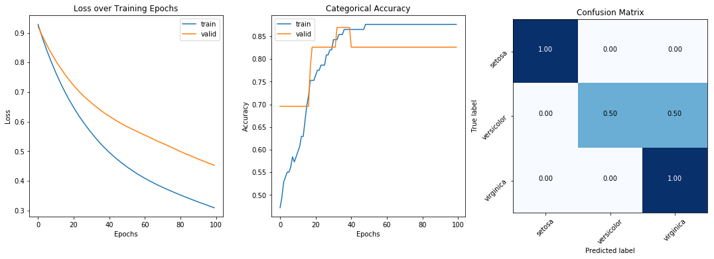

This write-up shows how to build a dashboard showing two metrics and a confusion matrix from the results of a machine learning model. The visualization is built to display the training loss per epoch, the categorical accuracy and the confusion matrix. These metrics are hard coded in, so they have to be changed manually if plotting different metrics.


```python
import itertools
import numpy as np
import matplotlib.pyplot as plt
from keras import layers
from keras.utils import to_categorical
from keras import Sequential
from sklearn import svm, datasets
from sklearn.model_selection import train_test_split
from sklearn.metrics import confusion_matrix
from sklearn import preprocessing
import matplotlib.pyplot as plt
from matplotlib import gridspec
```

## Confusion Matrix
The function below takes in an axes of a Matplotlib subplot and creates a confusion matrix.


```python
def plot_confusion_matrix(cm, classes, ax,
                          normalize=False,
                          cmap=plt.cm.Blues):
    """
    This function plots the confusion matrix on a subplot.
    Normalization can be applied by setting `normalize=True`.
    args:
        cm: Confusion Matrix (generated with sklearn)
        ax: <matplotlib.pyplot.axes> Subplot to modify
        classes: <list> of class names
        normalize: will normalize values of confusion matrix
    returns:
        None. The function modifies a matplotlib subplot
    """
    if normalize: cm = cm.astype('float') / cm.sum(axis=1)[:, np.newaxis]
        
    ax.imshow(cm, interpolation='nearest', cmap=cmap)
    
    tick_marks = np.arange(len(classes))
    ax.set_xticks(tick_marks)
    ax.set_yticks(tick_marks)
    ax.set_xticklabels(classes, rotation=45)
    ax.set_yticklabels(classes, rotation=45)
    ax.set_ylabel('True label')
    ax.set_xlabel('Predicted label')
    
    fmt = '.2f' if normalize else 'd'
    thresh = cm.max() / 2.
    for i, j in itertools.product(range(cm.shape[0]), range(cm.shape[1])):
        ax.text(j, i, format(cm[i, j], fmt),
                    horizontalalignment="center",
                    color="white" if cm[i, j] > thresh else "black")

   
```

## Dashboard Visualizer
the function below takes in a history object from a keras training cycle (`history = model.fit(x, y)`) and visualizes the results in a dashboard.


```python
def dashboard(history, cm, labels, y_pred=None, test_data=None):
    """
    Creates a dashboard of the data
    """
    assert len(y.shape) == 1, "y_pred must be a 1D array of truth values"
    
    fig = plt.figure(figsize=(15,10))
    grid = gridspec.GridSpec(4, 9)
    
    ax = []
    
    ax += [fig.add_subplot(grid[:2, :3])]
    ax[0].set_title('Loss over Training Epochs')
    ax[0].plot(history.history['loss'])
    ax[0].plot(history.history['val_loss'])
    ax[0].set_xlabel('Epochs')
    ax[0].set_ylabel('Loss')
    ax[0].legend(['train', 'valid'])
    
    ax += [fig.add_subplot(grid[0:2, 3:6])]
    ax[1].set_title('Categorical Accuracy')
    ax[1].plot(history.history['categorical_accuracy'])
    ax[1].plot(history.history['val_categorical_accuracy'])
    ax[1].set_xlabel('Epochs')
    ax[1].set_ylabel('Accuracy')
    ax[1].legend(['train', 'valid'])
    
    ax += [fig.add_subplot(grid[0:2, 6:])]
    ax[2].set_title('Confusion Matrix')
    plot_confusion_matrix(cm, labels, ax=ax[2], normalize=True)
    
    if not y_pred is None:
        x_test, y_test = test_data
        
        imgs = x_test[y_test != y_pred]
        lbls = y_test[y_test != y_pred]
        
        num_samples = len(lbls) if len(lbls) < 10 else 10
        
        # choose random images
        idxs = np.random.choice(imgs.shape[0], num_samples)
        for i in range(num_samples):
            ax += [fig.add_subplot(grid[3:,i])]
            ax[4+i].imshow(x_test[idsx[i]])
            ax[4+1].text(labels[y_pred[i]])
            
    fig.tight_layout()
```

## Demonstration with a SVM trained on the Iris Dataset
Below is a model trained to predict the category of flower from the iris dataset.


```python

# import some data to play with
iris = datasets.load_iris()
X = iris.data
y = iris.target
class_names = iris.target_names

# Split the data into a training set and a test set
X_train, X_test, Y_train, Y_test = train_test_split(X, y, random_state=0)

# Scale Data
scalar = preprocessing.StandardScaler().fit(X_train)

# One Hot Encoding
Y_encode = to_categorical(Y_train)

# Model
classifier = Sequential(
                [
                    layers.Dense(16, input_dim=4, activation='relu'),
                    layers.Dense(3, activation='softmax', name='Final')
                ])

# Build
classifier.compile(loss='categorical_crossentropy', 
                   optimizer='adam',
                   metrics=['categorical_accuracy'])

# Fit
hist = classifier.fit(scalar.transform(X_train), Y_encode, epochs=100, validation_split=0.2, verbose=0)

# Predict
y_pred = classifier.predict(scalar.transform(X_test))

# Compute confusion matrix
cnf_matrix = confusion_matrix(Y_test, y_pred.argmax(1))

# Build Dashboard
dashboard(hist, cm=cnf_matrix, labels=iris.target_names)
```




