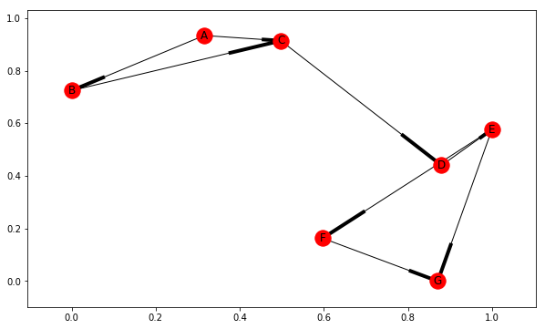

# Basic Page Rank Algorithm
Algorithm can be run K times, where page rank values of each node in a network converge over time.

Steps:
1. each node in the network starts with a value of 1 / number of nodes in the network. This is their level of importance
2. for each ranking calculation, nodes pass on their current value ranking in equal parts to all their outbound connections.
3. iterating through each node in the network, each node adds to it's own ranking the proportional ranking recieved by it's inbound connections.


```python
import networkx as nx
import matplotlib.pyplot as plt

G = nx.DiGraph()
G.add_edge('A', 'B')
G.add_edge('A', 'C')
G.add_edge('B', 'C')
G.add_edge('C', 'D')
G.add_edge('D', 'E')
G.add_edge('E', 'F')
G.add_edge('E', 'G')
G.add_edge('F', 'G')


plt.figure(figsize=(10,6))
nx.draw_networkx(G)
plt.show()
```





```python
def giveRank(g, rankings, node):

    # get node rank
    rank = rankings[node]

    # count node connections
    neighbors = len(g.neighbors(node))

    # divid rank by number of connections
    if neighbors:
        return rank / neighbors
    else:
        return 0

def pageRank(G, k = 1):
    pageRank = {n: 0 for n in G.nodes()}

    # Initialize Ranking
    for n in G.nodes():
        pageRank[n] += (1 / len(G.nodes()))

    for _ in range(k):
        curr_pageRank = pageRank
        for n in G.nodes():
            for neighbor in G.neighbors(n):
                pageRank[n] = giveRank(G, curr_pageRank, neighbor)

    return pageRank
```
