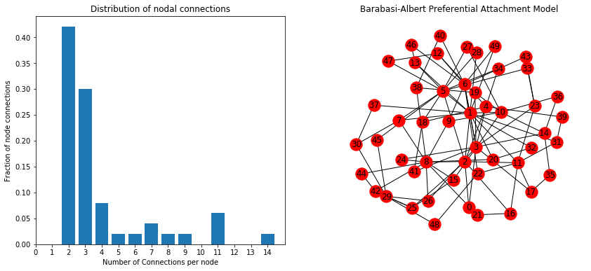
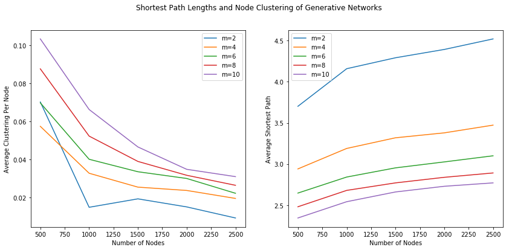

---
title: "Preferential Attachment Model"
date: "2018-04-18"
path: "/preferential-attachment-model/"
section: "Network Analysis" 
category: "Notes"
---

The Preferential Attachment Model is a network growing simulation that embodies the "richer get richer" phenomenon. A few nodes increase their connections in an exponential fashion, leaving most nodes left with only a couple degrees of connections.

## Degree Distribution
***
In a network, each node can have a range of connections to other nodes. As networks grow in size, there is a phenomenon where the nodes with more connections gain connections to new nodes at a faster rate than nodes with fewer connections. This phenomenon can be modeled with the barabasi-albert graph, which is a preferential attachment model. The distribution of connections on each node does not follow a regular gaussian distribution, but rather a skewed distribution more similar to that of a power law.


```python
import networkx as nx
import matplotlib.pyplot as plt
import numpy as np

K = nx.barabasi_albert_graph(50,2).to_directed()
num_nodes = nx.number_of_nodes(K)
num_edges = nx.number_of_edges(K)
vals = set(sorted(K.in_degree().values()))
histogram = [[i for i in K.in_degree().values()].count(j) / num_nodes for j in vals]

fig = plt.figure(figsize=(14,6))

ax1 = fig.add_subplot(121)
ax1.bar(left = list(vals), height = histogram, align='center')
ax1.set_xticks(np.arange(max(vals)+1))
ax1.set_title('Distribution of nodal connections')
ax1.set_xlabel('Number of Connections per node')
ax1.set_ylabel('Fraction of node connections')

ax2 = fig.add_subplot(122)
nx.draw_networkx(K.to_undirected(), ax=ax2)
ax2.axis('off')
ax2.set_title('Barabasi-Albert Preferential Attachment Model')

plt.show()
```





## Preferential Attachment Theorem
---
States that as nodes become attached to a network, the probability that they will connect to a given node is based on the proportion of connections already attached to that node. Therefore, the probability that an existing node will experience an increase in popularity is proportional to the number of connections it already has (current popularity). This is also the Rich-Get-Richer phenomenon.

Steps:
1. Nodes are created in order from 1, 2, 3... N
2. When a new node *j* is created, with a probability *p* node *j* will choose node *i* uniformly at random from all earlier pages, creating a link to page *i*
3. When a new node *j* is created, with probability 1-*p* node *j* will choose node *l* with a probability proportional to *l*'s current number of in-links, creating a link to node *l*

## Power Law in Nature
---
The rich get richer phenomenon operates on the mechanics of the Power law. f(x) = k<sup>c</sup>.

- Populations exibit Power law. A city grows in proportion to it's current size (rabbits and mice population growth is more evident)
- Websites exhibit Power law. As a website increases in popularity, more websites begin to link back to that website.
- People's social influence exhibit a Power Law. As a persons popularity increases, there is an increase likelihood for new people to have heard mention of the persons name.
- Number of copies of a gene in a Genome is proportional to the number of copies that already exist. As mutation events occur, the likelihood of a specific gene to get copied is a function of how many times that gene already occurs on the genome. 


```python
nx.average_clustering(K.to_undirected())
```


    0.20527899877899877


## Clustering Coefficients and Shortest Path lengths of Preferential Attachment Model
Addressing these properties in the Preferential Attachment Model provides a clear example of the shortcomings of this model.


```python
import matplotlib.patches as mpatches

fig = plt.figure(figsize=(14,6))
fig.suptitle('Shortest Path Lengths and Node Clustering of Generative Networks')
ax1 = fig.add_subplot(121)
ax2 = fig.add_subplot(122)
ax1.set_xlabel('Number of Nodes')
ax2.set_xlabel('Number of Nodes')
ax1.set_ylabel('Average Clustering Per Node')
ax2.set_ylabel('Average Shortest Path')

for m in range(2,12, 2):
    ave_clustering = []
    ave_pathLength = []
    
    node_population = list(range(500, 3000, 500))
    for k in node_population:
        G = nx.barabasi_albert_graph(k, m)
        ave_clustering.append(nx.average_clustering(G))
        ave_pathLength.append(nx.average_shortest_path_length(G))
              
    ax1.plot(node_population, ave_clustering, label='m={}'.format(m))
    ax2.plot(node_population, ave_pathLength, label='m={}'.format(m))
    ax1.legend()
    ax2.legend()  
    
plt.show()
    
```





In real world models, there is a relatively high clustering coefficient amongst nodes. Looking at the graph on the left, it appears that the generative model fails to maintain this property as it increases in size. This is because there is no mechanism in the Preferential Attachment Model that would favor triadic closure (Triangle formation -- mutual friends meeting each other). However, as networks increase in size in the real world, the path lengths between nodes do increase, which is maintained in the generative model.
