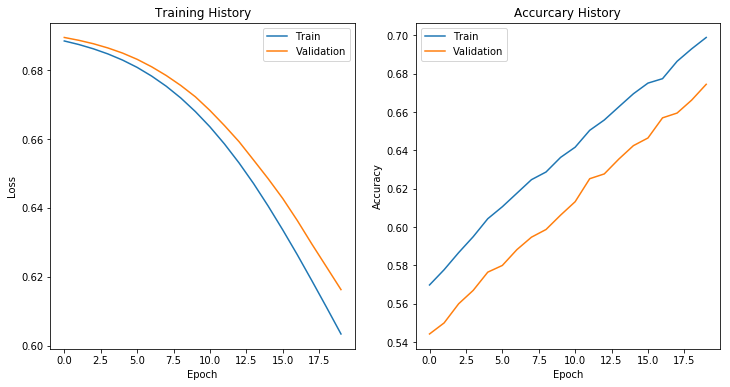
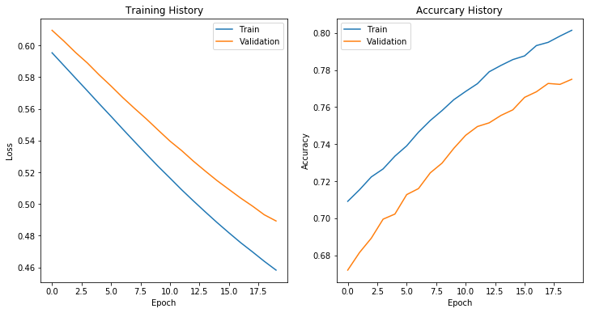

In this writeup I will be comparing the implementation of a sentiment analysis model using two different machine learning frameworks: PyTorch and Keras. I will design and train two models side by side -- one written using Keras and one written using PyTorch.

Keras is a high level machine learning library that offers a suite of tools and functions for rapid experimentation and model development. PyTorch is a more low-level framework, similar in concept to Tensorflow but different in application (TensorFlow is Static computation graph, PyTorch is Dynamic). PyTorch offers numpy like functions enhanced by automatic differentation, as well as pre-built functions for model development such as pre-defined cost functions and optimization routines. 

## Outline

A rough outline of the steps I take below is as follows:

 - Download the Data
 - Do some data exploration
     - Understand dataset
     - Look at some samples
 - Prepare data for training pipeline
 - Define Model Architecure
 - Define Learning / Opimization strategy
 - Train Model
 - Review Results


```python
from keras.datasets import imdb
import matplotlib.pyplot as plt
from IPython.display import Markdown, display
```

    Using TensorFlow backend.
    

## Download Data
The data comes in pre-processed, where each training sample is an array of word indexes based on a list of most frequently used words. 


```python
(x_train, y_train), (x_test, y_test) = imdb.load_data(seed=7)
```

## Exploring the Data


```python
word_index = imdb.get_word_index()
```

    Downloading data from https://s3.amazonaws.com/text-datasets/imdb_word_index.json
    1646592/1641221 [==============================] - 2s 1us/step
    

#### Create key value pair to convert word index to word


```python
word_index = {value: key for key, value in word_index.items()}
```


```python
display(Markdown("**How many words in corpus?**"))
print(len(word_index))
```


**How many words in corpus?**


    88584
    


```python
display(Markdown("**Top 30 most common words:**"))
for i in range(1, 15): print(word_index[i], end='\t')
for i in range(15, 29): print(word_index[i], end='\t')
    
display(Markdown("**Top 20 least common words:**"))
for i in range(88584 - 20, 88584 - 10): print(word_index[i], end='\t')
for i in range(88584 - 10, 88584): print(word_index[i], end='\t')
```


**Top 30 most common words:**


    the	and	a	of	to	is	br	in	it	i	this	that	was	as	for	with	movie	but	film	on	not	you	are	his	have	he	be	one	


**Top 20 least common words:**


    reble	percival	lubricated	heralding	baywatch'	odilon	'solve'	guard's	nemesis'	airsoft	urrrghhh	ev	chicatillo	transacting	sics	wheelers	pipe's	copywrite	artbox	voorhees'	


```python
display(Markdown("**What's the shortest review?**"))
short_review = (0, 100000, 'start with a large number')
for idx, review in enumerate(x_train):
    if len(review) < short_review[1]:
        short_review = (idx, len(review), ' '.join([word_index.get(i - 3, '?') for i in review]))
print('Review # {}({} words):\n\t{}'.format(short_review[0], short_review[1], short_review[2]))

display(Markdown("**What's the longest review?**"))
long_review = (0, 0, 'start with a large number')
for idx, review in enumerate(x_train):
    if len(review) > long_review[1]:
        long_review = (idx, len(review), ' '.join([word_index.get(i - 3, '?') for i in review]))
print('Review # {}({} words):\n\t{}....'.format(long_review[0], long_review[1], long_review[2][:1200]))
```


**What's the shortest review?**


    Review # 729(11 words):
    	? this movie is terrible but it has some good effects
    


**What's the longest review?**


    Review # 18853(2494 words):
    	? match 1 tag team table match bubba ray and spike dudley vs eddie guerrero and chris benoit bubba ray and spike dudley started things off with a tag team table match against eddie guerrero and chris benoit according to the rules of the match both opponents have to go through tables in order to get the win benoit and guerrero heated up early on by taking turns hammering first spike and then bubba ray a german suplex by benoit to bubba took the wind out of the dudley brother spike tried to help his brother but the referee restrained him while benoit and guerrero ganged up on him in the corner with benoit stomping away on bubba guerrero set up a table outside spike dashed into the ring and somersaulted over the top rope onto guerrero on the outside after recovering and taking care of spike guerrero slipped a table into the ring and helped the wolverine set it up the tandem then set up for a double superplex from the middle rope which would have put bubba through the table but spike knocked the table over right before his brother came crashing down guerrero and benoit propped another table in the corner and tried to irish whip spike through it but bubba dashed in and blocked his broth....
    

## Observations
Most of the words in the latter review aren't really good indicators of the sentiment of a review. Super low occuring words, like 'benoit' or 'bubba' do not give any indication of the sentiment, so we probably don't need to include those in our dataset. I'm going to reload the dataset with less words.

### Reloading Dataset, dropping all but top 10k most common words


```python
(X_train, Y_train), (X_test, Y_test) = imdb.load_data(seed=7, num_words=10000)
```


```python
plt.hist([len(i) for i in x_train if len(i) < 1000], bins=20)
plt.gca().set_xlabel('Length of Review')
plt.gca().set_ylabel('frequency of occurence')
plt.gca().set_title('How long are the reviews?')
plt.show()
```


```python
display(Markdown("**Top 30 most common words:**"))
for i in range(1, 15): print(word_index[i], end='\t')
for i in range(15, 29): print(word_index[i], end='\t')
    
display(Markdown("**Top 20 least common words:**"))
for i in range(10000 - 20, 10000 - 10): print(word_index[i], end='\t')
for i in range(10000 - 10, 10000): print(word_index[i], end='\t')
```


**Top 30 most common words:**


    the	and	a	of	to	is	br	in	it	i	this	that	was	as	for	with	movie	but	film	on	not	you	are	his	have	he	be	one	


**Top 20 least common words:**


    avant	answering	smallest	contacts	enlightenment	murphy's	employs	unforgivable	punchline	culminating	talentless	grabbing	soulless	unfairly	grail	retrospect	edged	retains	shenanigans	beaver	

### Observations: Standardize Review Length
Each sample of this dataset is a review of variable length. A dataset where each row is of variable length is no good for inputting into a model. I'm going to pad each review to be the first 100 words. This number is a bit arbitrary, and could probably be even shorter. If I find the model is overfitting, there might be too many input features. How many words does it take for you to understand the sentiment of a review? Clearly from reading the shortest review, the author made his sentiment clear within the first five words.


```python
from keras import preprocessing

X_train = preprocessing.sequence.pad_sequences(X_train, maxlen=100)
X_test  = preprocessing.sequence.pad_sequences(X_test, maxlen=100)
```


```python
print('New train shape:', X_train.shape)
```

    New train shape: (25000, 100)
    


```python
display(Markdown("**Padded version of shortest review:**"))
print(' '.join(word_index.get(i - 3, '?') for i in x_train[729]))

display(Markdown("**Padded version of longest review:**"))
print(' '.join(word_index.get(i - 3, '?') for i in x_train[18853]))
```


**Padded version of shortest review:**


    ? ? ? ? ? ? ? ? ? ? ? ? ? ? ? ? ? ? ? ? ? ? ? ? ? ? ? ? ? ? ? ? ? ? ? ? ? ? ? ? ? ? ? ? ? ? ? ? ? ? ? ? ? ? ? ? ? ? ? ? ? ? ? ? ? ? ? ? ? ? ? ? ? ? ? ? ? ? ? ? ? ? ? ? ? ? ? ? ? ? this movie is terrible but it has some good effects
    


**Padded version of longest review:**


    like taker was about to pass out but the rock broke ? hold only to find himself caught in the ? lock rock got out of the hold and watched taker ? angle rocky hit the rock bottom but taker refused to go down and kicked out angle ? taker up into the angle slam but was rock ? by the great one and ? winner and new wwe champion the rock br br finally there is a decent ? lately the ? weren't very good but this one was a winner i give this ? a a br br
    

## Prepare Data
Fortunately the data as pulled from the keras dataset is already tokenized, but not in tensor form. I will split the train so I have a validation set to evaulate and tune model against, and create a generator function for the data.


```python
from sklearn.model_selection import train_test_split
from torch.utils import data

x_train, x_valid, y_train, y_valid = train_test_split(X_train, Y_train, test_size=0.2, random_state=0)

# Pad to proper dimensions
x_train = preprocessing.sequence.pad_sequences(x_train, maxlen=100)
x_valid = preprocessing.sequence.pad_sequences(x_valid, maxlen=100)

dtype = torch.long

# PyTorch Preperation
if torch.cuda.is_available():
    device = torch.device("cuda")                   # a CUDA device object
    x_train = torch.from_numpy(x_train)  # directly create a tensor on GPU
    y_train = torch.from_numpy(y_train)
    x_valid = torch.from_numpy(x_valid)
    y_valid = torch.from_numpy(y_valid)
else:
    print('CUDA is not available. creating CPU tensors')
    device = torch.device('cpu')
    x_train = torch.from_numpy(x_train)     
    y_train = torch.from_numpy(y_train)  # directly create a tensor on GPU
    x_valid = torch.from_numpy(x_valid)
    y_valid = torch.from_numpy(y_valid)
    
print('new train shape:', x_train.shape)
print('validation size:', x_valid.shape)

y_train = y_train.unsqueeze(-1).float()
y_valid = y_valid.unsqueeze(-1).float()

train = data.TensorDataset(x_train, y_train)
valid = data.TensorDataset(x_valid, y_valid)
```

    CUDA is not available. creating CPU tensors
    new train shape: torch.Size([20000, 100])
    validation size: torch.Size([5000, 100])
    

## Create Model


```python
import torch
import torch.nn.functional as F
import torch.nn as nn
import torch.optim as optim
from keras.models import Sequential 
from keras.layers import Flatten, Dense 
from keras.layers import Embedding
from torchsummary import summary

import pdb
torch.manual_seed(1)
class Flat(nn.Module):
    def forward(self, x):
        return x.view(x.size()[0], -1)
    
# PyTorch implementation
class sentimentNet(nn.Module):
    
    def __init__(self, num_words, input_size, embedding_size):
        super(sentimentNet, self).__init__()
        
        self.embedding1 = nn.Embedding(num_words, embedding_size) 
        self.linear1 = nn.Linear(input_size * embedding_size, 1)
    def forward(self, inputs):
        embed1 = self.embedding1(inputs.long())
        flatt1 = embed1.view(-1, self.num_flat_features(embed1))
        layer1 = self.linear1(flatt1)
        output = F.log_softmax(layer1, dim=1)
        
        return output

    def num_flat_features(self, x):
        size = x.size()[1:]  # all dimensions except the batch dimension
        num_features = 1
        for s in size:
            num_features *= s
        return num_features
    
modelT = sentimentNet(num_words=10000, input_size=100, embedding_size=8)

# Keras implementation
modelK = Sequential([
    Embedding(10000, 8, input_length=100, name='embedding1'),
    Flatten(name='flatten'),
    Dense(1, activation='sigmoid', name='linear1')
]) 

print(modelT)
print('\n\nsentimateNet: Keras')
print(modelK.summary())
```

    sentimentNet(
      (embedding1): Embedding(10000, 8)
      (linear1): Linear(in_features=800, out_features=1, bias=True)
    )
    
    
    sentimateNet: Keras
    _________________________________________________________________
    Layer (type)                 Output Shape              Param #   
    =================================================================
    embedding1 (Embedding)       (None, 100, 8)            80000     
    _________________________________________________________________
    flatten (Flatten)            (None, 800)               0         
    _________________________________________________________________
    linear1 (Dense)              (None, 1)                 801       
    =================================================================
    Total params: 80,801
    Trainable params: 80,801
    Non-trainable params: 0
    _________________________________________________________________
    None
    

## Train Model


```python
from torch.utils import data
import collections

# data generator
datagen = data.DataLoader(train, batch_size=10, shuffle=False)

# PyTorch optimizers
costFN = nn.BCELoss()
optimizer = torch.optim.SGD(modelT.parameters(), lr=0.001, momentum=0.9)

# Keras optimizers
modelK.compile(optimizer='SGD', loss='binary_crossentropy', metrics=['acc']) 

num_epochs = 5
hist = collections.defaultdict(lambda:[])

# PyTorch Training
for epoch in range(num_epochs):
    print("Epoch {} / {}".format(epoch, num_epochs))
    running_loss = 0.0
    
    for i, data_batch in enumerate(datagen, 0):
        inputs, labels = data_batch
        
        optimizer.zero_grad()  # reset grads
        
        outputs = modelT(inputs)
        loss = costFN(outputs, labels)
        loss.backward()
        optimizer.step()
        
        for param in model.parameters():
            param.data -= learning_rate * param.grad
        if i % 200 == 199:    # print every 2000 mini-batches
            
            hist['loss'] += [loss.item()]
            print('sample {} --> loss: {}'.format(i + 1, loss.item()))
            running_loss = 0.0

```


```python
# Keras Training
history = modelK.fit(x_train.numpy(), y_train.numpy(), epochs=20, batch_size=32, validation_split=0.2, verbose=0)
print('Finished Training')
```

    Finished Training
    


```python
fig, ax = plt.subplots(1, 2, figsize=(12,6))
ax[0].plot(history.history['loss'], label='Train')
ax[0].plot(history.history['val_loss'], label='Validation')
ax[0].set_xlabel('Epoch')
ax[0].set_ylabel('Loss')
ax[0].set_title('Training History'); 
ax[0].legend()

ax[1].plot(history.history['acc'], label='Train')
ax[1].plot(history.history['val_acc'], label='Validation')
ax[1].set_xlabel('Epoch')
ax[1].set_ylabel('Accuracy')
ax[1].set_title('Accurcary History'); 
ax[1].legend()
plt.show()
```





### Observations
Need to troubleshoot loss of PyTorch model -- doesn't match Keras output. I'll keep training the keras model here, but since this write-up is focused around using PyTorch I won't go into too much optimization techniques with Keras.


```python
history = modelK.fit(x_train.numpy(), y_train.numpy(), epochs=20, batch_size=32, validation_split=0.2, verbose=0)
print('Finished Training')
```

    Finished Training
    


```python
fig, ax = plt.subplots(1, 2, figsize=(12,6))
ax[0].plot(history.history['loss'], label='Train')
ax[0].plot(history.history['val_loss'], label='Validation')
ax[0].set_xlabel('Epoch')
ax[0].set_ylabel('Loss')
ax[0].set_title('Training History'); 
ax[0].legend()

ax[1].plot(history.history['acc'], label='Train')
ax[1].plot(history.history['val_acc'], label='Validation')
ax[1].set_xlabel('Epoch')
ax[1].set_ylabel('Accuracy')
ax[1].set_title('Accurcary History'); 
ax[1].legend()
plt.show()
```





### Observations:

There is a 10% drop in accuracy between the train and validation sets, which means that there may be some ovefitting going on. Looks like Loss is still decreasing, so the model can be trained further. If overfitting becomes a bigger problem, regularization techniques can be applied to the models cost function or architecture to reduce overfitting. Since this write-up was focused around writing a model implementation in PyTorch, I won't be diving too much into optimization. To be continued!
