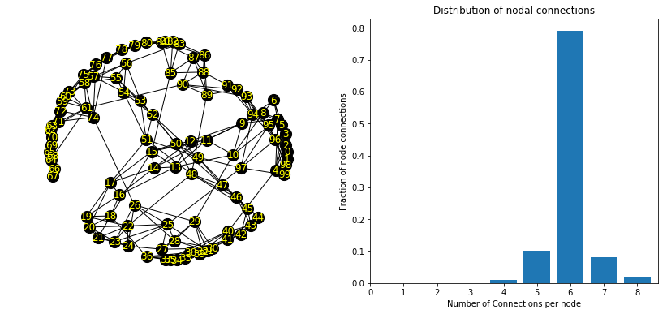
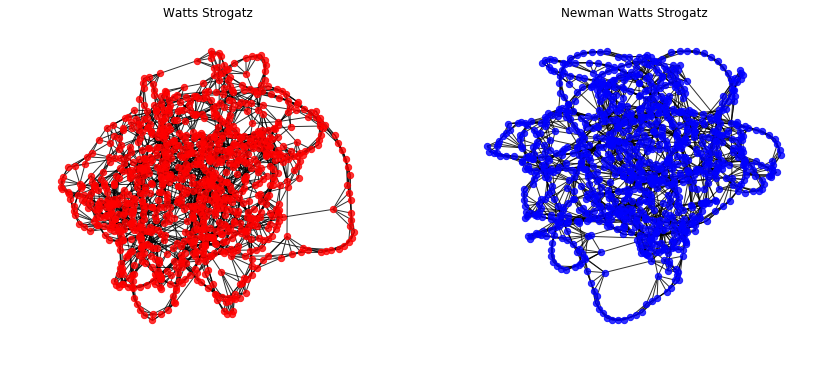
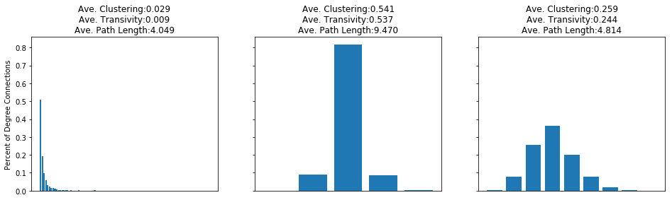

# Small World Network Model
The Small World Model is a representation of a network that shows both high clustering coefficient and increase shortest path length amongst nodes as the network grows. The basic steps to building the model is to:

1. Start with a ring network, where each node lattice is connected to k nearest neighbors.
2. With a probability of p, each node is rewired in such a way that it connects with another node on the network.

The Small World Model was developed by Watts and Strogatz.


```python
import networkx as nx
import matplotlib.pyplot as plt
import numpy as np

fig = plt.figure(figsize=(14,6))
ax1 = fig.add_subplot(121)
ax2 = fig.add_subplot(122)
ax1.axis('off')

ax2.set_title('Distribution of nodal connections')
ax2.set_xlabel('Number of Connections per node')
ax2.set_ylabel('Fraction of node connections')

G = nx.watts_strogatz_graph(100, 6, .04)
nx.draw_networkx(G, ax=ax1, node_size=200, node_color='black', font_color='yellow')

num_nodes = nx.number_of_nodes(G)
vals = set(sorted(G.to_directed().in_degree().values()))
hist = [[i for i in G.to_directed().in_degree().values()].count(j) / num_nodes for j in vals]
ax2.bar(left=list(vals), height=hist, align='center')

ax2.set_xticks(np.arange(max(vals)+1))
plt.show()
```





The degree of nodal connections displayed in the Small World Model show a gaussian distribution as opposed to the Preferential Attachment Model which displayed a Power Law distribution. This is because the rewiring probability is quite small, so most of the edges remain at the initial edge setting of 6. 

At the same time, you don't want the rewiring probabilty too high as it may cause the small world model to become disconnected. 

## Maintaining a Connected Small World Model


```python
# Run the connected version, which runs the simulation up to t times, making sure it returns a fully connected model.
G = nx.connected_watts_strogatz_graph(1000, 6, .05, 20)
```

## Newman Watts Strogatz Model
Similar Small World Network Model, but instead of rewiring with a probability *p*, the model adds a new edge to the graph.


```python
N = nx.newman_watts_strogatz_graph(1000,6,.05)
```


```python
fig = plt.figure(figsize=(14,6))
ax1 = fig.add_subplot(121)
ax2 = fig.add_subplot(122)
ax1.axis('off')
ax2.axis('off')
ax1.set_title('Watts Strogatz')
ax2.set_title('Newman Watts Strogatz')

nx.draw_networkx(G, ax=ax1, node_size=40, node_color='red', with_labels=False, alpha=0.8)
nx.draw_networkx(N, ax=ax2, node_size=40, node_color='blue', with_labels=False, alpha=0.8)

plt.show()
```





## Identifying Small World Models
When looking at a graph model, a tell tale sign of a Small World model is the distribution of degrees. Unlike the Preferential Attachment model, which exhibits a power-law like connection amongst nodes, the Small World model is a gaussian distribution. The spread of this distribution is driven by the probability of rewiring. If there is a high rewiring probability, the spread of degree connections will be much greater than for Small World models with low rewiring probability.

As nodes become rewired, the clustering coefficient decreases. Small World models with a low clusterign coefficient will indicate that there was a high probabilty of rewiring, as there will be a lot of local connections rewired to random, far away connections.


```python
import networkx as nx
import matplotlib.pyplot as plt
PA = nx.barabasi_albert_graph(1000,2)
S1 = nx.connected_watts_strogatz_graph(1000, 6, .03, 20)
S2 = nx.connected_watts_strogatz_graph(1000, 6, .25, 20)

fig, ax = plt.subplots(nrows=1, ncols=3, figsize=(16,4), sharey=True)

ax[0].set_ylabel('Percent of Degree Connections')
for i, g in enumerate([PA, S1, S2]):
    num_nodes = nx.number_of_nodes(g)
    num_edges = nx.number_of_edges(g)
    n_degrees = [i for i in g.degree().values()]
    
    histogram = [n_degrees.count(i) / num_nodes for i in sorted(set(n_degrees))]
    ax[i].bar(height=histogram, left=sorted(set(n_degrees)), align='center')
    ax[i].set_xticks([])
    ax[i].set_title('Ave. Clustering:{:{width}.{prec}f}\n'
                    'Ave. Transivity:{:{width}.{prec}f}\n'
                    'Ave. Path Length:{:{width}.{prec}f}'
                    .format(nx.average_clustering(g), 
                            nx.transitivity(g),
                            nx.average_shortest_path_length(g),
                            width=4, 
                            prec=3))

plt.show()
```





As seen above, the first model shows the skewed distribution of a Preferential Attachment model, the second shows a Small World model with low rewiring probability, and the third shows a Small World model with high rewiring probability.
