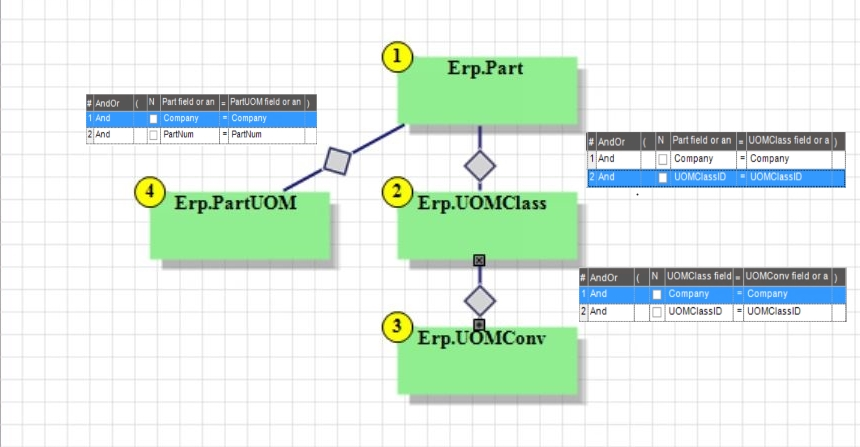
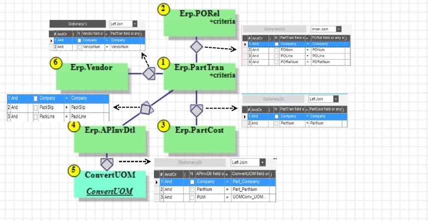
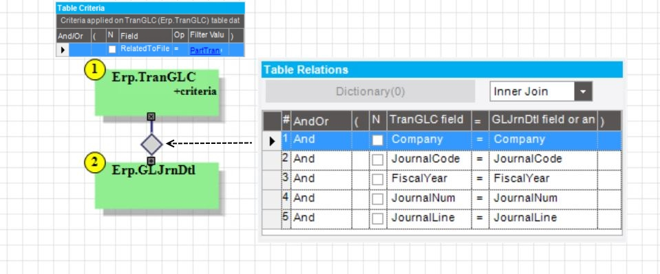
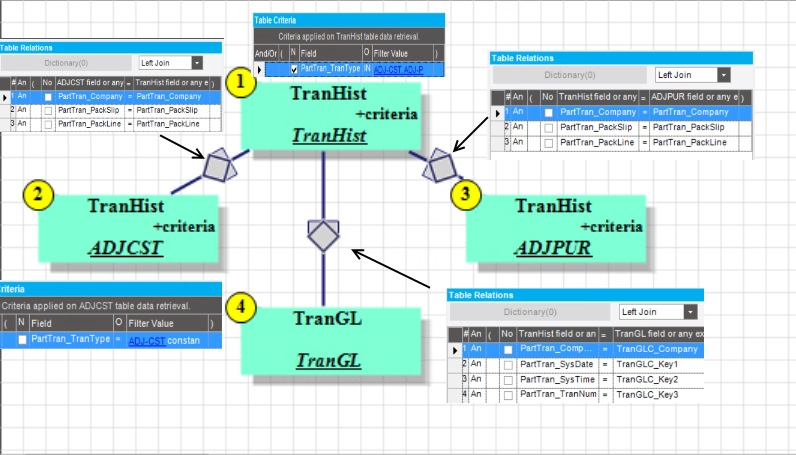

---
title: "SQL Development for Financial Variance Reporting"
date: "2018-04-08"
path: "/sql-purchase-price-variance/"
category: "Projects"
thumbnail: "PPVReport.jpg"
---

This write up walks through the development of a business query that identifies cost variances in invoices and purchase orders. I will be explaining the logic used to develop the sub-queries as well as the final join to produce the query results.

When your company creates a purchase order, there may be a price you expected to pay that differs from what was placed on the Purchase Order. If you have a quote from a supplier, or an established price history, then it may be of financial interest to know when the price placed on the purchase order differs significantly from the expected cost. At the same time, what ultimately affects your bottom line is how much you paid on the invoice. So you may be interested in knowing if there any instances when what was invoiced was significantly greater or lower than the price set on the purchase order. Perhaps there is a high frequency of additional miscellaneous 'box charges', or increased shipping rates that became frequent unexpected costs, causing us to pay way more than what was approved for on the purchase order. Perhaps you have a very talented accounts payable team that seems to always work out a discount when it comes time to invoice. 

The intention of a Purchased Goods Variance report is to detail the transactions where the final cost incurred was not what we expected it to be, and get an understanding of how accurate our standard (estimated) costs are as compared to what we actually pay.


This walk through covers the SQL and Report development for a financial report that details the pricing variance on purchased goods. The intent of this report is to compare two things:

- The variance from the standard cost set on a given part to what was marked on the purchase order
- The variance from the purchase order price on a given part to what was paid on the invoice.

The query developed for this report was done in the ERP system, Epicor. I will show both the SQL statements as well as screenshots of the Business Activity Query (BAQ), since these queries can be used to pull data directly from a SQL Server database instance and have more details of how the queries were built than just the screenshots alone. The report was developed using SQL Server Reporting Services (SSRS). 

# Epicor Logic on Variances
As goods are received into stock, a variance transaction can be recorded to the Epicor Database. If the total cost of the part received in based on Standard Cost differs from the total cost on the Purchase Order, an 'ADJ-CST' part transaction is recorded. Likewise, when a Purchase Order is invoiced, if the total cost on the Invoice differs from the total cost of the Purchase order, an 'ADJ-PUR' part transaction is recorded. These two transactions can be combined based on reciept entries to build a report on variances.

## SubQuery #1: UOM Conversion
All the financial calculations are based off the base unit of measure of the part. When parts are received to inventory, the transaction quantity is converted to a base UOM quantity. Unfortunately there are several instances where users set unique unit of measurements for Vendor or Our quantity on both the Purchase Orders and Invoices, so I found it best to calculate all quantities in my query to the base quantity before doing any calculations. To help out with this, I built a sub-query that takes a part and a given UOM, then converts it to the appropriate base UOM. 

---
#### Adding the UOM Class, Conv and PartUOM to the Part Table
There are some parts that have a unique conversion factor to take a single unit of measure back to the base. For example, raw material is usually sold by the pound (lb) by vendors, but we inventory by feet. The conversion from lbs to ft is driven by the density of the material and the cross sectional area. In other cases, there is a standard conversion, such as inches to feet. For the part specific conversion, we derive the conversion from the PartUOM table, otherwise we pull it from the UOMCONV table which has conversions based on standard UOM classes.

```
SELECT 
    [Part].[Company] AS [Part_Company],
    [Part].[PartNum] AS [Part_PartNum],
    [Part].[TypeCode] AS [Part_TypeCode],
    [UOMClass].[BaseUOMCode] AS [UOMClass_BaseUOMCode],
    [UOMConv].[ConvOperator] AS [UOMConv_ConvOperator],
    [UOMConv].[UOMCode] AS [UOMConv_UOMCode],
    [UOMConv].[UOMSymbol] AS [UOMConv_UOMSymbol],
    [Part].[IUM] AS [Part_IUM],
    (CASE WHEN UOMConv.UOMCode = PartUOM.UOMCode THEN 
        PartUOM.ConvFactor ELSE 
        UOMConv.ConvFactor 
     END) AS [Calculated_Conversion]
FROM Erp.Part AS Part
INNER JOIN Erp.UOMClass AS UOMClass ON 
    Part.Company = UOMClass.Company
AND Part.UOMClassID = UOMClass.UOMClassID

INNER JOIN Erp.UOMConv AS UOMConv ON 
    UOMClass.Company = UOMConv.Company
AND UOMClass.UOMClassID = UOMConv.UOMClassID

INNER JOIN Erp.PartUOM AS PartUOM ON 
    Part.Company = PartUOM.Company
AND Part.PartNum = PartUOM.PartNum
```


## Subquery #2: Transaction History
the first query pulls all the transaction history related to receiving in purchased goods. These transactions include the variance transactions, 'ADJ-CST' and 'ADJ-PUR, as well as the standard receipt transactions, 'INS-STK' and 'PUR-STK'. For now we're only interested in transactions that were posted to the General Ledger, so I will add a filter criteria on the "PostedToGL" field. 

---

#### Adding PartTran Table
From the Part Tran table we can get the details on the transaction, the receipt, related Purchase Order and transaction unit costs.

```
SELECT 
	[PartTran].[PartNum] as [PartTran_PartNum],
	[PartTran].[TranDate] as [PartTran_TranDate],
	[PartTran].[TranType] as [PartTran_TranType],
	[PartTran].[Company] as [PartTran_Company],
	[PartTran].[PONum] as [PartTran_PONum],
	[PartTran].[POLine] as [PartTran_POLine],
	[PartTran].[PORelNum] as [PartTran_PORelNum],
	[PartTran].[PackSlip] as [PartTran_PackSlip],
	[PartTran].[PackLine] as [PartTran_PackLine],
	[PartTran].[MtlUnitCost] as [PartTran_MtlUnitCost],
	[PartTran].[TranQty] as [PartTran_TranQty],
	[PartTran].[UM] as [PartTran_UM],
	(PartTran.POReceiptQty * PartTran.POUnitCost) as [Calculated_POCost],
	[PartTran].[SysDate] as [PartTran_SysDate],
	[PartTran].[SysTime] as [PartTran_SysTime],
	[PartTran].[TranNum] as [PartTran_TranNum]
FROM Erp.PartTran as PartTran
  WHERE (PartTran.TranType in ('ADJ-CST', 'ADJ-PUR', 'INS-STK', 'PUR-STK')  
    AND PartTran.PostedToGL = True))

```

#### Adding PORel Table
There are a lot of receipt transactions not related to inventoried goods, so we're going to only return transactions related to PO's that were for inventoried goods. The PORel table has a field called 'TranType', which denotes whether the PO was for inventory, subcontract operations or miscellaneous purchases. This will be the tables filter criteria, and it will be an inner join to the Part Transaction table based on PO key fields. I'll also pull the base quantities from the PO release.

```
SELECT 
	[PartTran].[PartNum] as [PartTran_PartNum],
	[PartTran].[TranDate] as [PartTran_TranDate],
	[PartTran].[TranType] as [PartTran_TranType],
	[PartTran].[Company] as [PartTran_Company],
	[PartTran].[PONum] as [PartTran_PONum],
	[PartTran].[POLine] as [PartTran_POLine],
	[PartTran].[PORelNum] as [PartTran_PORelNum],
	[PartTran].[PackSlip] as [PartTran_PackSlip],
	[PartTran].[PackLine] as [PartTran_PackLine],
	[PartTran].[MtlUnitCost] as [PartTran_MtlUnitCost],
	[PORel].[BaseQty] as [PORel_BaseQty],
	[PORel].[BaseUOM] as [PORel_BaseUOM],
	[PartTran].[TranQty] as [PartTran_TranQty],
	[PartTran].[UM] as [PartTran_UM]
FROM Erp.PartTran as PartTran
INNER JOIN Erp.PORel as PORel ON 
	PartTran.Company = PORel.Company
AND PartTran.PONum = PORel.PONum
AND PartTran.POLine = PORel.POLine
AND PartTran.PORelNum = PORel.PORelNum
AND ( PORel.TranType = 'PUR-STK'  )

  WHERE (PartTran.TranType in ('ADJ-CST', 'ADJ-PUR', 'INS-STK', 'PUR-STK')  and PartTran.PostedToGL = True))
```

#### Adding Part Cost and Vendor Table
The report needs the standard cost of the part as well as the vendor name, so two additional tables are left joined to the transaction table. The Standard Cost table, connected by Part Number, and the Vendor Table, connected by VendorNum. 
```
SELECT 
    [Vendor].[Name] AS [Vendor_Name],
    [PartTran].[PartNum] AS [PartTran_PartNum],
    [PartTran].[TrANDate] AS [PartTran_TrANDate],
    [PartTran].[TranType] AS [PartTran_TranType],
    [PartTran].[Company] AS [PartTran_Company],
    [PartTran].[PONum] AS [PartTran_PONum],
    [PartTran].[POLine] AS [PartTran_POLine],
    [PartTran].[PORelNum] AS [PartTran_PORelNum],
    [PartTran].[PackSlip] AS [PartTran_PackSlip],
    [PartTran].[PackLine] AS [PartTran_PackLine],
    (PartCost.StdMaterialCost) AS [Calculated_STDUnit],
    [PartTran].[MtlUnitCost] AS [PartTran_MtlUnitCost],
    [PORel].[BaseQty] AS [PORel_BaseQty],
    [PORel].[BaseUOM] AS [PORel_BaseUOM],
    [PartTran].[TranQty] AS [PartTran_TranQty],
    [PartTran].[UM] AS [PartTran_UM],
    [PartCost].[LastMaterialCost] AS [PartCost_LastMaterialCost],
    [PartTran].[SysDate] AS [PartTran_SysDate],
    [PartTran].[SysTime] AS [PartTran_SysTime],
    [PartTran].[TranNum] AS [PartTran_TranNum]
FROM Erp.PartTran AS PartTran

INNER JOIN Erp.PORel AS PORel ON 
    PartTran.Company = PORel.Company
AND PartTran.PONum = PORel.PONum
AND PartTran.POLine = PORel.POLine
AND PartTran.PORelNum = PORel.PORelNum
AND ( PORel.TranType = 'PUR-STK'  )

LEFT OUTER JOIN Erp.PartCost AS PartCost ON
    PartTran.Company = PartCost.Company
AND PartTran.PartNum = PartCost.PartNum

LEFT OUTER JOIN Erp.Vendor AS Vendor ON
    Vendor.Company = PartTran.Company
AND Vendor.VendorNum = PartTran.VendorNum

  WHERE (PartTran.TranType IN ('ADJ-CST', 'ADJ-PUR', 'INS-STK', 'PUR-STK')  
    AND PartTran.PostedToGL = True))
```

#### Adding AP Invoice Detail Table

The report needs to show the invoice quantity and costs, so the transaction history will incorporate the APInvDtl table. Since there is no 'base qty' fields for the APInvoice Table, this table needs to be joined with the UOM Conversion table to calculate invoice quantities based off of the base UOM of the part. To pull the correct conversion factor number from the UOM conversion table, the Purchased Unit of Measure on the AP Invoice Table is tied to the UOMConv_UOMCode from the conversion subquery.
```
SELECT 
    [Vendor].[Name] AS [Vendor_Name],
    [PartTran].[PartNum] AS [PartTran_PartNum],
    [PartTran].[TrANDate] AS [PartTran_TrANDate],
    [PartTran].[TranType] AS [PartTran_TranType],
    [PartTran].[Company] AS [PartTran_Company],
    [APInvDtl].[InvoiceNum] AS [APInvDtl_InvoiceNum],
    [APInvDtl].[InvoiceLine] AS [APInvDtl_InvoiceLine],
    [PartTran].[PONum] AS [PartTran_PONum],
    [PartTran].[POLine] AS [PartTran_POLine],
    [PartTran].[PORelNum] AS [PartTran_PORelNum],
    [PartTran].[PackSlip] AS [PartTran_PackSlip],
    [PartTran].[PackLine] AS [PartTran_PackLine],
    (PartCost.StdMaterialCost) AS [Calculated_STDUnit],
    [PartTran].[MtlUnitCost] AS [PartTran_MtlUnitCost],
    (CASE WHEN InvQty = 0 THEN 
        0 
     ELSE 
        APInvDtl.ExtCost / InvQty 
     END) AS [Calculated_INV_Unit],
    [PORel].[BaseQty] AS [PORel_BaseQty],
    [PORel].[BaseUOM] AS [PORel_BaseUOM],
    [PartTran].[TranQty] AS [PartTran_TranQty],
    [PartTran].[UM] AS [PartTran_UM],
    [PartCost].[LastMaterialCost] AS [PartCost_LastMaterialCost],
    [PartTran].[SysDate] AS [PartTran_SysDate],
    [PartTran].[SysTime] AS [PartTran_SysTime],
    [PartTran].[TranNum] AS [PartTran_TranNum]
FROM Erp.PartTran AS PartTran

INNER JOIN Erp.PORel AS PORel ON 
    PartTran.Company = PORel.Company
AND PartTran.PONum = PORel.PONum
AND PartTran.POLine = PORel.POLine
AND PartTran.PORelNum = PORel.PORelNum
AND ( PORel.TranType = 'PUR-STK'  )

LEFT OUTER JOIN Erp.PartCost AS PartCost ON
    PartTran.Company = PartCost.Company
AND PartTran.PartNum = PartCost.PartNum

LEFT OUTER JOIN Erp.Vendor AS Vendor ON
    Vendor.Company = PartTran.Company
AND Vendor.VendorNum = PartTran.VendorNum

LEFT OUTER JOIN Erp.APInvDtl as APInvDtl ON 
    PartTran.Company = APInvDtl.Company
AND PartTran.PackSlip = APInvDtl.PackSlip
AND PartTran.PackLine = APInvDtl.PackLine

LEFT OUTER JOIN  ConvertUOM  as ConvertUOM ON 
    APInvDtl.Company = ConvertUOM.Part_Company
AND APInvDtl.PartNum = ConvertUOM.Part_PartNum
AND APInvDtl.PUM = ConvertUOM.UOMConv_UOMCode

  WHERE (PartTran.TranType IN ('ADJ-CST', 'ADJ-PUR', 'INS-STK', 'PUR-STK')  
    AND PartTran.PostedToGL = True))
   ```
#### Notes on Invoice Joins

Pulling the AP Invoice Detail table onto the query completes this subquery. The invoices are joined to the Part Tran table based on receipt details. Even though we are looking at invoices for Purchase orders, there could be multiple invoices that cover a partial payment against a Purchase Order, which is dictated by what we receive in (i.e partial shipments of what we purchased). To maintain a one-to-one relationships, the invoices are tied back to individual receipt entries. At the same time, variances on what was received (Standard versus Purchase Order) occur before an invoice is created. In order to recognize which invoice was tied to the receipt transaction, the invoice fields need to come from the invoice table. Concretely, there are invoice fields available on the Part Transaction table but these will not always return the invoice number. 



## Subquery #3:  Transaction GL Information
The last piece of information on the report is the date the variance was posted to the General Ledger. The financial department would like to look at the variances per fiscal month, so in order to determine when the transaction was posted, I need to find the transaction as it occurred on the General Ledger Transaction table and tie it to the Journal Detail table where the posted date field is. Working backwards, the Journal Detail table is related to the General Ledger transaction table by journal code, fiscal year, journal number and line. The General Ledger transaction table is related to the Part Transaction table by transaction number and system date. 

The two tables required for this query is the TranGL table and the JrnlDtl table. These are joined together by fiscal key fields.

```

SELECT 
    [TranGLC].[Company] AS [TranGLC_Company],
    [TranGLC].[Key1] AS [TranGLC_Key1],
    [TranGLC].[Key2] AS [TranGLC_Key2],
    [TranGLC].[Key3] AS [TranGLC_Key3],
    [GLJrnDtl].[PostedDate] AS [GLJrnDtl_PostedDate],
    [GLJrnDtl].[FiscalYear] AS [GLJrnDtl_FiscalYear],
    [GLJrnDtl].[FiscalPeriod] AS [GLJrnDtl_FiscalPeriod]
FROM Erp.TranGLC AS TranGLC
INNER JOIN Erp.GLJrnDtl AS GLJrnDtl ON
    TranGLC.Company = GLJrnDtl.Company
AND TranGLC.JournalCode = GLJrnDtl.JournalCode
AND TranGLC.FiscalYear = GLJrnDtl.FiscalYear
AND TranGLC.JournalNum = GLJrnDtl.JournalNum
AND TranGLC.JournalLine = GLJrnDtl.JournalLine

 WHERE (TranGLC.RelatedToFile = 'PartTran')
 
```

One trick to the TranGLC is that it has unlabeled key fields, called Key1, Key2... Key5. These fields correspond to different values depending on the company transactions they refer to. The TranGLC holds general ledger transaction for everything, and the related data are all keyed by different values. Since we care about part transactions related to General Ledger transactions, we want to filter the TranGLC subquery by rows related to the 'PartTran' table.



## Top Level Query
The queries above are each dropped into a Common Table Expression (CTE) and then called together in the final query. This is because the Transaction History table has several rows of data that I'll need to put side by side (the standard variance and the invoice variance for one PO receipt). It's a bit cleaner to work with a CTE defined at the top of the query that is called multiple times than an embedded inner sub query. 

Specifically, the Transaction history table has four transaction types: two receipt transactions (INS-STK and PUR-STK), and two variance transactions (ADJ-CST, ADJ-PUR) that are created as a direct result of these receipt transactions. Since I want the variance transactions joined to the receipt transactions, I will filter the transaction history table by the receipt transactions, then join to this table two more instances of the transaction history table, filtered by each of the variances. All the transactions are based off a receipt, so I will use receipt information as the key fields. 

The last challenge is the posted date. The invoice variance against a receipt transaction only occurs after an invoice is created. What this means is that the general ledger transaction for the invoices happen on a different date than the general ledger transaction for receipts, and even though the transactions are tied by receipt information, they could be in different posting periods. In this report, we're going to look at the posting date of the receipt transaction itself. 

There are instances where there are zero quantity transactions. This makes it hard to calculate a unit price, so these are handled with an if/then statement in the query. 

```
SELECT distinct
    [TranHist].[PartTran_Company] AS [PartTran_Company],
    [TranHist].[PartTran_PartNum] AS [PartTran_PartNum],
    [TranHist].[PartTran_TranDate] AS [PartTran_TranDate],
    [TranHist].[PartTran_PONum] AS [PartTran_PONum],
    [TranHist].[PartTran_POLine] AS [PartTran_POLine],
    [TranHist].[PartTran_PackSlip] AS [PartTran_PackSlip],
    [TranHist].[PartTran_PackLine] AS [PartTran_PackLine],
    [TranHist].[APInvDtl_InvoiceNum] AS [APInvDtl_InvoiceNum],
    [TranHist].[APInvDtl_InvoiceLine] AS [APInvDtl_InvoiceLine],
    [TranHist].[PartTran_TranType] AS [PartTran_TranType],
    [TranHist].[Calculated_STDUnit] AS [Calculated_STDUnit],
    [TranHist].[PartTran_MtlUnitCost] AS [PartTran_MtlUnitCost],
    [TranHist].[Calculated_INV_Unit] AS [Calculated_INV_Unit],
    [ADJCST].[PartTran_MtlUnitCost] AS [PartTran_MtlUnitCost01],
    (CASE WHEN  TranHist.Calculated_InvQty = 0 THEN 0 
     ELSE ADJPUR.PartTran_MtlUnitCost /TranHist.Calculated_InvQty END) AS [Calculated_ADJPUR_Unit],
    [TranHist].[Calculated_InvQty] AS [Calculated_InvQty],
    [TranHist].[Calculated_InvUOM] AS [Calculated_InvUOM],
    [TranHist].[PORel_BaseQty] AS [PORel_BaseQty],
    [TranHist].[PORel_BaseUOM] AS [PORel_BaseUOM],
    [TranHist].[PartTran_TranQty] AS [PartTran_TranQty],
    [TranHist].[PartTran_UM] AS [PartTran_UM],
    [TranHist].[Calculated_STDCost] AS [Calculated_STDCost],
    [TranHist].[Calculated_POCost] AS [Calculated_POCost],
    [TranHist].[APInvDtl_TotalMiscChrg] AS [APInvDtl_TotalMiscChrg],
    [TranHist].[APInvDtl_ExtCost] AS [APInvDtl_ExtCost],
    [ADJPUR].[PartTran_MtlUnitCost] AS [PartTran_MtlUnitCost02],
    (ADJCST.PartTran_MtlUnitCost * ADJCST.PartTran_TranQty) AS [Calculated_ADJCST],
    [TranHist].[PartTran_PORelNum] AS [PartTran_PORelNum],
    [TranGL].[GLJrnDtl_PostedDate] AS [GLJrnDtl_PostedDate],
    [TranGL].[GLJrnDtl_FiscalYear] AS [GLJrnDtl_FiscalYear],
    [TranGL].[GLJrnDtl_FiscalPeriod] AS [GLJrnDtl_FiscalPeriod],
    [TranHist].[VENDor_Name] AS [VENDor_Name],
    [TranHist].[PartCost_LastMaterialCost] AS [PartCost_LastMaterialCost]
    
FROM  TranHist  AS TranHist

LEFT OUTER JOIN  TranHist AS ADJCST ON 
    ADJCST.PartTran_Company = TranHist.PartTran_Company
AND ADJCST.PartTran_PackSlip = TranHist.PartTran_PackSlip
AND ADJCST.PartTran_PackLine = TranHist.PartTran_PackLine
AND ( ADJCST.PartTran_TranType = 'ADJ-CST'  )

LEFT OUTER JOIN  TranHist AS ADJPUR ON 
    TranHist.PartTran_Company = ADJPUR.PartTran_Company
AND TranHist.PartTran_PackSlip = ADJPUR.PartTran_PackSlip
AND TranHist.PartTran_PackLine = ADJPUR.PartTran_PackLine
AND ( ADJPUR.PartTran_TranType = 'ADJ-PUR'  )

LEFT OUTER JOIN  TranGL AS TranGL ON
    TranHist.PartTran_Company = TranGL.TranGLC_Company
AND TranHist.PartTran_SysDate = TranGL.TranGLC_Key1
AND TranHist.PartTran_SysTime = TranGL.TranGLC_Key2
AND TranHist.PartTran_TranNum = TranGL.TranGLC_Key3

WHERE (not TranHist.PartTran_TranType in ('ADJ-CST', 'ADJ-PUR')
```



## Next Steps: Report Building
After the query is developed, the next steps is to design the report. The resulting query and data source is deployed to an SSRS report, then I use matrices and grouping to show the data in a more user friendly manner. In this particular report, the data was grouped by fiscal period then by supplier then by part, where each purchase quantities, cost and variance are broken out line by line. The development of the SSRS report is out of the scope of this write up, but below is a sample of the final output:


