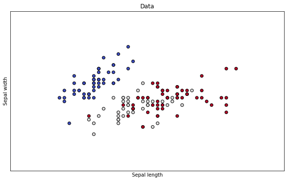
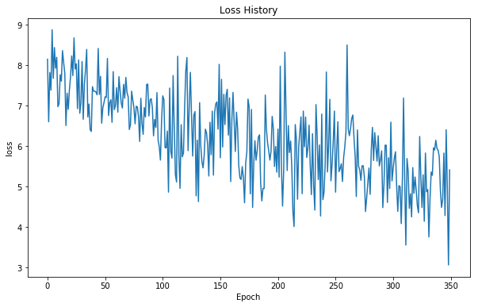

Support Vector Machine is a machine learning model that makes use of an L2 hinge loss function to optimize a linear classification model. It's best described by it's loss function, which seeks to create a margin between the score it gives to the correct label, and the score it gives to the other incorrect labels.

$$\large L_i = \sum_{j \neq y} max(0, s_j - s_{y_i} + \Delta)$$

The loss function can be described as the sum of differences between the prediction score given to the wrong class ($s_j$) and the prediction score of the correct class($s_{y_i}$), only if the prediction score of the wrong class was higher by a defined margin($\Delta$). The cost function wants all the scores assigned to the wrong class to be lower than the correct class by $\Delta$. The fact that we only care about differences greater than zero (max function) makes this a hinge loss function. 

Alternatives are squared hinge loss ($\max(0, -)^2$) which would penalize a boundary that allows data points to cross the margin more strongly. 

## Regularization
If there is a transformation $f(x_i) = W_ix_i + b $ where the prediction $ f(x_i) $ scores correctly (therefore generating zero loss), then any scaling of $W$ would yield the same loss of zero. This can cause the weights to explode to large numbers, so we want to penalize overly large weights. 

This technique also prevents overfitting, where the model may begin to favor a specific feature and begin maxing out a specific weight over all others. Adding this L2 regularization improves generalization of the model. 

$$\large R(W) = \lambda \sum_{k}\sum_{l}W^2_{k,l}$$


```python
import numpy as np

class SVM():
    
    def __init__(self, num_features, num_classes, e=1):
        self.features = num_features
        self.labels = num_classes
        self.params = {}

        self.params['W'] = np.random.rand(self.features, self.labels) * e  # so it's not zero initialization
        self.params['b'] = np.zeros((self.labels))
        self.params['dW'] = np.zeros((self.features, self.labels))
        self.params['loss'] = 0

    def evaluate(self, X, y, delta=1, reg=0.005):
        num_examples = X.shape[0]
        
        assert X.shape[1] == self.features, "input shape does not match feature size of model"
        
        # Forward pass
        W = self.params.get('W')
        b = self.params.get('b', np.zeros((num_examples, 1)))
        hypothesis = np.dot(X, W) + b
        
        # One hot encode y class labels
        one_hot = np.eye(self.labels)[y.reshape(-1)]
        correct_scores = hypothesis * one_hot
        
        # Hinge Loss
        diff = hypothesis - correct_scores + delta
        diff -= diff * one_hot
        cost = np.maximum(np.zeros_like(diff), diff)  # features x labels

        # Regularization
        L2 = 0.5 * reg * np.sum(W**2)
        
        # SVM
        self.params['loss'] = 1 / num_examples * np.sum(cost) + L2
        
        # backward pass
        grad = cost
        grad[diff > 0] = 1  # wrong scores to 1
        diff_total = np.sum(grad, axis=1) # sum wrong scores for each example
        
        grad[np.arange(num_examples), y] = - diff_total[np.arange(num_examples)]
        
        # Update Gradients
        self.params['dW'] = 1 / num_examples * np.dot(X.T, grad) + reg * W
        self.params['db'] = np.sum(grad, axis=0)
        
    
    def fit(self, X, y, epochs=50, batch=20, lr = 1e-2, lr_decay=0.9):
        num_train=X.shape[0]
        iters_per_epoch = max(num_train // batch, 1)
        
        loss_hist = []
        
        for e in range(epochs):
            for it in range(iters_per_epoch):
                # Select random [batch size] samples from data
                batch_idx = np.random.choice(X.shape[0], 10, replace=False)

                X_batch = X[batch_idx]
                Y_batch = y[batch_idx]

                # Evaluate -- new loss and grad
                self.evaluate(X_batch, Y_batch)
                
                # Update weights
                self.params['W'] -= lr * self.params['dW']
                self.params['b'] -= lr * self.params['db']
                loss_hist.append(self.params['loss'])
        
            if it % iters_per_epoch == 0:
                lr *= lr_decay  # Learning Rate Decay
        return loss_hist
        
    def predict(self, X):
        W = self.params.get('W')
        b = self.params.get('b', np.zeros((num_examples, 1)))
        return np.dot(X, W) + b
        
```


```python
%matplotlib inline
import numpy as np
import matplotlib.pyplot as plt
from sklearn import svm, datasets
 
# import some data to play with
iris = datasets.load_iris()
X = iris.data[:, :2]  # we only take the first two features.
y = iris.target
h = .02  # step size in the mesh
 
# create a mesh to plot in
x_min, x_max = X[:, 0].min() - 1, X[:, 0].max() + 1
y_min, y_max = X[:, 1].min() - 1, X[:, 1].max() + 1
xx, yy = np.meshgrid(np.arange(x_min, x_max, h),
                     np.arange(y_min, y_max, h))
 
# Plot also the training points
fig =plt.figure(figsize=(10,6))
plt.scatter(X[:, 0], X[:, 1], c=y, cmap=plt.cm.coolwarm, linewidth=1, edgecolor='black')
plt.xlabel('Sepal length')
plt.ylabel('Sepal width')
plt.xlim(xx.min(), xx.max())
plt.ylim(yy.min(), yy.max())
plt.xticks(())
plt.yticks(())
plt.title('Data')
plt.show()
```





```python
# Scale Data
x_scaled = X.copy()
mean = X.min(axis=0)
stdd = X.std(axis=0)
x_scaled -= mean
x_scaled /= stdd

# Create and Train Model
svm = SVM(2, 3)
loss = svm.fit(x_scaled, y, lr_decay=0.99)

# Plot Loss
fig = plt.figure(figsize=(10,6))
ax = fig.add_subplot(111)
ax.plot(np.arange(350), loss)
ax.set_title('Loss History')
ax.set_xlabel('Epoch')
ax.set_ylabel('loss')
plt.show()
```




