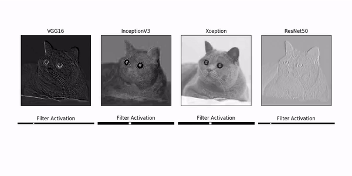
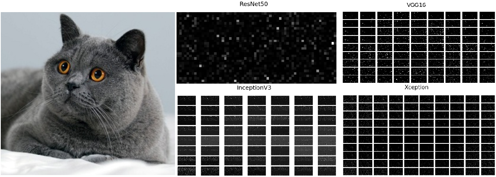

I was working with a mathematician from Harvard on a novel data processing algorithm, and one of the tasks laid out was to create a benchmark that would measure the effectivness of this new technique against current state-of-the-art machine learning models. The proposal of this new algorithm was that it offered a better representation of input data than the representation learned from deep learning models.

In order to test this assumption, I figured the best approach was to compare a bunch of models efficacy as feature representation for a classification task. This write up lays out how I used Transfer Learning techniques to turn pre-trained models into a data processing algorithm, with code on visualizing layer activations of a machine learning model (as depicted above)


## What is Transfer Learning?

Transfer learning is the application of Machine Learning which takes the lower level outputs of a more sophisticated pre-trained model as a base model for a different application.

There are several reasons why this is useful:

- The dataset on hand is small, and there is not enough available data to train a deep network from scratch. However the problem may require a more complex model.

- The problem is similar to a previous problem solved with a trained advanced model. Rather than spend time retraining an entire network, it can be useful to start  with a pre-trained network.

- Training a sophisticated network takes a considerable amount of time, money, and compute resources. Starting with a pre-trained network can shorten the development cycle considerably.

## Methods of Transfer Learning

There are two ways to apply Transfer Learning techniques to a model:

- Transfer Learning as feature extraction, saving the output and using this new representation of the data as the new input for your model.

- Transfer Learning as data processing, adding new untrained layers with random initialized values to the clipped base model and retraining.

### Feature Extraction Method

The first method is to clip the densely connected network segment from a pre-trained model, then running 'predictions' on the dataset to generate a new dataset. Since the classifier segment of the model has been removed, the resulting output would be low level representation of the raw data. This data can be saved and then used for further predictive modeling that deal with high level representation like classification or regression.

### Data Processing Method

The second method is to build a new model directly from a clipped base model. This  is where the pre-trained model would have it's densely connected layers removed, then new layers with randomized weights would be added to suit the context of the problem. Usually the new layers are just one or two standard affine layers connected to the output, but in the case of autonomous driving, sometimes it can be an RNN to recall recently seen examples.

The resulting model would be trained on the new dataset, either by freezing the weights of the base model (not training that segment) and only running backpropogation through the added layers, or retraining the entire model. If retrained, the further refinement of the weights on the pretrained network could improve the overall accuracy of the model.

### Approach

For this project, I went with the Feature Extraction method; saving the output of the base models as a new dataset.

### Dataset

The data used for this project was Udacity's Self Driving Car Dataset. I included a small segment of this dataset (3000 images) in the transfer learning repository so that the code can be run right out of the box.    

    +-- data/
    |   +-- log file <.csv>
    |   +-- left/
    |   |   +-- image #1 <.jpg>
    |   |   +-- image #2 <.jpg>       
    |   |   +-- ....     <.jpg>
    |   +-- center/
    |   |   +-- image #1 <.jpg>
    |   |   +-- image #2 <.jpg>       
    |   |   +-- ....     <.jpg>
    |   +-- right/
    |   |   +-- image #1 <.jpg>
    |   |   +-- image #2 <.jpg>       
    |   |   +-- ....     <.jpg>


To feed the data through the feature generation model, I created a data generator to proccess the dataset. The code turned out to be a bit long, so I won't post it here.

See [data_utils.py](https://github.com/JoshZastrow/Transfer-Learning/blob/master/data_utils.py#L16) for the data generator function.


# Feature Extraction

TThe Feature Extraction engine was created with a command line interface. The [model](https://github.com/JoshZastrow/Transfer-Learning/blob/master/model.py#L13) itself is actually quite simple due to the tools offered with Keras.


```python
from data_utils import DataGenerator, DataWriter, stopwatch
import numpy as np
from config import get_user_settings, create_parser
from keras import optimizers
from keras.layers import Dense, Dropout, MaxPooling2D
from keras.models import Sequential
import sys, traceback
import keras.applications

# If I go for random sampling... which I don't at the moment.
np.random.seed(7)

class FeatureGenerator():
    """
    Transfer Learning model.
    Convolutional Base Model Architecture, top layers (classifier) removed
    for low level feature genaration from raw data. Model pulls from a dataset
    and executes a prediction function to generate extracted features.

    args
    ----
        inputs (ndarray): 4D array of images (samples, height, width, channels)

    returns
    -------
        result (ndarray): generated features of input

    """
    def __init__(self, model, input_shape=(480, 640, 3)):
        conv_base = getattr(keras.applications, model)(
                include_top=False,
                weights='imagenet',
                input_shape=input_shape)

        self.model = Sequential()
        self.model.add(conv_base)
        # self.model.add(MaxPooling2D(pool_size=(2, 2)))

    def predict(self, inputs):
        return self.model.predict(inputs)
```

    Using TensorFlow backend.


My recommendation is to first run the helper on the program to get an outline of the required arguments for the program:

    python model.py --help

The program needs to know the output folder destination and the type of model to use for feature extraction. To execute the code the command line prompt would look something like this:

    python model.py   \
    -model "InceptionV3" \
    -output "data"

Running the program will process images from your dataset through the base model and output the results to an output folder.

If you would like to change how or where the resulting arrays are stored outside the settings of the config, the code for the data writer portion can be found [here](https://github.com/JoshZastrow/Transfer-Learning/blob/master/data_utils.py#L103).

# Results

The resulting data transformations is a collection of sparse activations far removed from the data rich image input. I fed an image through each model, then plotted each filter activation of the final layer for four benchmark Machine Learning Models. The low level activations from the data rich input of the cute cat are not really interpretable -- but that's what makes machine learning models so black box!



The code for this visualizer can be found [here](https://github.com/JoshZastrow/Transfer-Learning/blob/master/visualizer.py#L23). It also shows how to make use of the model without the accompanying data pipeline.

The feature extraction starts with the original image; apixel window of several hundred values both in height and width, with only three channels/filters of color. The resulting transformation leaves us a much smaller small pixel window--only a couple pixels across, but with way more filters/channels than RGB. In the visualization of the final data representations above, the resulting 2048 filters were organized in 32 x 64 tiles laid out side by side.

# Next Steps

The next steps with this newly processed data is to build and train a densely connected classifier or regression model on the model-specific feature representations of the data. After building the feature extractor, we decided not to pursue the benchmarking project further, so at the very least this project served as a fun transfer-learning demonstration!
